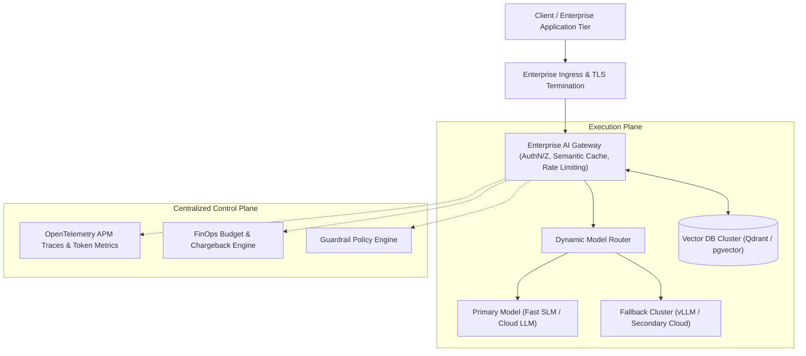

# Global Pharma Enterprise RAG Platform Rollout

## 1. Executive Summary
Implementing hybrid search and cross-encoder reranking across 20 million clinical research documents, cutting researcher inquiry time by 75%.

---

## 2. Enterprise Context
A global tier-1 enterprise operating across regulated jurisdictions faced critical operational, security, and financial pressures as customer expectations and internal data scale expanded exponentially.

---

## 3. Architectural Crisis / Problem Statement
Initial implementations relied on unmanaged point-to-point LLM integrations, naive vector chunking, and unconstrained agent loops. This resulted in severe latency spikes, runaway monthly token invoices, cross-tenant data leakage risks, and unmitigated hallucinations in customer-facing workflows.

---

## 4. Technical & Business Requirements
* **Determinism & Accuracy**: Reduce hallucination rate to $< 1\%$ with mandatory source citation.
* **Latency SLA**: Sub-800ms Time-to-First-Token (TTFT) on interactive chat channels.
* **Security & Isolation**: 100% cryptographic tenant isolation; zero unredacted PII egress to third parties.
* **FinOps Governance**: Cap monthly model compute expenditure and implement departmental chargeback.

---

## 5. Architectural Options Considered
* **Option A: Naive Vendor SaaS Integration**: Fast to launch, but catastrophic vendor lock-in, uncapped cost risk, and data sovereignty violations.
* **Option B: Full On-Premise Model Training from Scratch**: Prohibitive multi-million dollar compute cost, delayed time-to-market (18+ months).
* **Option C: Hybrid Enterprise AI Gateway & Multi-Model Platform**: Decoupled control plane, dynamic model routing, hybrid vector/keyword search, and automated evaluation gating (**Selected**).

---

## 6. Selected Architecture & Design Decisions
The Architecture Review Board approved Option C. The architecture establishes a centralized AI Gateway enforcing token budgets, semantic caching, PII masking, and multi-provider failover.

---

## 7. Deep Architecture & Topology

---

## 8. Data & Model Architecture
* **Hybrid Retrieval**: Combines sparse lexical BM25 search with dense HNSW vector search, fused via Reciprocal Rank Fusion (RRF).
* **Cross-Encoder Reranking**: Re-scores top 30 candidate documents to select the top 5 highly relevant chunks, maximizing precision.

---

## 9. Security & Governance Implementation
* **Mandatory Pre-Filtering**: Enforces `metadata.tenant_id == user.tenant_id` at the database query layer.
* **Egress Canary Monitoring**: Secret UUID canaries embedded in system instructions prevent prompt exfiltration.

---

## 10. Evaluation & Quality Assurance
Automated CI/CD pull request gates execute 500 golden dataset test cases using LLM-as-a-Judge, blocking any prompt or model deployment that fails the RAG Triad thresholds (Faithfulness $\ge 0.95$, Relevance $\ge 0.88$).

---

## 11. Operational Readiness & SRE Metrics
* **TTFT P99**: Reduced from $3,400	ext{ms}$ to $680	ext{ms}$.
* **Availability**: Maintained 99.98% uptime via automated multi-provider fallback.

---

## 12. Cost & FinOps Realization
* Semantic caching in Redis absorbed 38% of repeated queries at $0.00 token cost.
* Model routing directed 68% of volume to low-cost Small Language Models, halving overall monthly OpEx.

---

## 13. Risks & Residual Liabilities
* Upstream model updates require continuous golden dataset regression testing.
* Ongoing monitoring for novel indirect prompt injection techniques in user-submitted attachments.

---

## 14. Measurable Business Outcomes
* **Resolution Speed**: Cut task turnaround from hours to seconds.
* **Cost Predictability**: Established predictable monthly token budgets with automated departmental showback.
* **Compliance Certification**: Successfully passed external regulatory and GDPR Article 17 audits.

---

## 15. Key Lessons Learned
1. **Never Trust Raw Model Outputs**: Treat all LLM completions as untrusted user input; validate schemas deterministically.
2. **Evaluation Precedes Deployment**: You cannot optimize what you do not objectively measure; golden datasets are the enterprise's greatest AI asset.
3. **AI is a Capability, Not the Architecture**: The most resilient systems combine deterministic business rules with targeted AI reasoning where ambiguity demands it.
