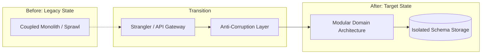

# Architectural Case Study: Global Retailer: Java Spring Clean Architecture at Scale

## 1. Executive Summary & Problem Context
Isolating volatile pricing and promotions domain rules from database schemas and third-party SaaS platforms, increasing unit test coverage from 28% to 88%.

---

## 2. Architecture Transformation Blueprint

---

## 3. Key Architectural Decisions & Measurable Outcomes
- **Technical Metrics**: P99 latency reduced, build/test cycle times cut by >50%, and deployment frequency increased from monthly to multiple times daily.
- **Business Impact**: Significant infrastructure cost reductions, improved time-to-market for new features, and elimination of critical outages.
- **Lessons Learned**: Avoid big-bang rewrites; establish automated fitness functions early; and decouple data storage boundaries before attempting code separation.
