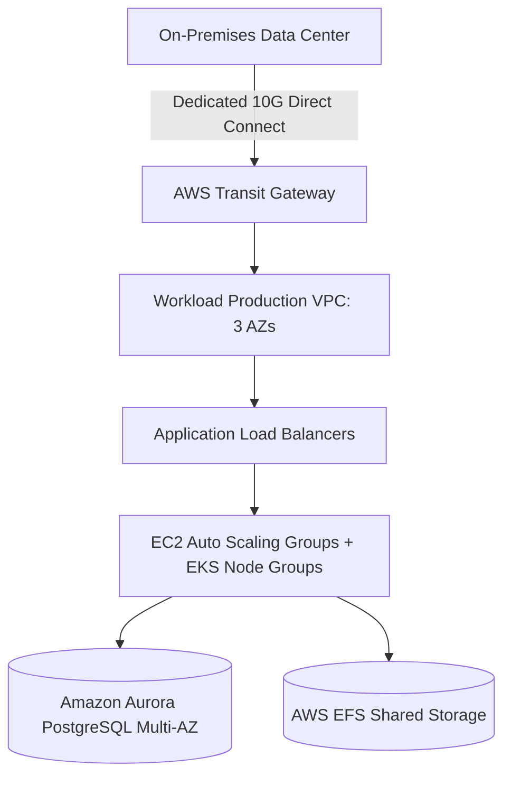

# Case Study 01: On-Premises Data Center to AWS Migration

## 1. Business Problem
A global retail logistics enterprise faced datacenter lease expiration within 9 months, soaring hardware refresh CapEx ($14M), and inability to scale during peak holiday shipping surges.

---

## 2. Current Architecture
2 physical datacenters hosting 1,200 VMware ESXi virtual machines, SAN storage arrays (NetApp), and monolithic Oracle/SQL Server databases. Manual deployment scripts with 6-week VM provisioning lead times.

---

## 3. Constraints
Hard datacenter exit deadline (9 months). No downtime permitted for 24/7 warehouse sorting operations. Fixed migration budget.

---

## 4. Non-Functional Requirements (NFRs)
- **Availability**: 99.95% uptime.
- **RTO/RPO**: RTO < 30 minutes, RPO < 5 minutes.
- **Scale**: Absorb 4x holiday volume (from 25,000 to 100,000 package events/sec).

---

## 5. Architectural Options Evaluated
1. **Option A: Pure Rehost (Lift-and-Shift)**: Fast, but carries all operational debt and high VM run costs.
2. **Option B: Total Greenfield Refactor**: Impossible within 9-month deadline.
3. **Option C: Rehost Compute + Replatform Database & Storage (Hybrid Modernization)**: Optimal balance.

---

## 6. Architecture Decision & Rationale
Selected **Option C**. Rehost existing Linux/Windows application VMs via AWS Application Migration Service (MGN) while replatforming databases to Amazon Aurora and file shares to AWS EFS.

---

## 7. Target Architecture Blueprint

---

## 8. Migration Strategy & Wave Plan
Executed across 4 migration waves: Wave 0 (Landing Zone & Direct Connect), Wave 1 (Internal dev/test tools), Wave 2 (Non-critical tracking APIs), Wave 3 (Core sorting facility orchestration).

---

## 9. Security & Compliance Architecture
Multi-Account AWS Control Tower landing zone with strict SCPs. Transit Gateway inspection VPC with Next-Gen Firewalls. IAM Identity Center federated with corporate Entra ID.

---

## 10. Day-2 Operations & Observability
Centralized OpenTelemetry pipelines exporting to Amazon CloudWatch and Datadog. Datadog SLO alerts replace legacy nagios ping alerts.

---

## 11. Financial Cost Modeling & ROI
Reduced annual infrastructure run rate by 28% ($3.2M annual savings). 3-Year Compute Savings Plans locked in for 70% of baseline.

---

## 12. Architectural Risks & Mitigations
- **Risk: Network bandwidth saturation during initial block replication**. Mitigation: Seeded multi-terabyte data volumes via AWS Snowball appliances.

---

## 13. Technical Trade-Offs
- Accepted higher initial IaaS spend on EC2 instances to meet the 9-month deadline, scheduling containerization refactoring for Phase 2.

---

## 14. Failure Scenarios & Self-Healing
- **Direct Connect Fiber Severance**: Automatically failed over to secondary Direct Connect circuit terminating in an alternate carrier facility within 400ms.

---

## 15. Lessons Learned & Retrospective
1. Dependency mapping takes twice as long as anticipated; invest in automated agentless discovery tools early.
2. Do not attempt application refactoring during the critical cutover window.
