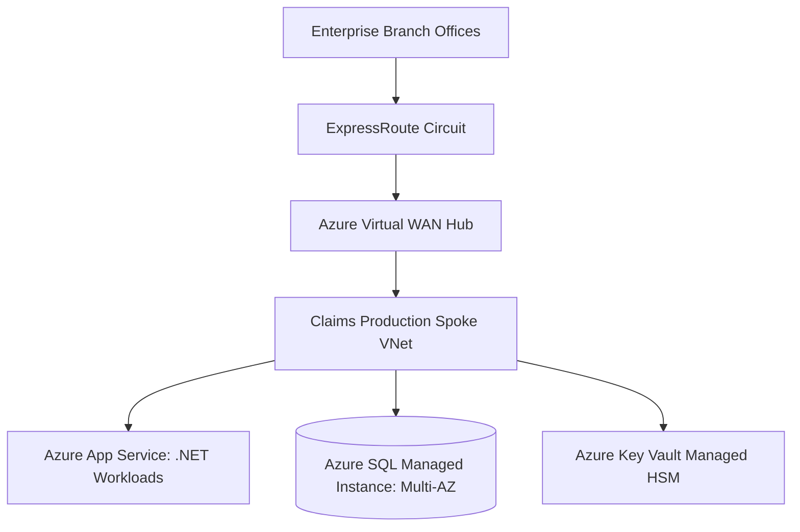

# Case Study 02: On-Premises Windows & SQL Enterprise to Microsoft Azure

## 1. Business Problem
A Fortune 500 insurance provider running hundreds of legacy .NET Framework applications and SQL Server clusters needed to modernize, cut licensing costs, and support remote workforces.

---

## 2. Current Architecture
Three regional datacenters running Windows Server 2012/2016, Active Directory Domain Services, SQL Server Always-On clusters, and IIS web farms.

---

## 3. Constraints
Heavy reliance on Windows Authentication, NTLM/Kerberos, and complex SQL Server stored procedures. Existing Microsoft Enterprise Agreement (EA) commitment.

---

## 4. Non-Functional Requirements (NFRs)
- **Compliance**: HIPAA and SOC2 compliance.
- **Availability**: 99.99% for claims processing.
- **Performance**: Sub-200ms claims submission response time.

---

## 5. Architectural Options Evaluated
1. **Option A: AWS Migration**: Required complex Active Directory translation and forfeiting Azure Hybrid Benefit discounts.
2. **Option B: Azure Landing Zone + Azure SQL Managed Instance**: Leveraged existing EA discounts and provided 99% SQL Server compatibility.

---

## 6. Architecture Decision & Rationale
Selected **Option B**. Azure provided seamless identity integration with Entra ID and massive cost savings via Azure Hybrid Benefit for Windows Server and SQL Server licenses.

---

## 7. Target Architecture Blueprint

---

## 8. Migration Strategy & Wave Plan
Wave migration using Azure Migrate: automated assessment mapped application dependencies, followed by lift-and-replatform waves over 12 months.

---

## 9. Security & Compliance Architecture
Microsoft Entra ID Privileged Identity Management (PIM) with Zero Standing Access. Azure Policy enforced encryption in transit and disabled public endpoints.

---

## 10. Day-2 Operations & Observability
Azure Monitor and Application Insights integrated into central Log Analytics workspaces. KQL queries track transaction bottlenecks.

---

## 11. Financial Cost Modeling & ROI
Saved $4.5M over 3 years by applying Azure Hybrid Benefit and 3-Year Reserved Instances.

---

## 12. Architectural Risks & Mitigations
- **Risk: Legacy Kerberos authentication breaking across cloud boundary**. Mitigation: Deployed Azure Active Directory Domain Services in the identity spoke.

---

## 13. Technical Trade-Offs
- Accepted SQL Managed Instance premium pricing over raw Azure SQL DB to preserve legacy cross-database queries without code rewrites.

---

## 14. Failure Scenarios & Self-Healing
- **Azure Datacenter Outage**: Paired region failover to secondary region via Azure Site Recovery restored operations within 20 minutes.

---

## 15. Lessons Learned & Retrospective
Azure Hybrid Benefit delivers staggering financial savings for Microsoft-heavy enterprises; license mobility must be evaluated upfront.
