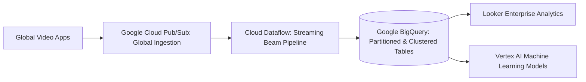

# Case Study 03: On-Premises Hadoop/Spark Analytics to Google Cloud BigQuery

## 1. Business Problem
A major media entertainment group suffered from a fragile 400-node on-premises Hadoop/Cloudera cluster. Batch reporting jobs took 18 hours, stalling real-time recommendation algorithms.

---

## 2. Current Architecture
On-premises Cloudera CDH cluster storing 3.5 PB of clickstream and viewing logs. HDFS storage was 92% full, and jobs frequently failed due to Out-Of-Memory (OOM) errors.

---

## 3. Constraints
Data science teams required continuous Spark and Python notebooks. Zero loss of historical telemetry data.

---

## 4. Non-Functional Requirements (NFRs)
- **Query Performance**: Ad-hoc analytical queries must complete in < 10 seconds (down from 45 minutes).
- **Scale**: Ingest 50 TB of new streaming telemetry daily.

---

## 5. Architectural Options Evaluated
1. **Option A: Rehost Hadoop to AWS EMR**: Solves hardware scaling but preserves MapReduce/YARN maintenance toil.
2. **Option B: Serverless Modernization to Google BigQuery + Pub/Sub**: Completely eliminates cluster management.

---

## 6. Architecture Decision & Rationale
Selected **Option B**. Google BigQuery offered serverless SQL processing, instant elasticity, and industry-leading performance for petabyte-scale data.

---

## 7. Target Architecture Blueprint

---

## 8. Migration Strategy & Wave Plan
Dual-ingest pipeline established: historical data copied via Cloud Storage Transfer Service; new clickstream data streamed simultaneously to both on-prem and GCP.

---

## 9. Security & Compliance Architecture
Customer-Managed Encryption Keys (CMEK) via Cloud KMS. Authorized Views and column-level data masking for PII compliance.

---

## 10. Day-2 Operations & Observability
Google Cloud Monitoring and BigQuery administrative resource charts. Automated alerting on query slot utilization.

---

## 11. Financial Cost Modeling & ROI
Eliminated $2.1M in annual hardware maintenance, Cloudera licensing, and datacenter power/cooling expenses.

---

## 12. Architectural Risks & Mitigations
- **Risk: Runaway on-demand BigQuery query spend**. Mitigation: Enforced BigQuery Slot Reservations (Enterprise Edition) with maximum slot caps.

---

## 13. Technical Trade-Offs
- Replaced complex Hive ETL scripts with standardized ANSI SQL and dbt models.

---

## 14. Failure Scenarios & Self-Healing
- **Upstream Ingestion Surge**: Cloud Pub/Sub absorbed 10x traffic surges with zero dropped events or manual scaling.

---

## 15. Lessons Learned & Retrospective
Decoupling storage from compute transforms analytical velocity; batch reporting windows shrank from 18 hours to 12 minutes.
