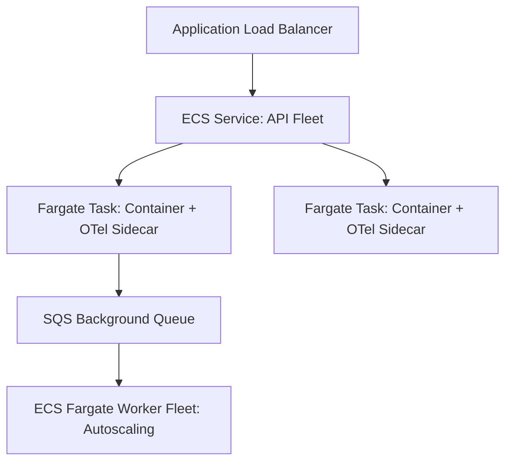

# Case Study 05: Replatforming VM Applications to Serverless Containers

## 1. Business Problem
An enterprise SaaS provider operated 150 virtual machines running background workers and REST APIs. Operating system patching and configuration drift consumed 40% of SRE time.

---

## 2. Current Architecture
Individual EC2 virtual machines provisioned via Ansible scripts. Each VM hosted multiple services, leading to dependency conflicts and unpredictable memory crashes.

---

## 3. Constraints
Small engineering team (12 developers). No capacity to manage a full Kubernetes cluster.

---

## 4. Non-Functional Requirements (NFRs)
- **Availability**: 99.9% uptime.
- **Operational Toil**: Zero OS patching and zero SSH access to production instances.

---

## 5. Architectural Options Evaluated
1. **Option A: Self-Managed Kubernetes (EKS)**: Over-engineered; operational tax too high for 12 engineers.
2. **Option B: Serverless Containers (AWS ECS + Fargate)**: Eliminates VM management while maintaining standard Docker images.

---

## 6. Architecture Decision & Rationale
Selected **Option B**. ECS Fargate allowed packaging applications into standard Docker containers while delegating all host management and patching to AWS.

---

## 7. Target Architecture Blueprint

---

## 8. Migration Strategy & Wave Plan
Standardized base Dockerfiles using multi-stage builds and distroless images. Automated CI/CD pipelines deployed task definitions directly to ECS clusters.

---

## 9. Security & Compliance Architecture
Non-root container execution; AWS Secrets Manager secrets injected directly into container environment variables at task launch.

---

## 10. Day-2 Operations & Observability
Container Insights enabled on ECS; structured JSON logs forwarded to CloudWatch Logs Insights.

---

## 11. Financial Cost Modeling & ROI
Compute spend reduced by 32% due to precise task-level autoscaling and eliminating idle VM buffer capacity.

---

## 12. Architectural Risks & Mitigations
- **Risk: Container startup latency during sudden traffic bursts**. Mitigation: Configured target-tracking autoscaling with aggressive scale-out steps.

---

## 13. Technical Trade-Offs
- Forfeited low-level kernel customization in exchange for zero OS patching overhead.

---

## 14. Failure Scenarios & Self-Healing
- **Task Crash**: ECS automatically replaced failing tasks in < 15 seconds without user-perceived downtime.

---

## 15. Lessons Learned & Retrospective
Serverless containers (Fargate / Cloud Run) deliver 90% of the benefits of Kubernetes with only 10% of the operational complexity.
