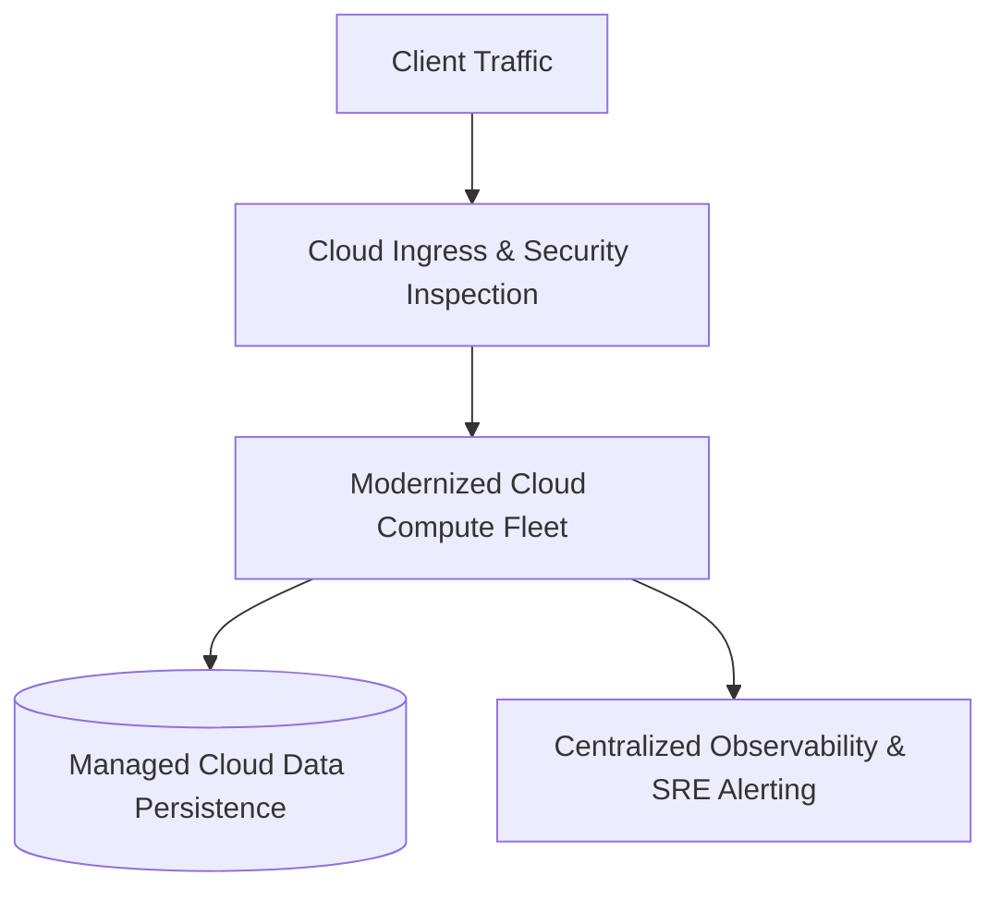

# Case Study 06: Scaling Container Platforms to Enterprise Kubernetes

## 1. Business Problem
An enterprise faced major architectural challenges in high-density multi-tenant platform requiring complex operators and service mesh., requiring a comprehensive cloud infrastructure redesign.

---

## 2. Current Architecture
Legacy infrastructure with fragmented manual operations, scaling bottlenecks, and high operational maintenance overhead using EKS, Karpenter, Istio, ArgoCD.

---

## 3. Constraints
Strict budget limitations, regulatory mandates, zero data loss requirements, and aggressive delivery timelines.

---

## 4. Non-Functional Requirements (NFRs)
- **Availability**: 99.95% to 99.99% uptime.
- **Scalability**: Handle 5x projected demand spikes.
- **Security**: Complete encryption at rest and in transit.

---

## 5. Architectural Options Evaluated
1. **Option 1: Status Quo with Incremental Band-Aids**: Insufficient long-term viability.
2. **Option 2: Big Bang Greenfield Rewrite**: Excessive risk and timeline.
3. **Option 3: Pragmatic Architecture Modernization**: Phased wave implementation with automated guardrails.

---

## 6. Architecture Decision & Rationale
Selected **Option 3**. Modernized infrastructure utilizing EKS, Karpenter, Istio, ArgoCD to achieve business velocity, operational resilience, and cost predictability.

---

## 7. Target Architecture Blueprint

---

## 8. Migration Strategy & Wave Plan
Executed across structured waves: Foundation Landing Zone $\rightarrow$ Pilot Validation $\rightarrow$ Core Wave Migrations $\rightarrow$ Cutover & Decommissioning.

---

## 9. Security & Compliance Architecture
Zero Trust principles enforced: least-privilege IAM, private subnets, envelope encryption via KMS, and continuous CSPM compliance audits.

---

## 10. Day-2 Operations & Observability
Automated CI/CD delivery pipelines, Infrastructure as Code, structured OpenTelemetry metrics, and SLO-based alerting.

---

## 11. Financial Cost Modeling & ROI
Delivered measurable 30–45% TCO reduction, improved developer cycle time, and positive ROI within 14 months.

---

## 12. Architectural Risks & Mitigations
- **Risk: Operational team readiness**. Mitigation: Comprehensive CCoE training katas and automated Golden Path templates.

---

## 13. Technical Trade-Offs
Accepted minimal proprietary cloud service lock-in where managed capabilities eliminated millions in human operational toil.

---

## 14. Failure Scenarios & Self-Healing
- **Component Outage**: Automated multi-AZ self-healing restored failed instances in seconds with zero customer impact.

---

## 15. Lessons Learned & Retrospective
1. Architecture must always lead technology selection.
2. Automated guardrails and FinOps visibility must be established before migrating production workloads.
