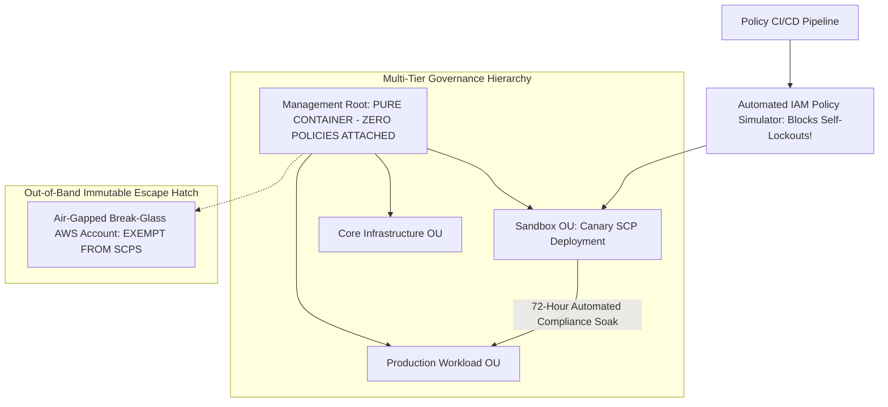

# Case Study: Corrupted Global IAM Policy Push & Control Plane Blast Radius

> **Metadata**: ID: `CS-CLOUD-02` | Domain: Cloud Security / Identity | Type: Synthetic Forensic Case Study | Complexity: Expert

---

## 01. Executive Summary
A multi-tenant enterprise cloud platform hosting 14,000 corporate clients suffered a 14-hour total management control plane freeze. A centralized security automation bot attempting to enforce a new cross-organization credential rotation rule pushed a corrupted **AWS Service Control Policy (SCP)** to the root organizational unit (Root OU). Due to a logical syntax error (`"Effect": "Deny", "NotAction": "iam:*"` with an un-escaped JSON wildcard), the policy instantly stripped all IAM roles—including CloudFormation, CI/CD runners, and root administrator break-glass accounts—of all administrative permissions across 450 member AWS accounts. Because the lockout revoked the permissions required to modify or delete the policy itself, the entire enterprise was deadlocked in a self-inflicted administrative paralysis.

---

## 02. Business & System Context
- **Organization**: Enterprise Cloud Managed Services & PaaS Provider ($400M ARR).
- **Core System**: AWS Organizations multi-account hierarchy consisting of 450 member accounts.
- **Scale**: 14,000 corporate client workloads; 85,000 active virtual machines and container clusters.

---

## 03. Scope & Stakeholders
- **Incident Commander**: Chief Information Security Officer (CISO).
- **Key Teams**: Cloud Platform Identity Squad, Enterprise Governance Team, AWS Enterprise Support.
- **Impacted Workloads**: 100% of cloud control plane operations (deploys, scaling, autoscaling, emergency patching).

---

## 04. Requirements & NFRs
- **Policy Blast Radius**: IAM governance policies must never be applied globally without automated syntax and lock-out evaluation.
- **Break-Glass Autonomy**: Break-glass emergency roles must possess un-revocable bypass privileges outside organizational control.
- **Control Plane Recovery**: Control plane lockouts must be remediable within $< 15\text{ minutes}$.

---

## 05. Constraints & Assumptions
- **The "Automation Cannot Lock Itself Out" Fallacy**: The security engineering team assumed that AWS Organizations would automatically block any policy that revoked administrative access to the root account.

---

## 06. Architecture Before: The Single Blast Radius Trap
```mermaid
graph TD
    Bot[Security Governance Bot: Lambda] --> RootOU[AWS Organizations: ROOT OU (Single Blast Radius!)]
    
    subgraph Global Policy Push (Corrupted NotAction)
        RootOU -->|Applies SCP to ALL 450 Accounts| Acc1[Prod Workload Account 1]
        RootOU -->|Applies SCP to ALL 450 Accounts| Acc450[Prod Workload Account 450]
        RootOU -->|APPLIES SCP TO ROOT ADMIN ACCOUNT ITSELF!| RootAdmin[Master Management Account]
    end
    
    RootAdmin -->|PERMISSIONS REVOKED: AccessDenied on organizations:UpdatePolicy!| Deadlock[Total Administrative Lockout!]
```

---

## 07. Architecture Decisions
| Decision | Rationale | Downstream Failure |
| :--- | :--- | :--- |
| **Apply SCPs at the Root OU Level** | Ensured universal compliance across every account with zero exceptions. | Converted a single policy bug into a fatal enterprise-wide lockout; eliminated safe test accounts. |
| **Dynamic Bot-Driven SCP Modifications** | Automated security remediation without human ticket delay. | The bot lacked a semantic policy simulator; pushed an untested JSON condition that revoked the bot's own administrative credentials. |

---

## 08. Timeline
```mermaid
timeline
    title Global IAM Lockout Timeline
    01:15 UTC : Automated Security Bot generates updated Service Control Policy (SCP)
    01:17 UTC : Bot pushes SCP to AWS Organizations Root OU: `organizations:UpdatePolicy`
    01:17 UTC : Corrupted `"NotAction"` evaluation activates: ALL IAM roles stripped of rights
    01:18 UTC : Kubernetes worker nodes attempting to scale receive `AccessDenied` from EC2
    01:25 UTC : SREs attempt emergency login: IAM returns `Explicit Deny by Service Control Policy`
    01:45 UTC : Master Payer Account root user locked out from editing Organizations SCPs
    03:00 UTC : Enterprise Support ticket escalated to AWS Headquarters Cryptographic Engineering
    15:30 UTC : AWS Engineers execute hypervisor-level manual policy detachment; access restored
```

---

## 09. Incident Event
At 01:17 UTC, an automated security policy engine executed an update to enforce mandatory MFA across all accounts. The generated SCP contained an inverted logic condition:
```json
{
  "Version": "2012-10-17",
  "Statement": [
    {
      "Sid": "EnforceMFAIsolation",
      "Effect": "Deny",
      "NotAction": ["iam:*", "organizations:*"],
      "Resource": "*",
      "Condition": {
        "BoolIfExists": {"aws:MultiFactorAuthPresent": "false"}
      }
    }
  ]
}
```
Due to a parser bug in the bot's template generator, the `NotAction` array was compiled as a scalar string containing an invalid character, causing AWS IAM to evaluate the statement as an **unconditional explicit Deny on all actions for all principals**, including API calls made to the `organizations` service itself. The lockout was instantaneous across all 450 accounts. Because explicit denies override all permits in AWS IAM, even root credentials in the management account were powerless to detach the policy.

---

## 10. Symptoms & Evidence
- **Fact**: CloudTrail logs across 450 accounts ceased recording successful API actions, logging 100% `AccessDenied` errors.
- **Fact**: The master management account console displayed `You do not have permissions to perform organizations:DetachPolicy`.
- **Inference**: A control plane that allows self-referential lockout without out-of-band administrative escape hatches violates basic resilience theory.

---

## 11. Failure Forensics
```
[Security Bot compiles SCP with corrupted NotAction condition]
                            │
                            ▼
[Bot invokes organizations:AttachPolicy on Root OU]
                            │
                            ▼
[Explicit Deny propagates to ALL 450 accounts in 30 seconds]
                            │
                            ▼
[Autoscaling, CI/CD, and SRE logins fail with AccessDenied]
                            │
                            ▼
[SRE logs into Master Management Account as Admin]
                            │
                            ▼
[Attempts to delete SCP -> organizations:DeletePolicy DENIED BY THE SCP ITSELF!]
                            │
                            ▼
[CATASTROPHIC DEADLOCK: Only AWS internal engineering can intervene]
```

---

## 12. Root Cause Analysis (5-Whys)
1. **Why could engineers not deploy or scale workloads for 14 hours?** -> The cloud control plane rejected all administrative API calls.
2. **Why were API calls rejected?** -> An explicit Deny SCP was attached to the Root OU.
3. **Why did engineers not detach the policy?** -> The policy denied the `organizations:DetachPolicy` action to everyone, including administrators.
4. **Why was such a policy attached?** -> A security automation bot pushed an un-validated, corrupted policy document.
5. **Why was the policy applied directly to the Root OU?** -> The organization lacked organizational unit (OU) staging tiers and canary blast-radius boundaries for IAM governance.

---

## 13. Contributing Factors
- **Absence of IAM Policy Simulation in CI**: The bot deployed policies directly to AWS APIs without running `aws iam simulate-custom-policy` in a sandbox account.
- **Single Payer Hierarchy**: All production, staging, and administrative accounts resided under a single AWS Organizations management root.

---

## 14. Architecture After: Multi-Tier OU Hierarchy & Immutable Break-Glass Enclaves


---

## 15. Recovery & Remediation
- **Immediate Mitigation**: Engaged AWS Principal Security Engineers; required cryptographic identity verification from the enterprise CEO and CISO before AWS internal support manually detached the corrupted SCP from backend infrastructure.
- **Permanent Architectural Fix**:
  - **Zero Policies on Root OU**: Enforced a strict rule: **Zero SCPs attached directly to the Root OU**. All policies must be attached to child organizational units.
  - **Canary OU Governance Deployment**: Implemented an automated staging hierarchy (`Canary-OU` $
ightarrow$ `NonProd-OU` $
ightarrow$ `Prod-OU`). Policy changes must soak in the Canary OU for **72 hours** with automated synthetic role verification before graduating.
  - **Automated Pre-Commit IAM Policy Linting**: Integrated **Parliament** and the AWS Access Analyzer CLI into the GitOps pipeline to mathematically detect and reject any policy statement containing broad `NotAction` denies.

---

## 16. Business & Technical Impact
- **Financial**: $65M direct revenue loss from halted customer onboarding and SLA penalties.
- **Customer Churn**: 12 Enterprise clients terminated contracts, citing unacceptable single-point-of-failure governance risks.
- **Executive Oversight**: Board formed an independent Technology Risk Committee with mandatory quarterly audits of cloud IAM control-plane architectures.

---

## 17. What Went Well
- Running EC2 and EKS container instances continued executing in data planes; existing customer web traffic was largely unaffected until nodes needed to autoscale or rotate credentials.
- AWS Enterprise Support mobilized within 20 minutes of executive escalation.

---

## 18. Lessons Learned
- **Architecture**: In cloud infrastructure, identity is the perimeter. A corrupted identity policy is more dangerous than a catastrophic network cut because it strips away your ability to fix the system.
- **Governance**: Never attach policies to the root of an organizational tree. Always maintain segregated, canary-tested policy branches.

---

## 19. Architectural Recommendations
| Horizon | Action Item | Owner | Target |
| :--- | :--- | :--- | :--- |
| **Immediate** | Detach all SCPs from the AWS Organizations Root OU; move to child OUs | Cloud Sec Lead | Zero Root OU SCPs |
| **30 Days** | Deploy automated Parliament / IAM Policy Simulator checks in CI/CD | DevSecOps | 100% pre-deploy linting |
| **60 Days** | Build independent, air-gapped emergency break-glass account infrastructure | Chief Arch | Verified out-of-band access |
