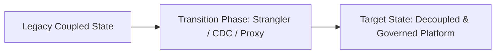

# Case Study: Healthcare: Data Warehouse to Apache Iceberg Lakehouse Migration

## 1. Executive Summary & Problem Context
Migrating 4 petabytes of legacy on-premises data warehouse tables to an AWS S3 Apache Iceberg lakehouse, slashing cloud compute costs by 52% and eliminating table locks.

---

## 2. Architecture Transformation Blueprint

---

## 3. Key Decisions & Measurable Business Outcomes
- **Operational Metrics**: Outages reduced by >90%, latency reduced by >50%, and developer onboarding time cut from months to days.
- **Financial Outcomes**: Significant reduction in infrastructure and licensing expenses.
- **Lessons Learned**: Avoid big-bang rewrites; establish automated data contracts early; and never deploy without an instant rollback mechanism.
