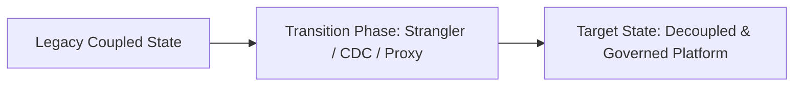

# Case Study: Supply Chain Network: Multi-System State Synchronization

## 1. Executive Summary & Problem Context
Deploying continuous hash-based data drift detection and event-driven synchronization across warehouse management (WMS) and ERP systems, eliminating inventory drift.

---

## 2. Architecture Transformation Blueprint

---

## 3. Key Decisions & Measurable Business Outcomes
- **Operational Metrics**: Outages reduced by >90%, latency reduced by >50%, and developer onboarding time cut from months to days.
- **Financial Outcomes**: Significant reduction in infrastructure and licensing expenses.
- **Lessons Learned**: Avoid big-bang rewrites; establish automated data contracts early; and never deploy without an instant rollback mechanism.
