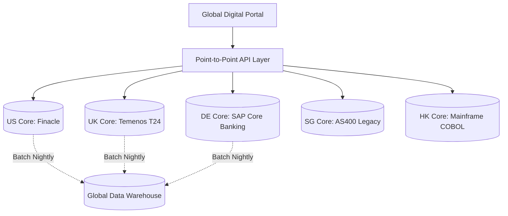
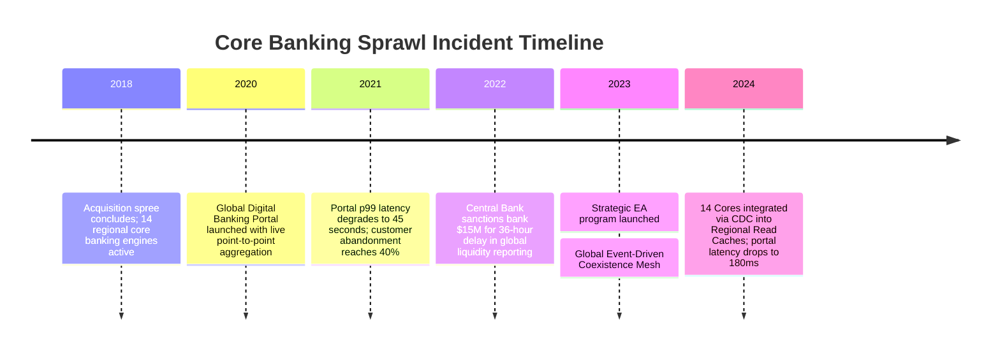
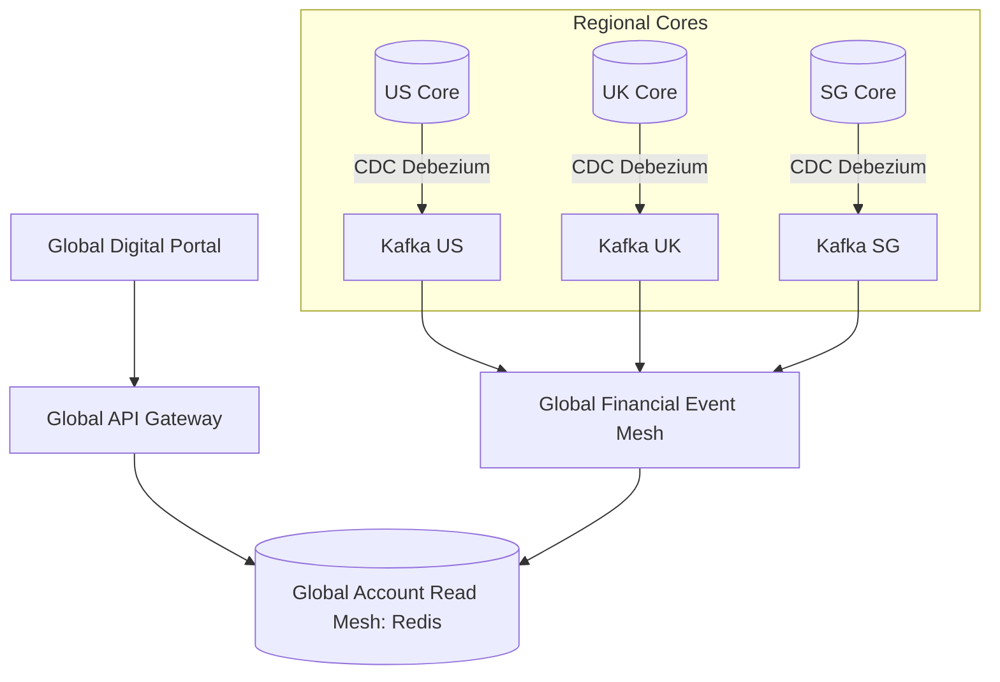

# Case Study: Global Bank Core Banking Sprawl & 14 Incompatible Ledger Silos

> **Metadata**: ID: `CS-ENT-01` | Domain: Enterprise Architecture / Banking | Type: Synthesis Case Study | Complexity: Expert

---

## 01. Executive Summary
A Tier-1 multinational bank operating across 14 jurisdictions accumulated 14 independent core banking ledger platforms over two decades of international acquisitions. Attempts to launch a unified global digital banking experience collapsed when cross-border balance inquiries required 45-second batch aggregations, and real-time payments could not clear across regional siloes. The bank suffered $120M in annual duplicate IT licensing and maintenance, lost 18% market share in commercial treasury to agile fintech competitors, and faced regulatory scrutiny for inconsistent capital liquidity reporting.

---

## 02. Business & System Context
- **Organization**: Tier-1 Multinational Financial Institution ($850B Assets Under Management).
- **Core Business Workflows**: Retail deposit accounts, commercial treasury cash management, and cross-border settlement.
- **Scale**: 28 Million customer accounts across North America, EMEA, and APAC.
- **Problem Context**: Each regional subsidiary operated as an autonomous feudal IT silo with its own vendor contracts, COBOL/RPG core ledgers, and bespoke batch data formats.

---

## 03. Scope & Stakeholders
- **Executive Sponsors**: Group Chief Information Officer (CIO), Group Chief Risk Officer (CRO).
- **Architecture Leadership**: Enterprise Architecture Steering Committee, Regional Chief Architects.
- **Key Teams**: 14 Regional Core Banking Engineering Teams, Global Data Platform Team, SWIFT/ISO Operations.

---

## 04. Requirements & NFRs
- **Global Real-Time Account Access**: Unified API displaying consolidated multi-currency balances in $< 500\text{ ms}$.
- **Cross-Border Transfer SLA**: Instant domestic settlement ($< 15\text{ seconds}$), international transfer in $< 2\text{ hours}$.
- **Capital Liquidity Reporting**: Hourly global cash position aggregation (previously 24-hour batch delay).

---

## 05. Constraints & Assumptions
- **Regional Regulatory Banking Charters**: Local regulators (OCC, FCA, BaFin, MAS) mandated that customer financial data must reside within national sovereign boundaries.
- **Mainframe Core Immobility**: Regional core banking systems could not be replaced simultaneously without risking multi-billion-dollar operational disruption.

---

## 06. Architecture Before


---

## 07. Architecture Decisions
| Decision | Rationale at the Time | Consequence & Architectural Debt |
| :--- | :--- | :--- |
| **Decentralized Regional Autonomy** | Permitted local acquisitions to close rapidly without IT integration delays. | Created 14 incompatible ledger data models, duplicated data centers, and prevented cross-border capabilities. |
| **Point-to-Point API Aggregation** | Attempted to build a global portal by querying all 14 regional cores live over REST. | Slowest regional core (AS400 SG) determined global portal response time; frequent cascading timeouts. |

---

## 08. Timeline


---

## 09. Incident / Transformation Event
During a period of heightened market volatility, corporate treasury clients attempted to transfer billions across regional accounts to optimize yield. The point-to-point aggregator flooded regional core mainframes with concurrent status check calls, exhausting CICS thread pools in the UK and Singapore cores. The digital portal crashed globally for 14 hours, locking enterprise treasurers out of their cash reserves.

---

## 10. Symptoms & Evidence
- **Fact**: Regional AS400 core CPU reached 100%, rejecting all branch and digital transactions for 8 hours.
- **Fact**: API Gateway logs recorded 85,000 HTTP 504 Gateway Timeout errors per minute.
- **Inference**: Live point-to-point aggregation across synchronous legacy systems is mathematically unviable at scale.

---

## 11. Failure Forensics
```
[Corporate Client Refreshes Global Dashboard]
                     │
                     ▼
[Global Aggregator Dispatches 14 Parallel REST Calls]
                     │
       ┌─────────────┼─────────────┐
       ▼             ▼             ▼
  [US Finacle]  [UK Temenos]  [SG AS400 Core]
  (200ms OK)    (850ms OK)    (CPU 100% -> Latency 35s)
                                   │
                                   ▼
                       [Aggregator Thread Pool Exhausted]
                                   │
                                   ▼
                       [Global Portal 504 Gateway Timeout]
```

---

## 12. Root Cause Analysis (5-Whys)
1. **Why did the portal fail?** -> The global aggregation service exhausted all worker threads waiting on slow regional responses.
2. **Why was the regional response slow?** -> The Singapore AS400 core was never designed for high-frequency interactive API queries.
3. **Why was it queried interactively?** -> The portal architecture relied on live queries rather than an asynchronous event-driven read cache.
4. **Why was there no read cache?** -> Architecture teams lacked a unified global data architecture and event streaming backbone.
5. **Why was there no global architecture?** -> M&A governance rewarded business velocity over enterprise technical consolidation, creating 14 isolated fiefdoms.

---

## 13. Contributing Factors
- **Incentive Misalignment**: Regional CIO bonuses were tied to regional P&L, discouraging investment in shared global integration platforms.
- **Missing Integration Standards**: No common domain model (e.g., BIAN or ISO 20022) existed across regional development units.

---

## 14. Architecture After / Resolution


---

## 15. Recovery / Remediation
- **Immediate Mitigation**: Implemented aggressive circuit breakers and degraded responses (rendering balance as "temporarily unavailable" if regional core exceeded 2.0s).
- **Permanent Architectural Fix**: Deployed **Log-Based CDC (Debezium)** on all 14 core databases streaming balance updates to Apache Kafka, projecting state into a regionalized, sovereign-compliant **Global Read Cache**.
- **Long-Term Action**: Established a multi-year phased core convergence roadmap targeting consolidation from 14 cores down to 3 sovereign regional hubs (Americas, EMEA, APAC).

---

## 16. Business & Technical Impact
- **Financial**: Saved $35M in annual duplicate integration tooling and eliminated outage downtime penalties.
- **Performance**: Global digital portal p95 balance latency dropped from 45 seconds to **180 milliseconds**.
- **Regulatory**: Satisfied central bank liquidity mandates with real-time continuous cash position aggregation.

---

## 17. What Went Well
- The distributed CDC pipeline was deployed non-intrusively without touching legacy COBOL/RPG core application logic.
- Circuit breaking prevented single-region outages from taking down global portal services.

---

## 18. What Went Wrong / Lessons Learned
- **Architecture**: You cannot "API-facade" away architectural fragmentation; a synchronous facade over distributed batch cores compounds failure probabilities.
- **Governance**: Enterprise Architecture must have veto authority over M&A technical integration plans before transaction closing.

---

## 19. Architectural Recommendations & Long-Term Actions
| Horizon | Strategic Action | Owner | Metric |
| :--- | :--- | :--- | :--- |
| **0-90 Days** | Mandate BIAN domain models for all cross-border API interfaces | Lead EA | 100% BIAN compliance |
| **6 Months** | Implement automated data sovereignty quarantine validation | Security Arch | Zero regulatory findings |
| **1-3 Years** | Consolidate 14 legacy cores into 3 cloud-native regional core engines | Core Banking Lead | 70% reduction in MIPS |
