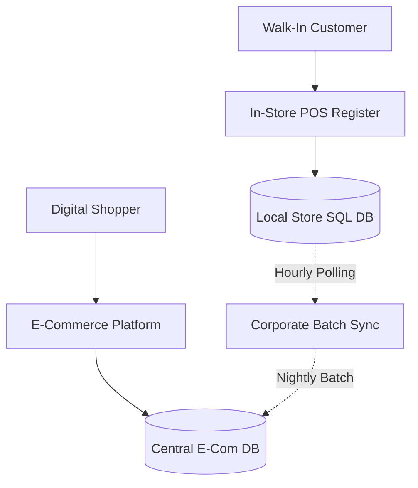
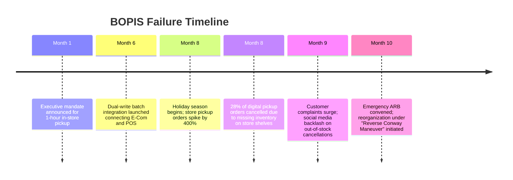
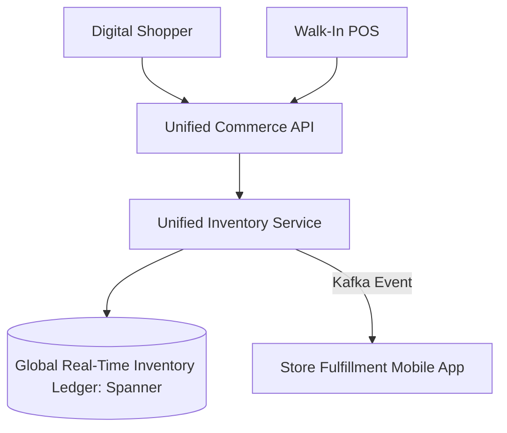

# Case Study: Conway's Law & Siloed Omnichannel Checkout Paralysis

> **Metadata**: ID: `CS-ENT-02` | Domain: Enterprise Architecture / Retail | Type: Synthetic Forensic Case Study | Complexity: Advanced

---

## 01. Executive Summary
A major Fortune 100 omnichannel retailer with 2,000 physical stores and a top-5 e-commerce website attempted to implement "Buy Online, Pick Up in Store" (BOPIS) and seamless cross-channel loyalty redemption. The initiative stalled for 18 months and ultimately produced widespread customer inventory cancellations. The root cause was an explicit manifestation of **Conway's Law**: the Retail Store Systems engineering organization and the Digital E-Commerce engineering organization were completely separate business silos with disjointed database models, conflicting KPIs, and competing inventory reservation systems that actively overwrote each other's state.

---

## 02. Business & System Context
- **Organization**: Omnichannel Retail Enterprise ($35B Annual Revenue).
- **Core Systems**: In-Store Point of Sale (POS), Warehouse Management System (WMS), E-Commerce Storefront.
- **Strategic Goal**: Unified commerce enabling customers to browse inventory in real-time and collect in-store within 2 hours.

---

## 03. Scope & Stakeholders
- **Retail Store Systems VP**: Owned physical store POS registers and local store inventory servers.
- **Digital E-Commerce VP**: Owned website, cloud microservices, and central fulfillment center stock.
- **Enterprise Architecture Lead**: Responsible for omnichannel alignment and integration strategy.

---

## 04. Requirements & NFRs
- **Inventory Reservation Accuracy**: Real-time store inventory sync with $< 0.1\%$ overselling error.
- **Order Ready-for-Pickup SLA**: $< 60\text{ minutes}$ from digital checkout to store staging area.
- **Peak Event Throughput**: 15,000 reservation updates per minute during holiday promotions.

---

## 05. Constraints & Assumptions
- **Siloed Incentive Structures**: Store managers were judged on store inventory turnover; e-commerce executives were judged on digital gross merchandise value (GMV).
- **Local Store POS Hardware**: Stores ran localized on-premises SQL servers that synced to corporate via hourly batch polling.

---

## 06. Architecture Before

*Notice that local store inventory and e-commerce stock were completely unlinked in real time.*

---

## 07. Architecture Decisions
| Decision | Rationale | Failure Mode |
| :--- | :--- | :--- |
| **Independent Store vs. Web IT Orgs** | Allowed digital team to move fast without legacy store constraints. | Created architectural divergence: two conflicting definitions of "Available-to-Promise" inventory. |
| **Batch Synchronization for BOPIS** | Avoided modifying store POS network infrastructure. | High inventory drift: items sold to walk-in shoppers remained visible online for up to 60 minutes. |

---

## 08. Timeline


---

## 09. Incident Event
During Black Friday, 45,000 customers ordered electronics online for in-store pickup. However, store inventory had already been purchased by walk-in shoppers hours earlier because local store SQL databases had not synced with the cloud e-commerce inventory. Store associates were forced to manually cancel 12,600 customer orders at the pickup counter, resulting in severe brand damage and $8.4M in refund compensation vouchers.

---

## 10. Symptoms & Evidence
- **Fact**: 28% cancellation rate for BOPIS orders on peak trading days.
- **Fact**: Store associates spent an average of 35 minutes searching shelves for items already sold.
- **Inference**: Systemic architecture breakdown caused by misalignment between organizational structure and operational data ownership.

---

## 11. Failure Forensics
```
[Customer Orders TV Online for Store Pickup]
                     │
                     ▼
[E-Com DB Marks TV "Reserved"] (Central Cloud)
                     │
         [60-Minute Batch Lag]
                     │
[Walk-in Shopper Buys Same TV at Store Register]
                     │
                     ▼
[Store POS Decrements Physical Stock] (Local Store DB)
                     │
                     ▼
[Customer Arrives at Store] ──► [Zero Physical Stock Available]
```

---

## 12. Root Cause Analysis (5-Whys)
1. **Why was the order canceled?** -> The item was not on the physical store shelf when the associate went to pick it.
2. **Why was it not on the shelf?** -> A walk-in customer had purchased it 20 minutes prior.
3. **Why did the website allow the purchase?** -> The website inventory showed 1 unit available.
4. **Why was inventory out of sync?** -> Store sales synced via an hourly batch job rather than an event-driven stream.
5. **Why was it batch?** -> The Store Systems team and E-Commerce team reported to different business executives who refused to collaborate on a shared real-time inventory ledger.

---

## 13. Contributing Factors
- **Conway's Law Anti-Pattern**: Software architecture mirrored the organizational fissure between brick-and-mortar retail and digital e-commerce.
- **Incentive Conflict**: Store managers viewed online store-pickup orders as unpaid operational labor that detracted from their direct store P&L.

---

## 14. Architecture After / Resolution


---

## 15. Recovery & Remediation
- **Reverse Conway Maneuver**: The CEO merged Store Systems and E-Commerce IT into a single **Unified Commerce Engineering** organization led by a Chief Digital & Technology Officer.
- **Real-Time Distributed Ledger**: Replaced hourly batch sync with a real-time event-driven inventory service running on Google Cloud Spanner. Every store checkout and online reservation decrements the exact same distributed counter with sub-50ms latency.
- **Safety Stock Buffer**: Implemented dynamic algorithmic safety buffers (items with stock count $\le 2$ are automatically excluded from digital store pickup).

---

## 16. Business & Technical Impact
- **BOPIS Cancellation Rate**: Dropped from 28% to **0.4%**.
- **Average Fulfillment Staging Time**: Reduced from 35 minutes to **8.5 minutes**.
- **Revenue**: Omnichannel revenue increased by $140M in the subsequent fiscal year.

---

## 17. What Went Well
- Executive leadership recognized that the failure was organizational and acted decisively to restructure engineering teams.
- Store fulfillment associates adopted the new unified handheld mobile app rapidly.

---

## 18. What Went Wrong / Lessons Learned
- **Architecture**: Software architecture cannot succeed when it fights against corporate political boundaries.
- **Conway's Law**: If you want a unified omnichannel customer experience, you must first create a unified omnichannel engineering team.

---

## 19. Architectural Recommendations
| Horizon | Action Item | Owner | Target |
| :--- | :--- | :--- | :--- |
| **Immediate** | Enforce 2-unit safety stock buffer on all store-pickup items | Product Lead | Zero overselling |
| **90 Days** | Migrate remaining store POS registers to real-time event publishing | In-Store Arch | 100% real-time POS |
| **1 Year** | Implement computer vision smart-shelf replenishment alerts | Innovation Lab | Automated restock |
