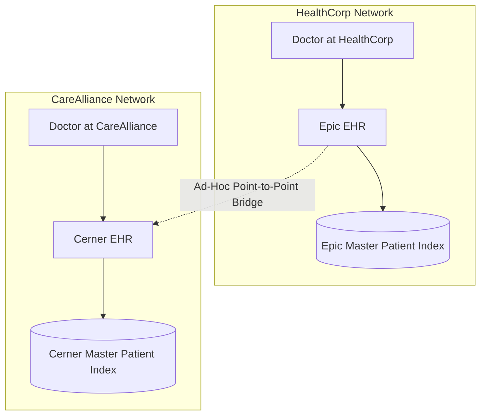
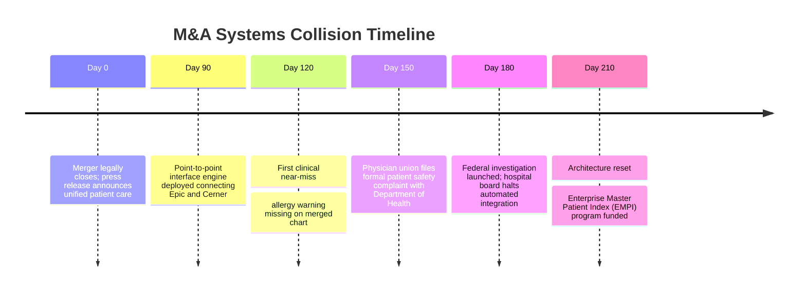
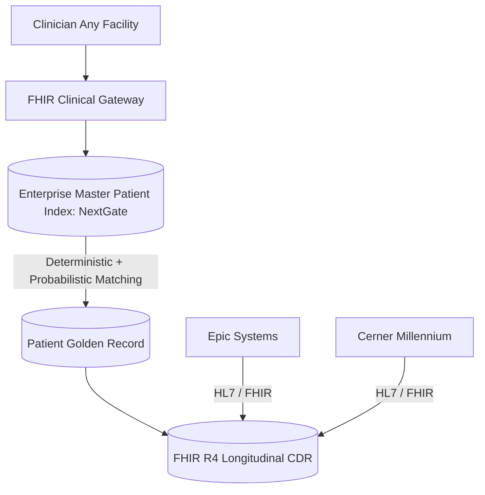

# Case Study: $20B Healthcare M&A Systems Collision & Identity Split

> **Metadata**: ID: `CS-ENT-03` | Domain: Enterprise Architecture / Healthcare | Type: Synthesis Case Study | Complexity: Expert

---

## 01. Executive Summary
Following a $20B mega-merger between two regional hospital networks (HealthCorp and CareAlliance), enterprise IT teams attempted to rapidly combine clinical workflows without resolving fundamental patient and provider identity divergences. The resulting systems collision created 420,000 duplicate patient medical records, sent laboratory results to wrong clinical providers, delayed emergency surgeries, and culminated in a $45M integration budget overrun accompanied by federal regulatory inquiries into patient safety violations.

---

## 02. Business & System Context
- **Organization**: Merged Health System (65 Hospitals, 800 Outpatient Clinics, 4.5M Annual Patients).
- **Core Applications**: Epic Systems EHR (Acquiring Network) and Cerner Millennium EHR (Acquired Network).
- **Integration Objective**: Allow clinicians across any facility to access complete historical patient medical records.

---

## 03. Scope & Stakeholders
- **Chief Medical Officer (CMO)**: Demanded zero clinical workflow interruption.
- **Enterprise Chief Medical Information Officer (CMIO)**: Champion of single-chart patient safety.
- **M&A Integration PMO**: Focused on aggressive Day-1 synergy cost targets.

---

## 04. Requirements & NFRs
- **Patient Identity Accuracy**: 99.999% accurate patient-to-chart linkage.
- **Emergency Chart Retrieval**: Full longitudinal clinical summary loaded in $< 3\text{ seconds}$ in Emergency Departments.
- **HIPAA Compliance**: Complete audit trail of all cross-entity clinical chart accesses.

---

## 05. Constraints & Assumptions
- **M&A Synergy Deadlines**: Management promised Wall Street $150M in immediate IT operational synergies within 12 months.
- **EMPI Discrepancy**: Acquiring network used deterministic SSN matching; acquired network used probabilistic demographic algorithms.

---

## 06. Architecture Before


---

## 07. Architecture Decisions
| Decision | Rationale | Failure Mode |
| :--- | :--- | :--- |
| **Point-to-Point EHR Bridging** | Fastest way to hit Day-1 M&A synergy deadlines. | No central master identity authority; patient charts merged incorrectly on common names (e.g., "John Smith"). |
| **Skipped Master Data Cleanse** | Cleansing 4.5M legacy records estimated at $12M and 9 months delay. | Injected 420,000 duplicate and cross-contaminated patient records into clinical workflow. |

---

## 08. Timeline


---

## 09. Incident Event
A trauma patient with a severe penicillin allergy was admitted to an acquired CareAlliance facility. Because the ad-hoc EHR bridge failed to reconcile the patient's identity with their historical record in the acquiring network's Epic database, the allergy record was omitted from the emergency room chart summary. Penicillin was administered, triggering severe anaphylaxis requiring emergency resuscitation.

---

## 10. Symptoms & Evidence
- **Fact**: 420,000 duplicate medical record numbers (MRNs) created in the first 120 days post-merger.
- **Fact**: 14 documented clinical near-miss incidents involving missing medication or allergy history.
- **Inference**: Forcing transactional synchronization between two multi-million-record health databases without master data governance creates fatal patient safety hazards.

---

## 11. Failure Forensics
```
[Patient "Maria Garcia", DOB 1982-04-12, Admitted to Hospital A]
                               │
                               ▼
[Point-to-Point Bridge Queries Hospital B Database]
                               │
                               ▼
[Ambiguous Match: 3 Different "Maria Garcia" Records Found]
                               │
       ┌───────────────────────┴───────────────────────┐
       ▼                                               ▼
[System Merges Chart with Wrong Maria Garcia]    [Critical Allergy Suppressed]
                               │
                               ▼
            [Severe Adverse Clinical Event]
```

---

## 12. Root Cause Analysis (5-Whys)
1. **Why was the wrong medication administered?** -> The clinical chart did not display the patient's life-threatening allergy.
2. **Why was the allergy omitted?** -> The ad-hoc EHR bridge linked the patient to a duplicate record lacking allergy history.
3. **Why did the bridge link the wrong record?** -> It lacked a probabilistic matching algorithm capable of disambiguating common names.
4. **Why was there no probabilistic matching engine?** -> Enterprise Master Patient Index (EMPI) deployment was cut to save budget and meet Day-1 M&A synergy deadlines.
5. **Why were technical deadlines prioritized over clinical safety?** -> M&A executive governance operated with zero enterprise architecture representation on the steering committee.

---

## 13. Contributing Factors
- **Governance Vacuum**: M&A integration decisions were driven exclusively by finance consultants with zero healthcare clinical architecture oversight.
- **Terminology Mismatch**: HealthCorp used ICD-10 and SNOMED; CareAlliance used proprietary local clinical concept codes.

---

## 14. Architecture After / Resolution


---

## 15. Recovery & Remediation
- **Immediate Mitigation**: Terminated the point-to-point bridge; required clinicians to execute dual manual chart lookups with strict identity verification protocols.
- **Permanent Architectural Fix**: Deployed an independent **Enterprise Master Patient Index (EMPI)** utilizing the Fellegi-Sunter probabilistic matching algorithm, establishing an immutable "Golden Record" across all facilities.
- **Long-Term Action**: Established an **Enterprise Clinical Data Repository (CDR)** based on HL7 FHIR R4, decoupling clinical applications from underlying vendor EHR databases.

---

## 16. Business & Technical Impact
- **Financial**: $45M integration budget overrun and $3.2M in regulatory remediation costs.
- **Patient Safety**: Identity error rate dropped from 9.3% to **0.002%** post-EMPI deployment.
- **Operations**: Reconciled 4.5M patient records into unified longitudinal records across all 65 hospitals.

---

## 17. What Went Well
- Clinical staff identified near-misses and escalated safety concerns before any patient fatality occurred.
- The transition to HL7 FHIR R4 provided a modern API architecture that accelerated subsequent digital health innovations.

---

## 18. Lessons Learned
- **Architecture**: In healthcare, identity architecture is clinical safety architecture. Never compromise patient identity matching to meet an M&A schedule.
- **Governance**: Enterprise Architects must have seat and voting authority on corporate M&A due diligence committees.

---

## 19. Architectural Recommendations
| Horizon | Action | Owner | Target |
| :--- | :--- | :--- | :--- |
| **0-30 Days** | Freeze ad-hoc cross-system EHR batch data synchronization | Lead EA | Zero chart cross-contamination |
| **90 Days** | Complete master patient index probabilistic deduplication | Data Arch | $< 0.01\%$ duplicate MRNs |
| **1 Year** | Mandate FHIR R4 US Core for all subsidiary software acquisitions | Integration Lead | 100% interoperability |
