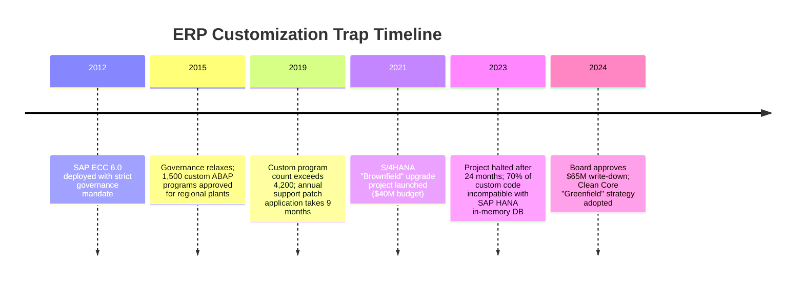
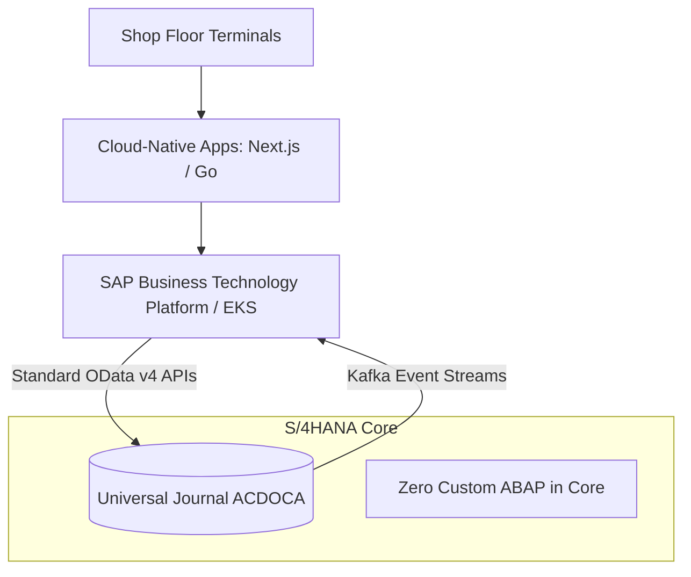

# Case Study: Industrial Manufacturer 10-Year SAP Customization Trap

> **Metadata**: ID: `CS-ENT-04` | Domain: Enterprise Architecture / ERP | Type: Synthetic Forensic Case Study | Complexity: Advanced

---

## 01. Executive Summary
A global heavy-machinery manufacturer customized its core SAP ERP system over a 10-year period with 4,200 bespoke ABAP modifications, 850 custom database tables, and modified core transaction codes. When SAP announced the end-of-life for legacy ECC 6.0, the manufacturer discovered that upgrading to S/4HANA was technically impossible without a $120M ground-up reimplementation. An initial upgrade attempt failed after 24 months, forcing the enterprise to take a $65M technical debt write-down and paralyzing corporate supply chain innovation.

---

## 02. Business & System Context
- **Organization**: Global Heavy Equipment Manufacturer ($14B Annual Revenue).
- **System Role**: Core ERP managing manufacturing BOMs, shop floor routing, inventory, and financials.
- **Scale**: 42 Manufacturing Plants, 12,000 Shop Floor Workers, 180,000 Component SKUs.

---

## 03. Scope & Stakeholders
- **Chief Financial Officer (CFO)**: Mandated financial control and compliance.
- **VP of Supply Chain Operations**: Sponsored custom shop floor scheduling logic.
- **Enterprise ERP Architecture Director**: Responsible for S/4HANA migration feasibility.

---

## 04. Requirements & NFRs
- **Clean Core Compliance**: Standardize on baseline SAP business processes without core codebase modifications.
- **Shop Floor Continuity**: Zero unscheduled manufacturing line halts during core software maintenance.
- **Upgrade Velocity**: Capability to adopt annual SAP feature releases within 6 weeks of release.

---

## 05. Constraints & Assumptions
- **Bespoke Shop Floor Logic**: Plant managers refused to adopt standard SAP production planning, insisting that their plant-specific routing formulas were proprietary competitive IP.

---

## 06. Architecture Before: The Customization Trap
```mermaid
graph TD
    subgraph SAP ECC 6.0 Core (Monolithic)
        StandardSAP[Standard SAP Modules: MM, PP, FICO]
        BespokeABAP[4,200 Custom ABAP Programs]
        CustomTables[850 Z-Tables Directly Joined to Core SAP Tables]
        ModifiedSAP[Overwritten Standard Function Modules]
        
        StandardSAP <--> BespokeABAP
        BespokeABAP <--> CustomTables
        ModifiedSAP <--> StandardSAP
    end
    ShopFloor[Shop Floor Terminals] --> BespokeABAP
```
*Every standard SAP table upgrade broke hundreds of custom Z-programs.*

---

## 07. Architecture Decisions
| Decision | Rationale | Downstream Failure |
| :--- | :--- | :--- |
| **"Give the Business Whatever It Wants"** | IT prioritized short-term business requests over architectural governance. | 10 years of unmanaged code bloat completely coupled the enterprise to an obsolete runtime. |
| **Direct Core Modification** | Faster than building sidecars or external integrations. | Upgrades became mathematically intractable; testing required 18 months of manual regression. |

---

## 08. Timeline


---

## 09. Incident Event
During a dry-run production cutover to test S/4HANA compatibility, the automated code inspector flagged 3,400 syntax errors and broken database joins. Standard core database tables that custom ABAP code queried directly (such as `BSEG` and `BSIS`) had been consolidated into the in-memory `ACDOCA` Universal Journal, completely shattering custom shop-floor scheduling algorithms and halting assembly lines across 6 pilot factories.

---

## 10. Symptoms & Evidence
- **Fact**: 4,200 custom Z-programs, of which 48% had not been executed by any user in over 3 years.
- **Fact**: Applying a standard SAP security patch required an average of 14 weeks of regression testing.
- **Inference**: Extreme software customization destroys operational agility and converts commercial off-the-shelf software into unmaintainable bespoke legacy code.

---

## 11. Failure Forensics
```
[SAP Upgrades ECC Core to S/4HANA]
                │
                ▼
[Database Replaced: Traditional RDBMS ──► In-Memory Columnar HANA]
                │
                ▼
[Consolidation: Tables BSEG, BSIS, COEP Merged into ACDOCA]
                │
                ▼
[3,400 Custom ABAP Z-Programs Relying on Old Indexes Fail to Compile]
                │
                ▼
[Manufacturing Assembly Lines Paralyzed; Cutover Aborted]
```

---

## 12. Root Cause Analysis (5-Whys)
1. **Why did the S/4HANA upgrade fail?** -> Thousands of custom programs failed to compile on the new in-memory data model.
2. **Why were there thousands of custom programs?** -> IT implemented every localized business request directly in ABAP.
3. **Why was it built directly in the ERP core?** -> No decoupled cloud extension platform or integration layer existed.
4. **Why did architecture allow this?** -> The ERP steering committee lacked veto authority over customization requests.
5. **Why was governance absent?** -> Enterprise Architecture was viewed as an advisory rubber-stamp rather than an operational governance checkpoint.

---

## 13. Contributing Factors
- **Technical Debt Amnesia**: Code was added continuously without lifecycle reviews, deprecation plans, or ownership tracking.
- **Vendor Lock-in**: Relying on proprietary ABAP language features prevented the adoption of modern, cloud-agnostic developer tools.

---

## 14. Architecture After: Clean Core & Cloud Sidecars


---

## 15. Recovery & Remediation
- **Clean Core Greenfield Mandate**: Transitioned from an in-place "Brownfield" upgrade to a clean "Greenfield" deployment.
- **Sidecar Extensibility Model**: All legitimate proprietary manufacturing IP was re-engineered as standalone microservices running on Kubernetes, interacting with SAP exclusively through public, stable **OData v4 APIs and Kafka event streams**.
- **Code Retirement**: Permanently retired 3,200 obsolete custom programs without replacement by adopting standard SAP business processes.

---

## 16. Business & Technical Impact
- **Financial**: Wrote off $65M in sunk project costs; saved $18M annually in ongoing regression testing overhead.
- **Upgrade Agility**: Reduced future SAP patch deployment cycles from **14 weeks to 3 days**.
- **Shop Floor Operations**: Standardized manufacturing scheduling across all 42 plants globally.

---

## 17. What Went Well
- The Clean Core strategy eliminated 85% of custom maintenance toil.
- Modern developer teams were able to build shop-floor web applications using modern JavaScript/Go rather than legacy ABAP.

---

## 18. Lessons Learned
- **Architecture**: A COTS/SaaS system customized beyond 15% of its core ceases to function as commercial software and becomes a liability.
- **Strategy**: Keep the core clean. Extend on the outside via event-driven sidecars and standard public APIs.

---

## 19. Architectural Recommendations
| Horizon | Action Item | Owner | Target |
| :--- | :--- | :--- | :--- |
| **Immediate** | Impose absolute freeze on all new custom table creation in ERP | ERP Arch | Zero new Z-tables |
| **90 Days** | Catalog and decommission all custom code with zero executions in 12m | Basis Lead | 40% code reduction |
| **1 Year** | Deploy cloud-native extension sidecar platform on Kubernetes | Lead EA | 100% API integration |
