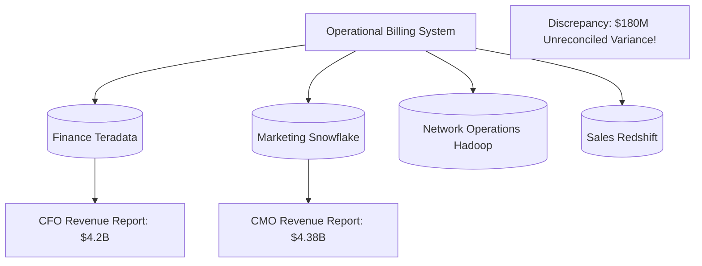
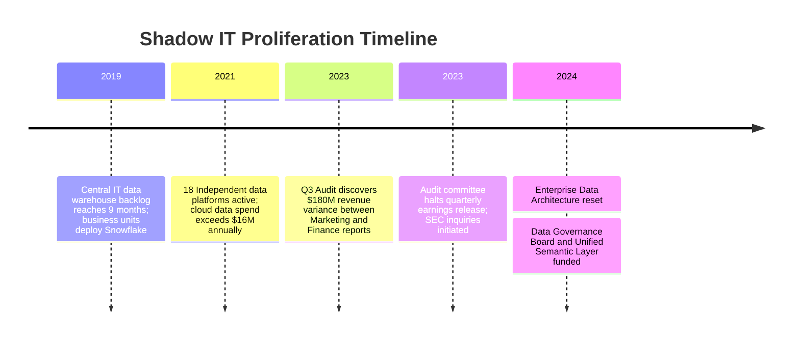
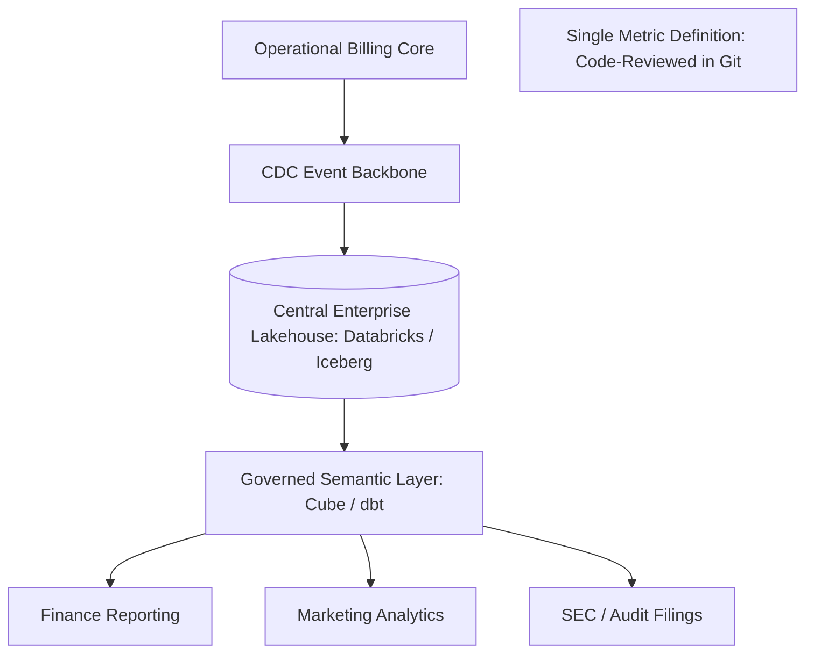

# Case Study: Shadow IT Data Platform Proliferation & Revenue Metric Collapse

> **Metadata**: ID: `CS-ENT-05` | Domain: Enterprise Architecture / Data | Type: Synthetic Forensic Case Study | Complexity: Advanced

---

## 01. Executive Summary
A global telecommunications provider ($22B Annual Revenue) allowed autonomous business units to spin up 18 independent data platforms, data lakes, and Snowflake accounts over a 5-year period. The proliferation of shadow IT created conflicting revenue, churn, and active subscriber metrics across corporate reporting lines. During an earnings audit, the CFO discovered a $180M revenue discrepancy between the Marketing Snowflake warehouse and the Finance Teradata platform, triggering an SEC reporting delay, an external forensic audit, and a $32M emergency data governance consolidation initiative.

---

## 02. Business & System Context
- **Organization**: Telecommunications & Broadband Carrier (45M Subscribers).
- **Core Problem**: 18 separate analytics stacks (Snowflake, Databricks, Redshift, Teradata, Hadoop) calculating core KPIs with disparate business logic.
- **High-Stakes Outcome**: Public quarterly earnings financial restatement risk.

---

## 03. Scope & Stakeholders
- **Chief Financial Officer (CFO)**: Required single authoritative source for revenue numbers.
- **Chief Data Officer (CDO)**: Charged with building a centralized Data Mesh / Lakehouse.
- **Business Unit Analytics Directors**: Defended their local custom metrics and shadow platforms.

---

## 04. Requirements & NFRs
- **Single Source of Truth**: Unified semantic data model across all 45M subscriber records.
- **Data Freshness**: Nightly financial revenue reconciliations completed by 04:00 UTC.
- **Audit Lineage**: 100% column-level lineage tracking from operational source systems to financial statements.

---

## 05. Constraints & Assumptions
- **Frustration with Central IT**: Business units adopted shadow cloud platforms because central IT took 6 months to fulfill a simple reporting request.

---

## 06. Architecture Before: The 18-Platform Data Swamp


---

## 07. Architecture Decisions
| Decision | Rationale | Downstream Failure |
| :--- | :--- | :--- |
| **Unrestricted Cloud Account Creation** | Encouraged business agility and fast experimentation. | Zero data governance; duplicate storage costs ($1.4M/mo); incompatible revenue definitions. |
| **Ad-Hoc ETL Scripts (Shadow IT)** | Avoided waiting for central IT pipeline queues. | 650 unmanaged Python scripts modifying data in flight without version control or documentation. |

---

## 08. Timeline


---

## 09. Incident Event
During external financial audit review for annual SEC 10-K filings, auditors cross-referenced digital broadband recurring revenue reported by marketing against accounts receivable reported by corporate finance. Marketing reported $4.38B based on gross contract value in Snowflake, while Finance reported $4.20B based on GAAP realized cash in Teradata. Neither team could reconcile the $180M variance because the transformation logic was buried in hundreds of undocumented shadow Python cron jobs.

---

## 10. Symptoms & Evidence
- **Fact**: 18 separate analytical data stores containing duplicate customer billing records.
- **Fact**: 650 undocumented ETL cron jobs running under individual developer service accounts.
- **Inference**: Decentralized data engineering without centralized semantic governance produces metric entropy and regulatory peril.

---

## 11. Failure Forensics
```
[Raw Billing Transaction: $100 Subscription with $20 Promotional Discount]
                             │
       ┌─────────────────────┴─────────────────────┐
       ▼                                           ▼
[Finance ETL Pipeline]                     [Marketing Shadow Python Script]
- GAAP Rule: Records Net Revenue ($80)     - Gross Value Rule: Records Gross ($100)
- Applies churn deferrals                  - Ignores cancellation chargebacks
       │                                           │
       ▼                                           ▼
[Finance Teradata: $80]                    [Marketing Snowflake: $100]
       │                                           │
       └─────────────────────┬─────────────────────┘
                             ▼
              [$20 Metric Drift Per Subscriber]
              [Multiplied by 9M Customers = $180M Variance]
```

---

## 12. Root Cause Analysis (5-Whys)
1. **Why was there a $180M revenue discrepancy?** -> Marketing and Finance calculated subscriber revenue using different mathematical formulas.
2. **Why were they using different formulas?** -> Each department owned an independent data warehouse with separate ETL transformation logic.
3. **Why did they build separate data warehouses?** -> Central IT could not deliver analytics capabilities fast enough to support business campaigns.
4. **Why was IT so slow?** -> Central IT operated a rigid, monolithic data team with zero self-service developer tooling.
5. **Why was shadow IT unmanaged?** -> Enterprise Architecture lacked cloud account provisioning controls and enterprise data governance frameworks.

---

## 13. Contributing Factors
- **Absence of a Semantic Layer**: Metrics like "Active Subscriber" and "Net Revenue" were defined in SQL scripts rather than a shared, governed semantic repository.
- **Lack of FinOps Governance**: Cloud spending was dispersed across 14 departmental cost centers with zero centralized visibility.

---

## 14. Architecture After: Governed Enterprise Data Platform


---

## 15. Recovery & Remediation
- **Central Data Governance Council**: Established a shared data modeling team pairing central enterprise architects with embedded domain data stewards.
- **Unified Semantic Layer**: Implemented **dbt and Cube** to define corporate business metrics as version-controlled code in Git. No BI dashboard is permitted to query raw tables directly.
- **Platform Rationalization**: Consolidated 18 platforms down to a single cloud lakehouse architecture using Apache Iceberg, terminating 12 legacy database contracts.

---

## 16. Business & Technical Impact
- **Financial**: Eliminated $14M in redundant annual cloud infrastructure and software licensing fees.
- **Governance**: Achieved 100% automated column-level data lineage, satisfying SEC audit requirements.
- **Metric Integrity**: Reconciled corporate revenue metrics with zero variance between departments.

---

## 17. What Went Well
- The dbt semantic layer allowed business analysts to contribute metric definitions via standard Git pull requests.
- Consolidating data into open table formats (Apache Iceberg) prevented vendor lock-in.

---

## 18. Lessons Learned
- **Architecture**: Decentralized data ownership (Data Mesh) requires centralized semantic governance; otherwise, it degrades into a fragmented data swamp.
- **Service**: If central IT does not provide self-service platforms, the business will build shadow IT to survive.

---

## 19. Architectural Recommendations
| Horizon | Action Item | Owner | Target |
| :--- | :--- | :--- | :--- |
| **0-30 Days** | Enforce SSO & cloud account provisioning approval gates | Cloud Sec Lead | Zero unapproved clouds |
| **90 Days** | Implement dbt semantic metrics for Top-20 corporate KPIs | Lead Data Arch| 100% metric alignment |
| **1 Year** | Decommission remaining legacy departmental data platforms | CDO | 60% TCO reduction |
