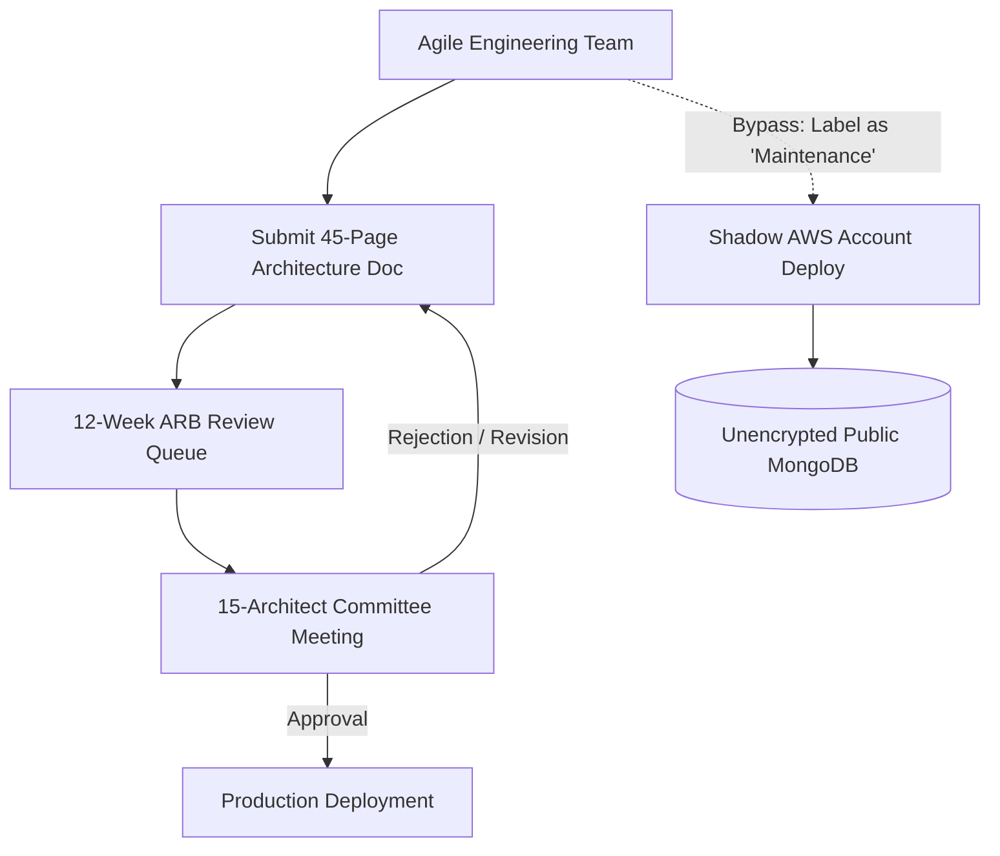
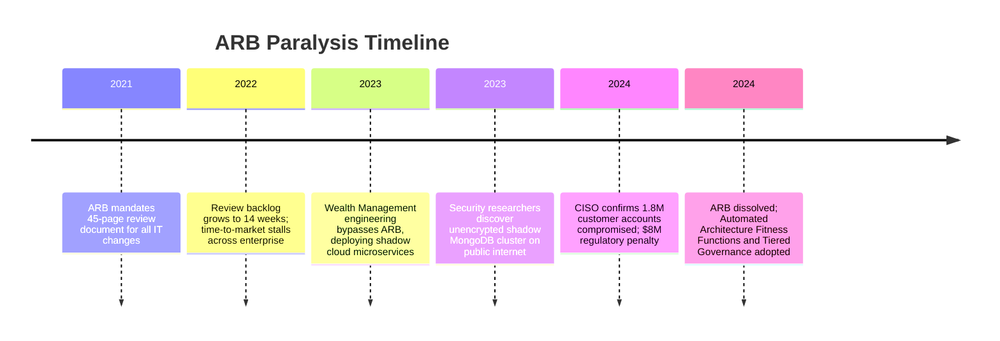

# Case Study: Architecture Review Board Paralysis & Governance Bypass Crisis

> **Metadata**: ID: `CS-ENT-06` | Domain: Enterprise Architecture / Governance | Type: Synthetic Forensic Case Study | Complexity: Advanced

---

## 01. Executive Summary
A global financial services firm instituted a centralized, bureaucratic Architecture Review Board (ARB) requiring a 45-page document submission and a 12-week review queue for any software architecture change. Paralyzed by the backlog, engineering teams systematically bypassed the ARB by breaking major initiatives into micro-projects labeled as "minor maintenance" and deploying unvetted public cloud microservices and databases. The governance bypass remained undetected until an unreviewed, unencrypted MongoDB database was exposed to the public internet, leaking 1.8M customer records and resulting in an $8M regulatory fine.

---

## 02. Business & System Context
- **Organization**: Financial Services & Wealth Management Firm ($6B Annual Revenue).
- **Governance Model**: Classical centralized ARB meeting weekly with 15 voting senior architects.
- **Outcome**: Governance gridlock, shadow cloud deployments, and major security breach.

---

## 03. Scope & Stakeholders
- **Chief Enterprise Architect**: Defended the rigorous 45-page compliance review process.
- **Engineering Directors**: Struggling to meet aggressive competitive product launch deadlines.
- **Chief Information Security Officer (CISO)**: Caught between governance mandates and breach fallout.

---

## 04. Requirements & NFRs
- **Architecture Compliance**: 100% adherence to corporate security, data privacy, and reliability standards.
- **Review Cycle Time**: Architecture decisions approved in $< 5\text{ business days}$.
- **Developer Velocity**: Bi-weekly production release cadences supported without manual governance stalls.

---

## 05. Constraints & Assumptions
- **Waterfall Mindset in Cloud World**: The ARB operated on quarterly waterfall review cadence while engineering teams were mandated to operate using two-week agile sprints.

---

## 06. Architecture Before: The Bureaucratic Chokepoint


---

## 07. Architecture Decisions
| Decision | Rationale | Downstream Failure |
| :--- | :--- | :--- |
| **Universal 45-Page Architecture Document** | Ensure exhaustive review of all technical risks. | High friction caused engineering teams to actively circumvent governance. |
| **All Decisions Voted by Single Central Board** | Maintain strict consistency across all corporate software. | Total bottleneck: 15 architects reviewing 200+ projects/year led to rubber-stamping or multi-month delays. |

---

## 08. Timeline


---

## 09. Incident Event
To meet a strict marketing deadline for a new wealth management advisory mobile app, the engineering team categorized the project as "Routine API Maintenance" to bypass the 14-week ARB queue. The team provisioned a standalone AWS account using a departmental credit card and deployed an open-source MongoDB instance without VPC isolation, TLS encryption, or authentication. Within 72 hours of going live, an automated malicious internet scanner discovered the open database port 27017 and exfiltrated 1.8M customer tax identifiers and account balances.

---

## 10. Symptoms & Evidence
- **Fact**: Average ARB approval turnaround time was 78 calendar days.
- **Fact**: 64% of production code deployments in 2023 were classified as "minor maintenance" to avoid ARB review.
- **Inference**: Excessive governance friction does not reduce risk; it drives risk into the shadows.

---

## 11. Failure Forensics
```
[Agile Team Faces 14-Week ARB Queue vs. 6-Week Business Deadline]
                               │
                               ▼
[Decision: Bypass Governance by Claiming "Routine Maintenance"]
                               │
                               ▼
[Provision Shadow AWS Account with Credit Card]
                               │
                               ▼
[Deploy MongoDB Without Authentication or VPC Peering]
                               │
                               ▼
[Automated Shodan Scanner Identifies Exposed Port 27017]
                               │
                               ▼
[1.8M Records Exfiltrated; $8M Fine Imposed]
```

---

## 12. Root Cause Analysis (5-Whys)
1. **Why was customer data leaked?** -> An unencrypted MongoDB database was exposed directly to the public internet without credentials.
2. **Why was it configured insecurely?** -> It was deployed in an unmanaged shadow cloud account lacking enterprise security guardrails.
3. **Why was it deployed in a shadow account?** -> The engineering team bypassed the corporate IT architecture process.
4. **Why did they bypass the process?** -> The ARB review queue took 14 weeks, which would have caused them to miss their contractual product launch.
5. **Why did the ARB take 14 weeks?** -> Governance relied on manual document reviews by a single centralized committee rather than automated policy-as-code guardrails.

---

## 13. Contributing Factors
- **Compliance Theater**: The ARB produced an illusion of control while 60%+ of actual engineering changes occurred outside its visibility.
- **Missing Automated Guardrails**: The enterprise lacked AWS Organizations / Azure Policy service control policies (SCPs) preventing the creation of unmanaged cloud accounts.

---

## 14. Architecture After: Automated Governance as Code
```mermaid
graph TD
    DevTeam[Agile Engineering Team] --> Git[Git Repository]
    Git --> CI[CI/CD Pipeline]
    
    subgraph Automated Governance (Zero Wait Time)
        CI --> Guardrails[Policy-as-Code: Open Policy Agent / Checkov]
        CI --> Fitness[Architectural Fitness Functions]
        CI --> CloudGuard[AWS Service Control Policies: Enforce Encryption]
    end
    
    Guardrails -->|Tier 1 (Low Risk): Auto-Approved| Deploy[Production Deployment]
    Guardrails -->|Tier 3 (High Risk): Async Review| ArchReview[Targeted Peer Architecture Review]
```

---

## 15. Recovery & Remediation
- **Dissolved Monolithic ARB**: Replaced the single 15-person committee with **Federated Architecture Guilds** embedded inside business units.
- **Tiered Risk Governance**:
  - *Tier 1 (Low Risk / Standard Tech)*: 100% automated approval via CI/CD Policy-as-Code checks ($< 10\text{ minutes}$).
  - *Tier 2 (Moderate Risk)*: Async peer review by embedded lead architect ($< 48\text{ hours}$).
  - *Tier 3 (High Risk / Strategic Pivot)*: Focused 1-hour architecture consultation.
- **Automated Guardrails**: Implemented AWS Service Control Policies (SCPs) mathematically preventing any database from being launched without encryption or with public 0.0.0.0/0 routing.

---

## 16. Business & Technical Impact
- **Security**: 100% of cloud resources now provisioned inside managed landing zones with enforced encryption.
- **Velocity**: Average architecture approval time dropped from **78 days to 4 hours** (95% automated).
- **Engagement**: Developer Net Promoter Score (NPS) regarding architecture teams increased from -42 to +58.

---

## 17. What Went Well
- The incident catalyzed a complete transformation of enterprise architecture from an obstructionist gatekeeper into an enabler of automated guardrails.
- Cloud security policies successfully prevented future shadow accounts.

---

## 18. Lessons Learned
- **Architecture**: Governance that cannot keep pace with delivery velocity will be routed around like damage.
- **Modern EA Standard**: Modern enterprise architecture is not a committee that reviews documents; it is an engineering platform that enforces guardrails as code.

---

## 19. Architectural Recommendations
| Horizon | Action Item | Owner | Target |
| :--- | :--- | :--- | :--- |
| **Immediate** | Replace 45-page template with 2-page lightweight Architecture Decision Record (ADR) | Chief Arch | 90% doc reduction |
| **60 Days** | Deploy Open Policy Agent (OPA) / Conftest guardrails in all CI/CD pipelines | Platform Lead | 100% automated checks |
| **6 Months** | Establish embedded domain architect rotation across agile pods | VP Eng | Zero governance bypasses |
