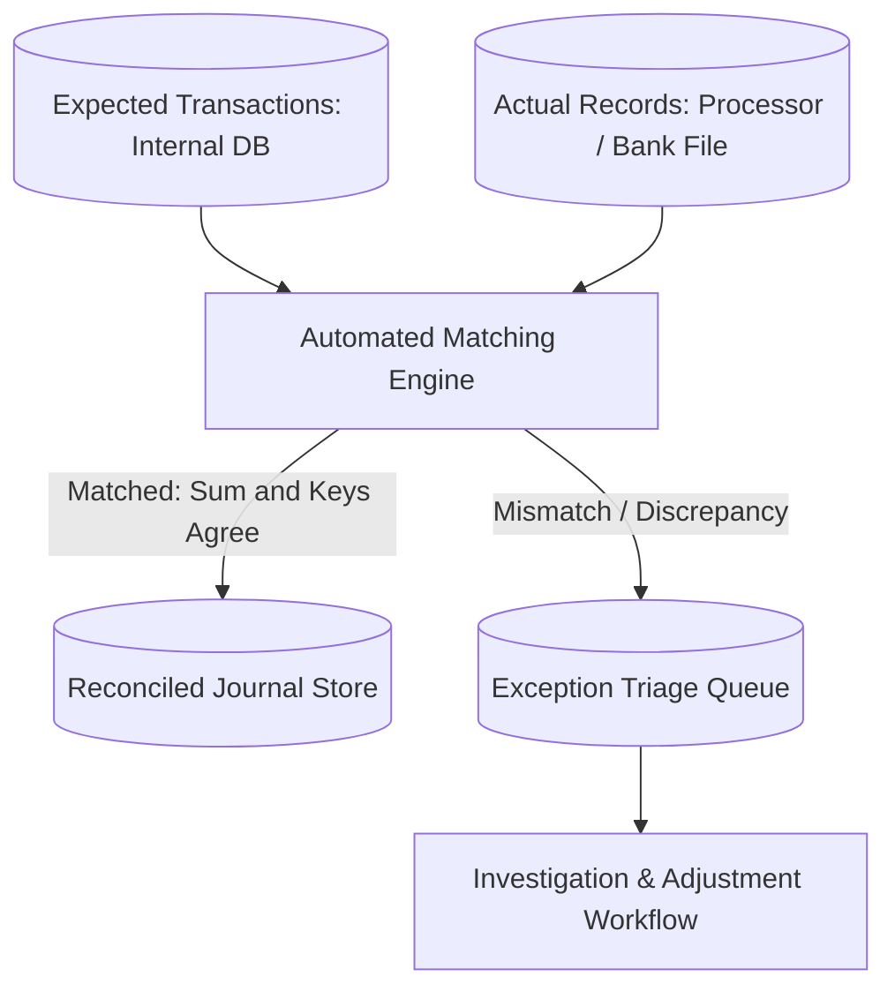

# Financial Case Study: Interchange-Plus Gateway Fee Audit & Reconciliation

## 1. Executive Summary & Problem Context
Auditing processor transaction fee invoices against contractual interchange-plus pricing models, detecting $850k in billing overcharges over two fiscal quarters.

---

## 2. Reconciliation & Matching Flow

---

## 3. Key Decisions & Measurable Financial Outcomes
- **Financial Accuracy**: Auto-match rates increased to >99.5%, reducing manual operational investigation overhead by >80%.
- **Discrepancy Remediation**: Elimination of revenue leakage from undetected processor overbilling and uncaptured orders.
- **Audit Compliance**: Complete, immutable audit trails established for external financial auditors (SOX, SOC1).
