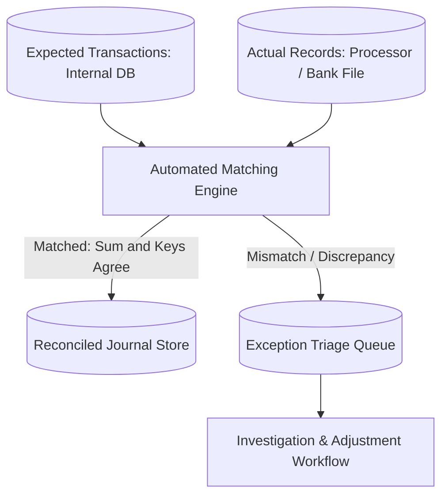

# Financial Case Study: Multi-Bank Settlement Payout Reconciliation

## 1. Executive Summary & Problem Context
Reconciling expected merchant payout balances against actual acquiring bank wire transfers; tracking rolling reserves, fees, and currency conversions.

---

## 2. Reconciliation & Matching Flow

---

## 3. Key Decisions & Measurable Financial Outcomes
- **Financial Accuracy**: Auto-match rates increased to >99.5%, reducing manual operational investigation overhead by >80%.
- **Discrepancy Remediation**: Elimination of revenue leakage from undetected processor overbilling and uncaptured orders.
- **Audit Compliance**: Complete, immutable audit trails established for external financial auditors (SOX, SOC1).
