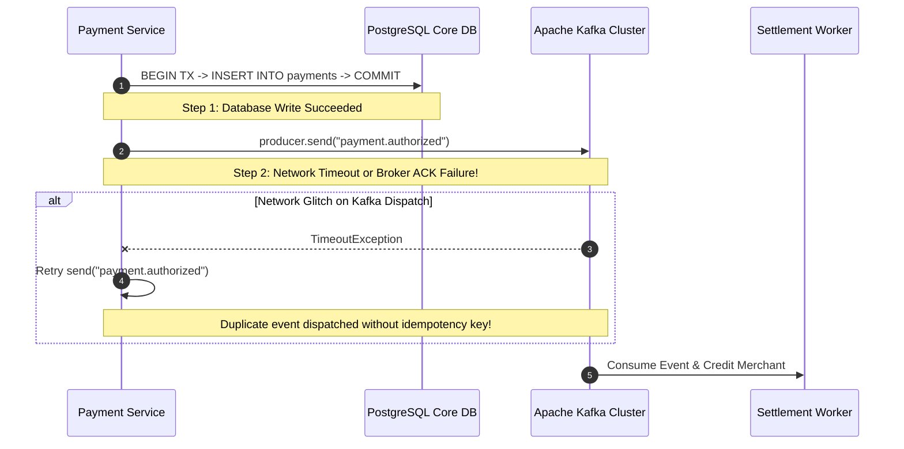

# Case Study: Dual-Write Ghost Payments & Ledger Desynchronization

> **Metadata**: ID: `CS-INT-01` | Domain: Enterprise Integration / Fintech | Type: Synthetic Forensic Case Study | Complexity: Advanced

---

## 01. Executive Summary
A digital neobank processing 15M daily card transactions experienced severe ledger desynchronization resulting in $4.2M in duplicate payments and phantom account debits. The failure occurred because the payment service executed a classic **Dual-Write Anti-Pattern**: committing a transaction to a local PostgreSQL database and subsequently publishing a payment event to an Apache Kafka cluster without an atomic boundary. When Kafka brokers suffered network packet loss, database transactions remained committed while event dispatches failed or were aggressively retried, creating irreconcilable ghost payments across external clearing networks.

---

## 02. Business & System Context
- **Organization**: High-Growth Digital Neobank (6.5M Retail Accounts).
- **Core Workflow**: Real-time card transaction processing and automated merchant settlement.
- **Scale**: 850 peak transaction requests per second (TPS).
- **Impact**: Customers saw funds debited twice, while merchant settlement accounts were over-credited by millions.

---

## 03. Scope & Stakeholders
- **Incident Commander**: Lead Payments Architect.
- **Key Teams**: Core Ledger Team, Event Streaming Infrastructure, Card Network SRE, Financial Operations.
- **External Dependencies**: Visa Debit Processing Rail, AWS Managed Streaming for Kafka (MSK).

---

## 04. Requirements & NFRs
- **Payment Processing Latency**: P99 $< 150\text{ ms}$.
- **Financial Consistency**: Exactly-once financial outcome; zero ledger drift ($\sum \text{Debits} == \sum \text{Credits}$).
- **Availability**: 99.999% availability for debit card authorizations.

---

## 05. Constraints & Assumptions
- **Original Assumption**: The engineering team assumed that network dispatches to a local Kafka cluster within the same cloud region had a $< 0.001\%$ failure rate, rendering atomic outbox patterns "premature optimization."

---

## 06. Architecture Before: The Dual-Write Hazard


---

## 07. Architecture Decisions
| Decision | Rationale | Failure Mode |
| :--- | :--- | :--- |
| **Dual Write in Application Code** | Simple to implement; avoided managing an outbox table or CDC tool. | Fundamentally non-atomic: either DB commits and Kafka fails, or Kafka publishes and DB crashes before commit. |
| **Automatic Client Retries without Deduplication** | Prevented message loss during brief network hiccups. | Generated duplicate event publications whenever broker ACKs were lost in flight. |

---

## 08. Timeline
```mermaid
timeline
    title Ghost Payments Incident Timeline
    14:15 UTC : AWS Availability Zone interconnect experiences 2% packet loss
    14:18 UTC : Kafka producers begin throwing RequestTimeoutException on acks=all
    14:22 UTC : Application retry loops flood Kafka with duplicate messages
    14:45 UTC : Customer support inundated with calls reporting duplicate card charges
    15:10 UTC : Financial operations halts merchant settlement batch processing
    16:30 UTC : Database reconciliation reveals 18,400 duplicate payment events
    22:00 UTC : Custom drift repair script deployed to reverse phantom debits
```

---

## 09. Incident Event
During a routine AWS cross-AZ network degradation lasting 12 minutes, TCP latency between application pods and Kafka brokers spiked from 1.2ms to 450ms. Application producer threads configured with a 300ms timeout aborted their dispatches, even though Kafka brokers had already committed the records to partition logs. The application code caught the timeout exception, assumed the message was lost, and retried the entire business operation, causing multiple debit events for a single database purchase.

---

## 10. Symptoms & Evidence
- **Fact**: Kafka topic partition offsets advanced by 34,000 records while PostgreSQL sequence numbers advanced by only 15,600.
- **Fact**: 18,400 customer accounts had double holds placed on their balances.
- **Inference**: Distributed state cannot be kept in sync through sequential synchronous API or network calls.

---

## 11. Failure Forensics
```
[Client Card Swiped for $50.00]
              │
              ▼
[Postgres DB commits: Account -$50.00] (Success)
              │
              ▼
[Producer sends event to Kafka broker]
              │
  ┌───────────┴───────────┐
  ▼                       ▼
[Broker writes record]   [ACK lost in network degradation]
                          │
                          ▼
            [App throws TimeoutException]
                          │
                          ▼
            [App catches error and retries]
                          │
                          ▼
            [Duplicate event written to Kafka]
                          │
                          ▼
[Settlement Worker consumes BOTH events -> Disburses $100.00 to Merchant]
```

---

## 12. Root Cause Analysis (5-Whys)
1. **Why were merchants paid twice?** -> Downstream settlement workers processed duplicate payment events from Kafka.
2. **Why were duplicate events published?** -> The payment service retried message dispatch upon receiving a network timeout.
3. **Why did the timeout occur if the message was written?** -> The Kafka broker committed the write, but the acknowledgement packet was dropped by the network.
4. **Why was the application managing DB and Kafka writes separately?** -> The system used the Dual-Write pattern instead of the Transactional Outbox pattern.
5. **Why was the Outbox pattern not implemented?** -> Architecture guidelines lacked a mandatory standard for distributed transactional boundaries.

---

## 13. Contributing Factors
- **Kafka Producer Configuration**: `enable.idempotence` was set to `false`, allowing duplicate writes on network retries.
- **Downstream Consumer Blindness**: The settlement service blindly trusted all incoming Kafka events without verifying event IDs against an idempotency database.

---

## 14. Architecture After: Transactional Outbox Pattern
```mermaid
graph TD
    Client[Card Swiped] --> PaymentSvc[Payment Service]
    
    subgraph PostgreSQL Database (Single Atomic ACID Transaction)
        PaymentSvc -->|1. Write Payment| PayTable[(Payments Table)]
        PaymentSvc -->|2. Write Outbox| OutboxTable[(Transactional Outbox)]
    end
    
    OutboxTable -->|Log-Based CDC: Debezium| Kafka[Kafka Event Mesh]
    Kafka -->|Idempotent Consumer| SettleSvc[Settlement Service]
    SettleSvc --> SettleDB[(Idempotency Key Store)]
```

---

## 15. Recovery & Remediation
- **Immediate Mitigation**: Halted settlement batch runs; ran an emergency deduplication script grouping events by transaction reference ID.
- **Permanent Architectural Fix**: Implemented the **Transactional Outbox Pattern** using **Debezium CDC**. Application code only writes to PostgreSQL; Debezium reads the PostgreSQL Write-Ahead Log (WAL) and guarantees exactly-once publication to Kafka.
- **Idempotent Consumers**: Configured downstream consumers with unique `idempotency_key` constraints in their databases.

---

## 16. Business & Technical Impact
- **Direct Financial Impact**: $4.2M in over-settled funds required 14 days of manual interbank clawbacks ($180k unrecoverable).
- **Customer Trust**: 4,200 customers experienced overdrafts, triggering $65k in fee refunds and reputational harm.
- **Architecture Standard**: The Transactional Outbox was codified as a non-negotiable architectural tier for all financial services.

---

## 17. What Went Well
- Database transaction logs provided an immutable audit trail allowing full mathematical recovery of the true ledger state.
- Financial operations responded within 35 minutes to halt automated bank transfers.

---

## 18. Lessons Learned
- **Architecture Axiom**: Dual writes across separate network boundaries are a mathematical impossibility if consistency is required.
- **Idempotency**: Every event consumer in an asynchronous architecture must be unconditionally idempotent.

---

## 19. Architectural Recommendations
| Horizon | Action Item | Owner | Target |
| :--- | :--- | :--- | :--- |
| **Immediate** | Enable `enable.idempotence=true` on all Kafka producers across enterprise | Platform Lead | Zero producer dupes |
| **30 Days** | Migrate all financial microservices to Transactional Outbox | Lead Architect | 100% atomic outbox |
| **90 Days** | Implement automated daily reconciliation across all ledgers | Data Arch | Automatic drift detection |
