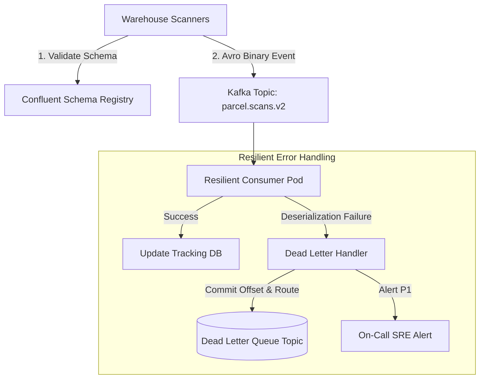

# Case Study: Kafka Poison Pill Consumer Freeze in Nationwide Logistics

> **Metadata**: ID: `CS-INT-02` | Domain: Enterprise Integration / Logistics | Type: Synthetic Forensic Case Study | Complexity: Advanced

---

## 01. Executive Summary
A nationwide parcel delivery network ($8B Annual Revenue) experienced a 9-hour total freeze of its real-time package tracking platform, impacting 14 million active parcel deliveries. A newly deployed warehouse scanning service emitted a JSON event containing an unexpected numeric string in a date field (`"timestamp": 1711928345000` instead of ISO-8601 string `"2024-03-31T14:19:05Z"`). Downstream consumer pods crashed on unhandled deserialization exceptions, re-fetched the exact same uncommitted message upon restart, and entered an infinite crash loop (**Poison Pill Anti-Pattern**), completely blocking all partition processing across 32 Kafka consumer groups.

---

## 02. Business & System Context
- **Organization**: Tier-1 Freight & Logistics Carrier.
- **System Purpose**: Ingesting real-time parcel barcode scans from 450 sorting hubs to update customer tracking pages.
- **Scale**: 35,000 barcode scan events per second across 64 Kafka topic partitions.

---

## 03. Scope & Stakeholders
- **Incident Commander**: Lead Integration Architect.
- **Key Teams**: Warehouse Edge Engineering, Stream Processing Team, Tracking Portal SRE.
- **Customer Impact**: Millions of enterprise shippers unable to track time-sensitive pharmaceutical and retail shipments.

---

## 04. Requirements & NFRs
- **Event Processing Latency**: P99 $< 2.0\text{ seconds}$ from physical scan to consumer web portal update.
- **Stream Resiliency**: Zero-downtime event processing; single malformed message must never halt cluster throughput.

---

## 05. Constraints & Assumptions
- **Absence of Schema Registry**: The enterprise utilized raw JSON over Kafka without Confluent Schema Registry or Avro/Protobuf contract validation.

---

## 06. Architecture Before
```mermaid
graph TD
    Hub[450 Warehouse Hub Scanners] --> IngressAPI[Scan Ingress Service]
    IngressAPI --> KafkaTopic[Kafka Topic: parcel.scans.v1]
    
    subgraph Consumer Group (Crash Loop Trap)
        KafkaTopic --> Consumer1[Tracking Consumer Pod 1]
        Consumer1 -->|Unmarshal Fails!| Crash[Pod Crash & Restart]
        Crash -->|Reconnect & Re-read Same Offset| Consumer1
    end
```

---

## 07. Architecture Decisions
| Decision | Rationale | Failure Mode |
| :--- | :--- | :--- |
| **JSON Schemas Without Registry** | Low barrier to entry; allowed edge devices to deploy quickly without schema compilation. | No contract enforcement; producer deployed breaking type changes directly to production. |
| **Fail-Stop Consumer Error Handling** | "Never drop an event" philosophy dictated crashing the thread on parsing errors. | Single bad record halted the entire partition pipeline for millions of valid records behind it. |

---

## 08. Timeline
```mermaid
timeline
    title Poison Pill Incident Timeline
    08:00 UTC : Dallas sorting hub deploys v2.4.1 firmware to 1,200 barcode scanners
    08:04 UTC : First scan with integer epoch timestamp published to partition 12
    08:05 UTC : Consumer Pod 3 crashes with Jackson `MismatchedInputException`
    08:06 UTC : Kubernetes restarts pod; pod re-reads offset 849201; crashes immediately
    08:15 UTC : All 16 tracking consumer replicas enter CrashLoopBackOff state
    09:30 UTC : Kafka consumer lag exceeds 12 Million unread messages
    14:00 UTC : Emergency patch deployed injecting Dead Letter Queue (DLQ) error handler
    17:00 UTC : Consumer lag cleared; tracking portal returns to real-time status
```

---

## 09. Incident Event
At 08:00 UTC, a routine scanner firmware update in the Dallas sorting facility altered the barcode payload serialization logic, outputting epoch timestamps as 64-bit integers instead of ISO-8601 strings. The tracking consumer application, built with Java and Jackson ObjectMapper, attempted to parse the integer into a `java.time.Instant` using a strict string deserializer. The unhandled exception killed the worker thread before committing the offset. Kubernetes restarted the pod, which immediately re-read the exact same uncommitted offset, reproducing the crash ad infinitum.

---

## 10. Symptoms & Evidence
- **Fact**: Kubernetes pod restart count climbed to 1,420 restarts across all consumer replicas.
- **Fact**: Prometheus metric `kafka_consumergroup_lag` grew linearly at 35,000 messages/sec, reaching 12.8M.
- **Inference**: A single poison pill in a partitioned queue produces complete head-of-line blocking for that partition.

---

## 11. Failure Forensics
```
[Dallas Scanner publishes: {"timestamp": 1711928345000}] (Offset: 849201)
                             │
                             ▼
              [Kafka Partition 12 Log]
                             │
                             ▼
         [Consumer Pod reads Offset 849201]
                             │
                             ▼
   [Jackson Deserializer: MismatchedInputException]
                             │
                             ▼
         [Thread Dies -> Offset NOT Committed]
                             │
                             ▼
           [Kubernetes Restarts Pod (CrashLoop)]
                             │
                             ▼
  [Pod Re-reads Offset 849201 -> REPEAT CRASH INFINITELY]
```

---

## 12. Root Cause Analysis (5-Whys)
1. **Why did package tracking halt?** -> Consumer pods were stuck in an infinite restart crash loop.
2. **Why were they restarting?** -> The deserializer threw an unhandled runtime exception on a malformed timestamp.
3. **Why did the pod not skip the message?** -> The consumer lacked a Dead Letter Queue (DLQ) error handler.
4. **Why was a malformed message published?** -> A warehouse firmware update changed the serialization format without backward compatibility testing.
5. **Why was this change permitted?** -> The organization lacked a central Schema Registry enforcing contract compatibility before message publication.

---

## 13. Contributing Factors
- **Missing Circuit Breaking**: Consumers did not separate the deserialization phase from the business processing phase.
- **Lack of Schema Validation in CI/CD**: Firmware builds were not verified against contract compatibility test suites.

---

## 14. Architecture After: Resilient Consumer with Schema Registry & DLQ


---

## 15. Recovery & Remediation
- **Immediate Mitigation**: SREs manually advanced the consumer offset past the offending message using `kafka-consumer-groups --reset-offsets --to-offset 849202`.
- **Permanent Architectural Fix**: Wrapped the deserializer in a `SeekToCurrentErrorHandler` with a dedicated **Dead Letter Queue (DLQ)**. Any unparseable message is immediately routed to `parcel.scans.dlq` with full diagnostic headers, the partition offset is committed, and downstream processing continues unimpeded.
- **Contract Enforcement**: Standardized on **Apache Avro** with **Confluent Schema Registry** enforcing `BACKWARD` compatibility.

---

## 16. Business & Technical Impact
- **Operational Impact**: 14M packages went un-tracked for 9 hours, creating massive call center overload (38,000 inbound escalations).
- **Technical Metrics**: Consumer recovery pipeline processed 12.8M lagged messages in 3 hours post-fix.
- **Engineering Governance**: Schema Registry integration made mandatory for all Kafka topics company-wide.

---

## 17. What Went Well
- Kafka cluster brokers remained completely healthy; data was safely persisted in partition logs without loss.
- The manual offset advancement script allowed partial recovery while the code fix was compiled and tested.

---

## 18. Lessons Learned
- **Architecture**: A message consumer that crashes on deserialization is a denial-of-service vulnerability waiting to be triggered.
- **Contract First**: Event schemas are APIs. Publishing un-governed JSON into a multi-consumer enterprise event mesh is an architectural anti-pattern.

---

## 19. Architectural Recommendations
| Horizon | Action Item | Owner | Target |
| :--- | :--- | :--- | :--- |
| **Immediate** | Deploy DLQ error-handling wrappers across all Kafka consumer services | Stream Team | Zero crash-loop freezes |
| **60 Days** | Deploy Schema Registry and migrate Top-10 critical topics to Avro | Lead EA | 100% contract validation |
| **6 Months** | Implement automated contract breaking-change detection in CI pipelines | DevOps Lead | Zero unvetted schema updates |
