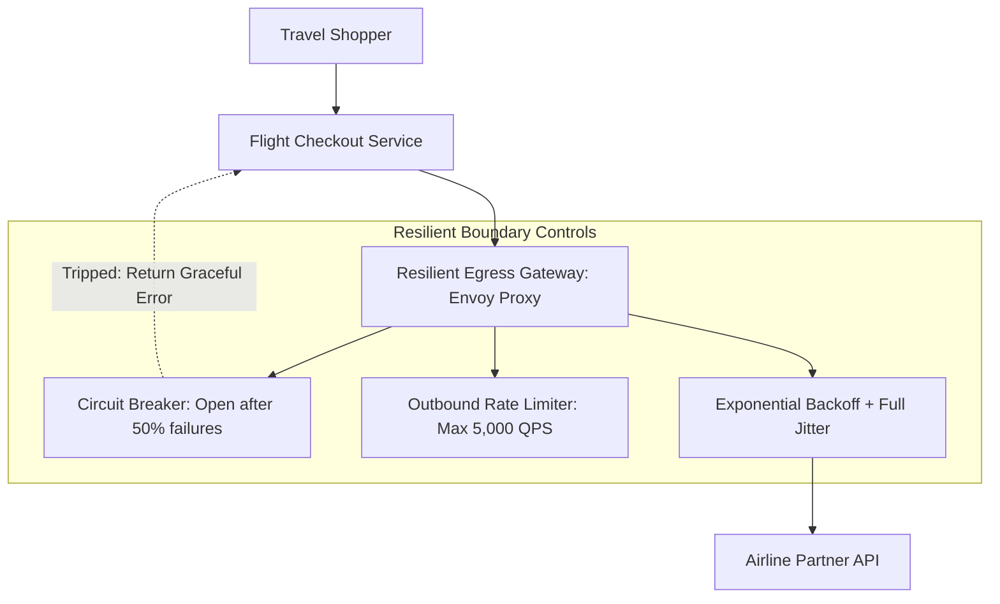

# Case Study: Travel Booking Engine Meltdown from Unbounded Partner API Retries

> **Metadata**: ID: `CS-INT-03` | Domain: Enterprise Integration / Travel | Type: Synthetic Forensic Case Study | Complexity: Advanced

---

## 01. Executive Summary
A global Online Travel Agency (OTA) processing 250,000 daily airline bookings suffered an 8-hour total booking outage during a holiday travel rush. A transient 3-second database hiccup at a major airline partner triggered automated, immediate retries across 800 microservice worker pods. Because the retry logic lacked **exponential backoff, jitter, and circuit breaking**, the retry traffic exploded by 800% (a self-inflicted **Retry Storm**), flooding the partner's API with 32,000 requests/sec. The partner's edge firewalls blacklisted the OTA's entire IP range, paralyzing flight booking operations and costing $3.8M in lost gross commissions.

---

## 02. Business & System Context
- **Organization**: Global Online Travel Agency ($5B Annual GMV).
- **System Purpose**: Real-time flight search, price quotation, seat reservation, and ticketing via Global Distribution Systems (GDS) and airline direct-connect APIs.
- **Scale**: Baseline search traffic: 4,000 requests/sec; Booking checkout traffic: 120 checkouts/sec.

---

## 03. Scope & Stakeholders
- **Incident Commander**: Principal Platform Architect.
- **Key Teams**: Flight Booking Service Team, Edge Infrastructure Team, Partner Integration Engineering.
- **External Dependencies**: Airline Partner Direct-Connect API (Amadeus / Sabre / Airline Ingress).

---

## 04. Requirements & NFRs
- **Booking SLA**: Complete end-to-end flight ticket issuance within $< 5.0\text{ seconds}$.
- **Resilience Standard**: Partner API unavailability must gracefully degrade without cascading into local service failure.

---

## 05. Constraints & Assumptions
- **Flawed Client Configuration**: Developers configured HTTP clients with `max_retries = 5`, `timeout = 1000ms`, and `retry_delay = 0ms` (immediate retry).

---

## 06. Architecture Before: The Retry Storm Trap
```mermaid
graph TD
    Client[Travel Shopper] --> CheckoutSvc[Flight Checkout Service (800 Pods)]
    
    subgraph Self-Inflicted Amplification
        CheckoutSvc -->|Call 1 (Timeout 1s)| PartnerAPI[Airline Partner API]
        PartnerAPI -. 503 / Timeout .-> CheckoutSvc
        CheckoutSvc -->|Immediate Retry 2| PartnerAPI
        CheckoutSvc -->|Immediate Retry 3| PartnerAPI
        CheckoutSvc -->|Immediate Retry 4| PartnerAPI
        CheckoutSvc -->|Immediate Retry 5| PartnerAPI
    end
    
    PartnerAPI --> WAF[Partner Cloudflare / Akamai WAF]
    WAF -->|Traffic Exceeds 30k QPS: Rate Limit 429 & IP Blacklist!| Drop[Blackhole All Traffic]
```

---

## 07. Architecture Decisions
| Decision | Rationale | Failure Mode |
| :--- | :--- | :--- |
| **Aggressive Immediate Retries** | "Never lose a flight sale due to a minor glitch." | Traffic amplification factor of $5x$ during downstream latency; converts minor hiccups into catastrophic outages. |
| **No Circuit Breaker Pattern** | Feared false-positive trips would prematurely block sales. | Zero traffic shedding; pods hammered dead partner until partner IP-banned the enterprise. |

---

## 08. Timeline
```mermaid
timeline
    title Retry Storm Incident Timeline
    18:00 UTC : Airline partner experiences transient DB lock; latency rises from 200ms to 1,200ms
    18:01 UTC : 800 OTA booking pods time out at 1,000ms and fire 5 immediate retries
    18:03 UTC : Outbound request volume surges from 4,000 QPS to 32,000 QPS
    18:05 UTC : Partner WAF detects DDoS-like traffic profile; automatically drops OTA IP range
    18:10 UTC : All flight checkouts fail globally with HTTP 403 Forbidden
    21:30 UTC : OTA engineering deploys emergency hotfix removing aggressive retries
    02:00 UTC : Airline partner security team whitelists OTA IP range; service restored
```

---

## 09. Incident Event
At 18:00 UTC, the airline partner experienced a brief 3-second database lock contention that pushed API response times above 1,000ms. The OTA booking pods, configured with a rigid 1-second timeout, aborted in-flight requests and immediately launched 5 back-to-back retries without delay. Multiplied across thousands of concurrent shoppers, outbound request volume exploded from 4,000 QPS to 32,000 QPS within 120 seconds. The airline partner's automated edge protection classified the surge as a volumetric DDoS attack and blacklisted the OTA's egress CIDR blocks.

---

## 10. Symptoms & Evidence
- **Fact**: Outbound network egress traffic to airline partner surged by 800% within 2 minutes.
- **Fact**: Partner API returned HTTP 403 Forbidden for 8 continuous hours.
- **Inference**: In distributed architectures, client retry logic without backoff acts as an internal denial-of-service weapon.

---

## 11. Failure Forensics
```
[Airline Partner experiences 3-second latency spike]
                           │
                           ▼
     [OTA HTTP Client reaches 1,000ms timeout]
                           │
  ┌────────────────────────┴────────────────────────┐
  ▼                                                 ▼
[Request 1 Fails] ──(0ms delay)──► [Request 2 Fails] ──(0ms delay)──► [Request 3...]
                                                    │
                                                    ▼
                     [800 Pods x 5 Retries = 32,000 QPS Storm]
                                                    │
                                                    ▼
                     [Airline WAF: Volumetric Attack Flagged]
                                                    │
                                                    ▼
                     [OTA Egress IPs Blacklisted for 8 Hours]
```

---

## 12. Root Cause Analysis (5-Whys)
1. **Why was the booking engine down for 8 hours?** -> The airline partner's WAF blacklisted the OTA's IP addresses.
2. **Why were the IPs blacklisted?** -> Outbound request volume reached 32,000 QPS, triggering DDoS defense rules.
3. **Why did request volume surge to 32,000 QPS?** -> Client HTTP libraries executed 5 immediate retries per failed call.
4. **Why was there no backoff or jitter?** -> Developers hardcoded a loop without exponential backoff algorithms.
5. **Why was this permitted into production?** -> Integration standards did not enforce circuit breaking or client resiliency governance.

---

## 13. Contributing Factors
- **Synchronous Coupling**: The booking flow held synchronous HTTP connections open from user browser down to external airline partner.
- **Absence of Rate Limiting**: The OTA lacked an outbound egress gateway to enforce traffic shaping toward partner rate limits.

---

## 14. Architecture After: Resilient Egress Gateway with Circuit Breakers


---

## 15. Recovery & Remediation
- **Immediate Mitigation**: Scaled down all booking worker pods to zero to halt the traffic storm; negotiated IP unblocking with airline security.
- **Permanent Architectural Fix**:
  - Implemented **Exponential Backoff with Full Jitter**:
    $$\text{Delay} = \text{random}(0, \min(\text{max\_delay}, \text{base} \times 2^{\text{attempt}}))$$
  - Deployed **Resilience4j / Envoy Circuit Breakers**: Trips open when failure rate exceeds 50% over a 10-second window, rejecting calls locally in $< 1\text{ ms}$.
  - Established an **Outbound Egress Token Bucket Limiter** capping requests at the partner's agreed contract ceiling (5,000 QPS).

---

## 16. Business & Technical Impact
- **Financial**: Lost $3.8M in flight booking commissions and paid $450k in partner penalty SLA fees.
- **Reputation**: Blacklisting publicized across airline industry consortiums.
- **Resiliency**: Re-tested under simulated partner outages; retry amplification reduced from $800\%$ to $< 12\%$.

---

## 17. What Went Well
- SRE teams quickly diagnosed that the 403 Forbidden errors were coming from partner edge firewalls rather than internal DNS issues.
- The implementation of circuit breaking permanently stabilized outbound partner communication.

---

## 18. Lessons Learned
- **Architecture**: A retry without exponential backoff and randomized jitter is indistinguishable from a cyberattack.
- **Contract Adherence**: Always enforce outbound rate limiting to respect downstream partner capacity limits.

---

## 19. Architectural Recommendations
| Horizon | Action Item | Owner | Target |
| :--- | :--- | :--- | :--- |
| **Immediate** | Audit all HTTP client configurations for unbounded retries | Platform Team | Zero immediate retries |
| **30 Days** | Mandate Circuit Breaker & Exponential Backoff in shared client SDK | Integration Arch | 100% SDK compliance |
| **90 Days** | Deploy centralized Envoy egress proxy with token-bucket traffic shaping | Edge Lead | Zero partner rate-limit bans |
