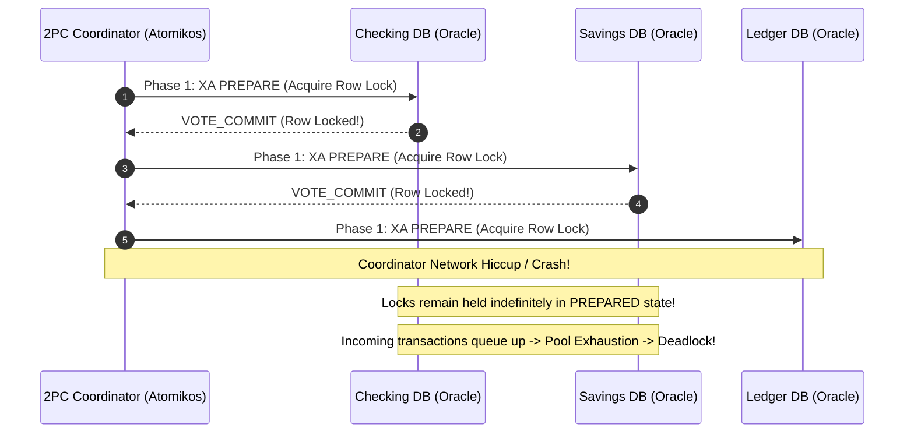

# Case Study: Distributed Two-Phase Commit Deadlock in Core Banking

> **Metadata**: ID: `CS-INT-04` | Domain: Enterprise Integration / Banking | Type: Synthetic Forensic Case Study | Complexity: Expert

---

## 01. Executive Summary
A multinational retail bank designed a real-time account transfer platform utilizing **Distributed Two-Phase Commit (2PC / XA Transactions)** across four separate relational databases (Checking, Savings, Fraud, and General Ledger). Under peak morning salary deposit concurrency (1,200 transfers/sec), a transient network timeout on the coordinator node left thousands of distributed database locks open in the `PREPARED` state. The open locks cascaded into global database connection exhaustion, deadlocking all four database clusters and causing a 6-hour complete shutdown of consumer banking operations.

---

## 02. Business & System Context
- **Organization**: Retail Bank (12M Customer Accounts).
- **Core Workflow**: Real-time fund transfers between checking, savings, and loan accounts.
- **Scale**: 1,200 financial transactions/sec peak throughput.
- **Architectural Paradigm**: Distributed ACID via Java Transaction API (JTA / Atomikos) and XA database drivers.

---

## 03. Scope & Stakeholders
- **Incident Commander**: Chief Banking Architect.
- **Key Teams**: Core Banking Database Team, Payments Application Team, SRE.
- **Impacted Systems**: 4 Oracle Database Clusters managing $85B in deposits.

---

## 04. Requirements & NFRs
- **Transactional Consistency**: Strict ACID compliance (zero dirty reads, zero balance drift).
- **Transfer Latency**: P99 $< 800\text{ ms}$.
- **Availability**: 99.999% for retail money movement.

---

## 05. Constraints & Assumptions
- **The ACID Dogma**: The architecture team believed that financial regulations mandated synchronous two-phase commit across all databases, rejecting eventual consistency and Sagas as "uncompliant."

---

## 06. Architecture Before: The 2PC Vulnerability


---

## 07. Architecture Decisions
| Decision | Rationale | Failure Mode |
| :--- | :--- | :--- |
| **Distributed 2PC (XA) across 4 DBs** | Guaranteed strict immediate consistency without handling partial failures in application code. | 2PC is a blocking protocol. If the coordinator fails between Prepare and Commit, database resources remain locked indefinitely. |
| **Long Database Lock Timeouts** | Set to 60 seconds to prevent aborting transfers prematurely. | Allowed blocking transactions to accumulate exponentially, consuming all available database connection pool slots. |

---

## 08. Timeline
```mermaid
timeline
    title 2PC Deadlock Timeline
    08:30 UTC : Morning salary deposit traffic begins surging toward 1,200 TPS
    08:42 UTC : Coordinator node VM suffers 4-second hypervisor memory pause
    08:43 UTC : 3,200 in-flight XA transactions freeze in PREPARED state across Oracle DBs
    08:45 UTC : Incoming user transactions block waiting for row locks on checking accounts
    08:48 UTC : HikariCP connection pools on all 4 database clusters reach 100% saturation
    08:50 UTC : All 4 core banking databases freeze completely; CPU drops to 2% while I/O locks hit 100%
    14:30 UTC : DBAs manually terminate 14,000 hanging XA transaction IDs via DBA commands
```

---

## 09. Incident Event
During peak morning salary credit processing, the virtual machine hosting the primary 2PC transaction coordinator experienced a 4-second pause due to cloud hypervisor noisy-neighbor memory ballooning. In that 4-second window, 3,200 transactions completed Phase 1 (`PREPARE`) and acquired row-level exclusive locks across Checking, Savings, and Ledger tables. Because the coordinator was paused, it never sent the Phase 2 (`COMMIT`) message. Subsequent incoming transfers queued up waiting for the locked rows, exhausting the 2,000-connection pools on all four database clusters within 180 seconds.

---

## 10. Symptoms & Evidence
- **Fact**: Oracle `v$lock` view showed 14,200 transactions waiting on row locks held by XA transactions in `PREPARED` state.
- **Fact**: Active database connection counts maxed out at 2,000/2,000 across all 4 database engines.
- **Inference**: Distributed 2PC cannot survive latency jitter in high-concurrency environments.

---

## 11. Failure Forensics
```
[Coordinator issues XA PREPARE to 4 Databases]
                      │
                      ▼
[Databases lock rows: Checking, Savings, Ledger]
                      │
                      ▼
[Coordinator pauses / network packet dropped]
                      │
                      ▼
[Databases wait in PREPARED state (Locks HELD)]
                      │
                      ▼
[Incoming traffic attempts to access locked accounts]
                      │
                      ▼
[2,000 Database Connections Blocked Waiting on Locks]
                      │
                      ▼
[Connection Pool Starvation -> Complete Banking Freeze]
```

---

## 12. Root Cause Analysis (5-Whys)
1. **Why did all core banking databases freeze?** -> Available connection pools were completely exhausted by blocked threads.
2. **Why were threads blocked?** -> They were waiting for exclusive row locks held by uncommitted XA transactions.
3. **Why were the XA transactions uncommitted?** -> They were waiting for Phase 2 COMMIT instructions from the coordinator.
4. **Why did the coordinator fail to send COMMIT?** -> The coordinator encountered a transient network/memory pause that exceeded socket timeouts.
5. **Why was the system designed with 2PC?** -> The architecture team dogmatically adhered to distributed ACID transactions instead of adopting asynchronous Saga orchestration.

---

## 13. Contributing Factors
- **High Lock Contention**: Corporate payroll accounts experienced thousands of simultaneous credit requests, concentrating locks on identical general ledger rows.
- **Missing Heuristic Rollback**: Databases were configured with manual heuristic resolution, preventing the database engine from automatically rolling back abandoned transactions.

---

## 14. Architecture After: Event-Driven Saga Pattern
```mermaid
graph TD
    Client[Transfer Request] --> TransferSvc[Transfer Orchestrator (Saga)]
    
    TransferSvc -->|1. Debit Checking (Local ACID)| DB1[(Checking DB)]
    TransferSvc -->|2. Async Event: FundsDebited| Kafka[Apache Kafka]
    
    Kafka -->|3. Credit Savings| SvcSavings[Savings Service]
    SvcSavings --> DB2[(Savings DB)]
    
    Kafka -->|4. Post Ledger Entry| SvcLedger[Ledger Service]
    SvcLedger --> DB3[(Ledger DB)]
    
    subgraph Failure Handling
        SvcSavings -.->|On Failure: Compensating Event| TransferSvc
        TransferSvc -.->|Refund Debit| DB1
    end
```

---

## 15. Recovery & Remediation
- **Immediate Mitigation**: Database Administrators executed emergency scripts to heuristically rollback thousands of stranded transactions (`ROLLBACK FORCE 'tx_id'`), releasing row locks.
- **Permanent Architectural Fix**: Completely eliminated Distributed 2PC/XA. Replaced with an **Event-Driven Saga Orchestration Engine** with compensating transactions.
- **Local Transactions**: Each service executes a strictly local ACID transaction within its own database. If downstream steps fail, the orchestrator triggers automated compensating transactions (e.g., re-crediting the checking account).

---

## 16. Business & Technical Impact
- **Operational Impact**: 6 hours of total mobile banking, ATM, and branch teller paralysis.
- **Regulatory Scrutiny**: Mandatory central bank audit; bank required to submit an architectural remediation report within 60 days.
- **Performance**: Eliminating 2PC reduced transfer latency from 750ms to **85ms** and increased peak throughput capacity by 400%.

---

## 17. What Went Well
- Database write-ahead logs were not corrupted; once XA locks were released, all accounts resumed normal operation with zero data loss.
- SRE monitoring dashboards immediately identified lock wait counts, directing DBAs to the exact problem.

---

## 18. Lessons Learned
- **The Fallacy of Distributed ACID**: 2PC trades availability for consistency in the most fragile way possible: it couples the availability of the entire system to the *worst-performing* component.
- **Embrace Eventual Consistency**: Sagas with compensating transactions are the industry standard for high-throughput financial architectures.

---

## 19. Architectural Recommendations
| Horizon | Action Item | Owner | Target |
| :--- | :--- | :--- | :--- |
| **Immediate** | Configure aggressive 10s heuristic abort timeouts on all Oracle XA databases | Lead DBA | Zero hung locks |
| **60 Days** | Migrate inter-account transfer flows to Saga Orchestration | Core Arch | 100% 2PC removal |
| **6 Months** | Conduct Chaos Engineering drills simulating network splits during Sagas | SRE Lead | Verified compensation |
