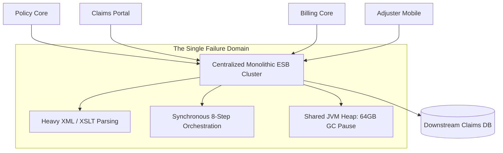

# Case Study: Centralized ESB Monolith Chokepoint in Insurance Claims

> **Metadata**: ID: `CS-INT-05` | Domain: Enterprise Integration / Insurance | Type: Synthetic Forensic Case Study | Complexity: Advanced

---

## 01. Executive Summary
A global insurance provider ($18B Annual Premiums) routed all enterprise integrations—spanning 120 policy administration, underwriting, billing, and claims applications—through a single, centralized **Enterprise Service Bus (ESB)** cluster. During a major regional hurricane disaster, inbound claims surged by 600%. The centralized ESB, performing heavy XML parsing, XSLT transformations, and synchronous orchestrations on a single shared memory heap, suffered severe CPU and garbage collection starvation. Claims settlement stalled for 5 days, backlogging 140,000 claims and triggering regulatory fines for failing statutory catastrophe-response SLAs.

---

## 02. Business & System Context
- **Organization**: Property & Casualty (P&C) Insurance Carrier.
- **System Role**: Centralized Enterprise Service Bus (IBM WebSphere / TIBCO) acting as the sole integration highway.
- **Scale**: 4,500 integration flows running inside a single monolithic runtime cluster.

---

## 03. Scope & Stakeholders
- **Incident Commander**: Director of Integration Architecture.
- **Key Teams**: Central ESB Middleware Team, Claims Engineering, Catastrophe Response Ops.
- **External Dependencies**: Third-Party Claims Adjuster APIs, National Weather Service Feeds.

---

## 04. Requirements & NFRs
- **Catastrophe Surge Capacity**: Scale up to 10x baseline claims volume (from 50 claims/sec to 500 claims/sec).
- **Processing Latency**: P95 $< 1.5\text{ seconds}$ for claims submission validation.

---

## 05. Constraints & Assumptions
- **The "Smart Pipes" Fallacy**: The organization mandated that all business logic, message transformation, and routing must live inside the centralized ESB, leaving endpoint applications as "dumb endpoints."

---

## 06. Architecture Before: The ESB Bottleneck


---

## 07. Architecture Decisions
| Decision | Rationale | Failure Mode |
| :--- | :--- | :--- |
| **Centralized Integration Bus** | Single enterprise control point for security, logging, and transformation. | Giant single point of failure (SPOF); CPU starvation in one business flow took down all other corporate flows. |
| **Heavy In-Flight XSLT Transformations** | Transformed complex 10MB XML documents into canonical models in memory. | Massive memory consumption; triggered frequent 30-second Stop-the-World garbage collection freezes. |

---

## 08. Timeline
```mermaid
timeline
    title Centralized ESB Collapse Timeline
    Day 1, 06:00 : Hurricane makes landfall; policyholders begin filing property claims
    Day 1, 09:00 : Claims submission rate spikes from 40 QPS to 480 QPS
    Day 1, 09:30 : ESB JVM heap reaches 96%; major GC pause lasts 42 seconds
    Day 1, 10:00 : All enterprise integration flows freeze: claims, billing, and policy queries
    Day 2 : ESB queue depth reaches 140,000 unread claims; cluster crashes repeatedly
    Day 5 : Engineering manually separates claims flow onto isolated emergency servers
```

---

## 09. Incident Event
When Hurricane Ian struck, hundreds of thousands of homeowners filed property damage claims simultaneously through the mobile portal. The claims submission payload included high-resolution damage photos encoded as Base64 strings inside 15MB XML envelopes. The centralized ESB parsed these giant XML payloads in-memory while executing complex XSLT transformation scripts. The JVM garbage collector collapsed under the memory pressure, causing 45-second Stop-The-World pauses that dropped TCP connections and froze all other unrelated corporate applications (including commercial billing and automotive underwriting).

---

## 10. Symptoms & Evidence
- **Fact**: ESB JVM garbage collection logs showed GC pauses exceeding 40 seconds every 2 minutes.
- **Fact**: Centralized ESB CPU utilization pegged at 100% across all 16 clustered server nodes.
- **Inference**: Centralizing heterogeneous integration workloads on a single runtime creates lethal resource contagion.

---

## 11. Failure Forensics
```
[15MB XML Claims Payload with Base64 Photos Arrives at ESB]
                             │
                             ▼
[XSLT Parser allocates 120MB memory in JVM heap per message]
                             │
                             ▼
    [500 Concurrent Claims = 60GB Memory Demanded Instantly]
                             │
                             ▼
[JVM Garbage Collector Freezes System: 45-Second STW Pause]
                             │
                             ▼
[TCP Connection Timeouts Across ENTIRE Enterprise Integration Bus]
                             │
                             ▼
[Claims, Billing, and Policy Systems Disconnected Simultaneously]
```

---

## 12. Root Cause Analysis (5-Whys)
1. **Why did all corporate integrations fail?** -> The centralized ESB cluster stopped responding to network traffic.
2. **Why did the ESB stop responding?** -> The JVM was frozen in continuous Stop-The-World garbage collection cycles.
3. **Why was memory exhausted?** -> It was parsing hundreds of 15MB XML payloads containing embedded Base64 photos.
4. **Why was the ESB parsing binary photos?** -> The integration architecture channeled all data through a single monolithic bus instead of using direct object storage.
5. **Why was everything on one bus?** -> The enterprise adhered to the outdated "Smart Pipes, Dumb Endpoints" ESB paradigm.

---

## 13. Contributing Factors
- **Missing Payload Size Limits**: The ESB ingress gateway lacked basic payload size enforcement, accepting 50MB requests without rejection.
- **Lack of Multi-Tenancy Isolation**: High-volume catastrophe claims ran on the exact same compute resources as low-volume corporate accounting integrations.

---

## 14. Architecture After: Decentralized Integration Mesh
```mermaid
graph TD
    ClaimsPortal[Claims Portal] --> ObjectStore[(S3: Store Photos Directly)]
    ClaimsPortal -->|Metadata JSON Only (< 5KB)| APIGW[API Gateway]
    
    APIGW --> ClaimsIngress[Lightweight Claims Microservice: Go]
    ClaimsIngress --> Kafka[Kafka Claims Topic]
    
    Kafka --> ClaimsEngine[Decoupled Claims Processor]
    
    subgraph Enterprise Decoupling (No Central ESB)
        BillingApp[Billing Core] --> KafkaBilling[Billing Events Topic]
        PolicyApp[Policy Core] --> KafkaPolicy[Policy Events Topic]
    end
```

---

## 15. Recovery & Remediation
- **Immediate Mitigation**: Configured an emergency reverse proxy in front of the ESB to strip Base64 images and route raw photos directly to Amazon S3.
- **Permanent Architectural Fix**: Decommissioned the centralized monolithic ESB in favor of a **Decentralized Integration Mesh**:
  - Replaced "Smart Pipes" with "Dumb Pipes, Smart Endpoints" using **Apache Kafka**.
  - Enforced lightweight JSON contracts ($< 50\text{ KB}$); all binary artifacts are uploaded directly to object storage via pre-signed URLs.
  - Deployed containerized, independent integration adapters per business domain on Kubernetes.

---

## 16. Business & Technical Impact
- **Financial**: $2.4M in regulatory fines for delayed catastrophe claim processing; $12M in emergency consultant remediation fees.
- **Performance**: Claims ingestion throughput scaled from 50 QPS to **2,500 QPS** with p95 latency under 120ms.
- **Cost**: Eliminating commercial ESB software licenses saved $4.8M annually.

---

## 17. What Went Well
- Stripping binary photos at the edge proxy immediately relieved 70% of memory pressure during emergency triage.
- The crisis provided executive sponsorship to finally dismantle the 15-year-old monolithic ESB.

---

## 18. Lessons Learned
- **Architecture**: Dumb pipes, smart endpoints. Never place heavy business logic or binary file transformations inside a centralized message bus.
- **Blast Radius**: Shared integration runtimes guarantee shared failure. Domain integration adapters must be independently isolated.

---

## 19. Architectural Recommendations
| Horizon | Action Item | Owner | Target |
| :--- | :--- | :--- | :--- |
| **Immediate** | Enforce strict 1MB payload limits on all remaining legacy ESB endpoints | Integration Lead | Zero OOM crashes |
| **90 Days** | Migrate binary attachments across all apps to S3 pre-signed URLs | Cloud Arch | 95% payload reduction |
| **1 Year** | Decommission centralized ESB cluster; complete move to Kafka event mesh | Chief Arch | 100% ESB retirement |
