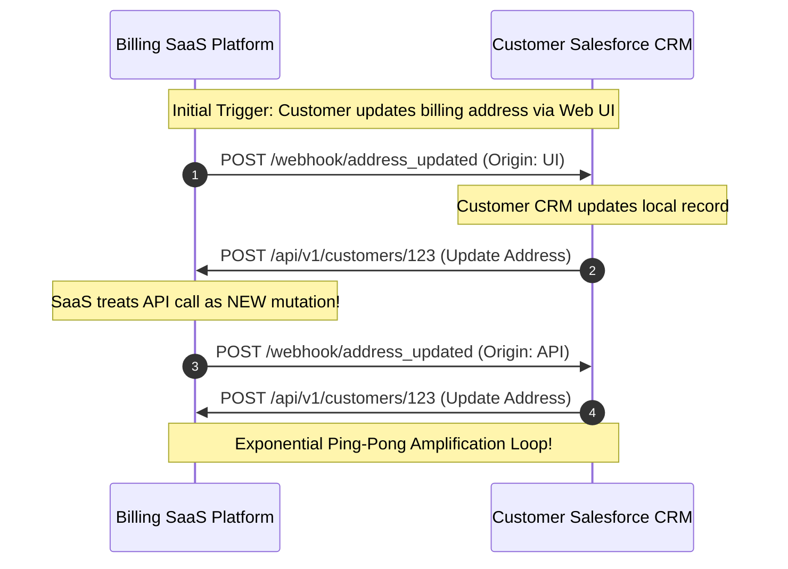
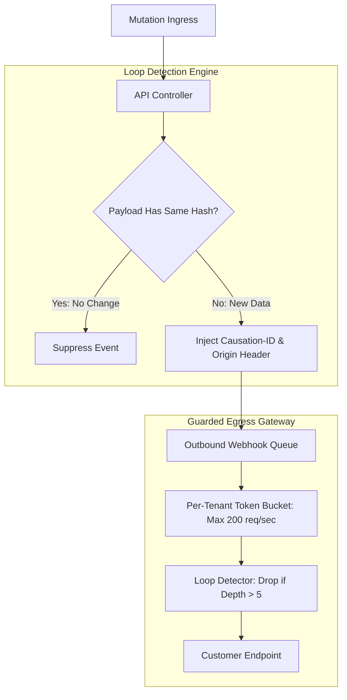

# Case Study: Webhook Ping-Pong Feedback Loop & Customer DDoS

> **Metadata**: ID: `CS-INT-06` | Domain: Enterprise Integration / SaaS | Type: Synthetic Forensic Case Study | Complexity: Advanced

---

## 01. Executive Summary
A leading B2B billing SaaS provider implemented an automated webhook synchronization engine allowing customers to sync subscription state with their internal CRM and ERP systems. A major enterprise customer configured bidirectional webhooks between the billing SaaS and their Salesforce instance. An innocuous customer address update triggered an infinite, self-amplifying **Webhook Ping-Pong Loop**: each update from the SaaS generated an update event in Salesforce, which fired a webhook back to the SaaS, which treated it as an external mutation and fired another webhook. Within 35 minutes, 45 Million synthetic webhooks were generated, saturating outbound NAT gateways, exhausting customer servers, and incurring $140,000 in cloud data transfer fees.

---

## 02. Business & System Context
- **Organization**: B2B Subscription Billing SaaS (15,000 Enterprise Tenants).
- **Feature Context**: Outbound Webhook Delivery Service delivering real-time JSON events on entity changes.
- **Scale**: Normal outbound webhook volume: 2,500 events/sec across all tenants.

---

## 03. Scope & Stakeholders
- **Incident Commander**: Lead Platform Architect.
- **Key Teams**: Webhook Delivery Team, Billing Core Services, Network Security.
- **Impacted Customer**: Fortune 500 Enterprise Tenant whose internal servers were crashed by the loop.

---

## 04. Requirements & NFRs
- **Delivery Guarantee**: At-least-once webhook delivery with automatic retry on customer 5xx errors.
- **Delivery Latency**: P95 $< 1.0\text{ second}$ from billing event to customer webhook receipt.

---

## 05. Constraints & Assumptions
- **Missing Provenance Tracking**: The webhook payload contained entity state, but lacked a **Causation ID** or origin attribution header distinguishing user-initiated changes from system-synced changes.

---

## 06. Architecture Before: The Infinite Ping-Pong Loop


---

## 07. Architecture Decisions
| Decision | Rationale | Failure Mode |
| :--- | :--- | :--- |
| **Blind Event Generation on Any Mutation** | Ensured downstream systems were always updated regardless of how data changed. | Generated infinite loops when integrating with systems that also had automated outbound sync triggers. |
| **No Per-Tenant Egress Rate Limiting** | Allowed large enterprise customers to burst high-volume bulk imports. | Enabled a single runaway tenant loop to monopolize all outbound NAT gateway bandwidth. |

---

## 08. Timeline
```mermaid
timeline
    title Webhook Loop Incident Timeline
    11:15 UTC : Customer updates corporate address in billing portal
    11:16 UTC : Salesforce sync script detects change; pushes back to billing API
    11:20 UTC : Ping-pong loop accelerates; webhook delivery queue grows by 10,000/min
    11:35 UTC : Outbound webhook volume hits 85,000 requests/sec (34x normal volume)
    11:42 UTC : AWS NAT Gateway bandwidth saturates at 45 Gbps; packet drops occur
    11:50 UTC : Customer CRM servers crash from HTTP connection saturation
    12:10 UTC : SRE identifies runaway tenant ID; deploys emergency kill-switch rule
```

---

## 09. Incident Event
At 11:15 UTC, a customer administrator updated their billing postal code. The SaaS fired a webhook to Salesforce. A newly deployed Salesforce Apex trigger, designed to keep addresses in sync, updated the local account and immediately made a REST API call back to the SaaS billing endpoint to ensure alignment. The SaaS API controller executed the update, generated a new `customer.updated` domain event, and dispatched another webhook. The two systems entered a tight feedback loop, doubling request frequencies every second until the SaaS outbound queues were processing 85,000 webhook dispatches per second for that single customer.

---

## 10. Symptoms & Evidence
- **Fact**: 45 Million webhook delivery attempts executed for a single `tenant_id` within 45 minutes.
- **Fact**: Outbound cloud NAT gateway data transfer reached 45 Gbps, causing packet loss for all other SaaS tenants.
- **Inference**: Bidirectional distributed integration without causal loop detection is an accidental distributed denial-of-service generator.

---

## 11. Failure Forensics
```
[User updates address: "100 Main St"]
                  │
                  ▼
[SaaS fires Webhook #1 to Salesforce]
                  │
                  ▼
[Salesforce Apex Trigger fires REST API update back to SaaS]
                  │
                  ▼
[SaaS sees mutation -> Generates Domain Event]
                  │
                  ▼
[SaaS fires Webhook #2 to Salesforce]
                  │
                  ▼
   [INFINITE FEEDBACK LOOP ACTIVATED]
                  │
                  ▼
[45,000,000 Requests in 45 Minutes -> NAT Saturation]
```

---

## 12. Root Cause Analysis (5-Whys)
1. **Why were 45M webhooks dispatched?** -> The billing SaaS and customer CRM continuously triggered mutations on each other.
2. **Why did the SaaS trigger a webhook on an incoming API update?** -> The application treated all database mutations identically, regardless of origin.
3. **Why did the system not detect the loop?** -> Events lacked a **Correlation ID / Causation ID** chain tracking the original initiating actor.
4. **Why did the loop consume all egress bandwidth?** -> The webhook dispatcher lacked per-tenant token-bucket rate limiting.
5. **Why were these guardrails missing?** -> The webhook architecture was designed for low-volume point-to-point delivery without considering bidirectional integration topologies.

---

## 13. Contributing Factors
- **Aggressive Retries**: As the customer's Salesforce server began returning HTTP 503 errors under the load, the SaaS retry engine queued an additional 5 retries per message, worsening the flood.
- **Shared Egress Infrastructure**: All SaaS tenants shared the same outbound NAT gateways, allowing one tenant's loop to degrade network performance for all 15,000 tenants.

---

## 14. Architecture After: Causal Attribution & Tenant Egress Throttling


---

## 15. Recovery & Remediation
- **Immediate Mitigation**: Executed an emergency Redis blacklist command blocking all outbound webhook dispatches for the affected tenant ID.
- **Permanent Architectural Fix**:
  - **Causation Headers**: All webhooks now include `X-Correlation-ID` and `X-Origin-Source`. If an incoming API call carries the same correlation ID as a recently generated outbound webhook, the event is automatically suppressed.
  - **Idempotent State Hashing**: The system calculates a SHA-256 hash of the entity state. If an incoming update does not change any field values, **zero domain events are generated**.
  - **Per-Tenant Egress Rate Limiting**: Enforced an absolute ceiling of 200 webhook dispatches per second per tenant, preventing single-tenant runaway consumption.

---

## 16. Business & Technical Impact
- **Financial**: Incurred $140,000 in unexpected AWS NAT Gateway and data transfer fees; credited customer $50,000 for server downtime.
- **Security**: Closed a critical vulnerability that could have been weaponized to perform denial-of-service attacks on customer infrastructure.
- **SLA**: Preserved multi-tenant isolation; shared egress pools isolated from single-tenant surges.

---

## 17. What Went Well
- Outbound webhook worker metrics clearly pinpointed the specific tenant ID, allowing surgical blacklisting without restarting services.
- The incident led to the development of a robust distributed loop-detection library now open-sourced by the team.

---

## 18. Lessons Learned
- **Architecture**: In event-driven systems, always assume bidirectional integration will occur. Without causal tracking, distributed feedback loops are mathematically inevitable.
- **Rate Limiting**: Apply rate limiting not only at inbound ingress, but equally at outbound egress.

---

## 19. Architectural Recommendations
| Horizon | Action Item | Owner | Target |
| :--- | :--- | :--- | :--- |
| **Immediate** | Deploy per-tenant egress token bucket limiter on webhook workers | Platform SRE | 200 QPS ceiling |
| **30 Days** | Implement SHA-256 state hashing to eliminate no-op event dispatches | Core Arch | 100% no-op suppression |
| **90 Days** | Standardize W3C `traceparent` and causation headers across all webhooks | Integration Lead | Zero undetected loops |
