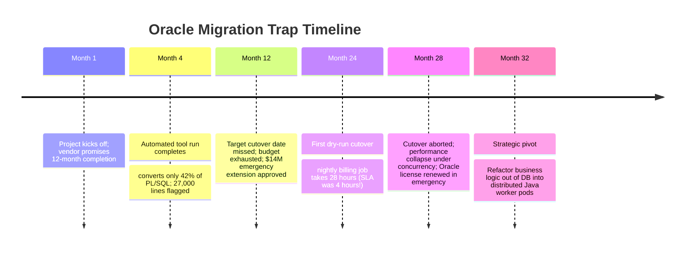

# Case Study: Oracle to PostgreSQL Stored Procedure Trap in Telecom Billing

> **Metadata**: ID: `CS-MIG-01` | Domain: Migration / Database | Type: Synthetic Forensic Case Study | Complexity: Expert

---

## 01. Executive Summary
A Tier-1 telecommunications operator attempted to migrate its mission-critical billing engine from an expensive Oracle Exadata appliance to Amazon Aurora PostgreSQL to save $18M in annual database licensing fees. The project was scoped at 12 months and $8M based on vendor claims of "automated schema translation tools." In reality, the database housed 45,000 lines of complex, proprietary PL/SQL stored procedures, nested autonomous transactions, and user-defined types developed over 18 years. Automated tools translated only 40% of the codebase, leaving 27,000 lines requiring manual re-architecture. The project stalled for 2.5 years, consumed $30M ($22M overrun), and failed its initial production cutover due to severe query performance degradation.

---

## 02. Business & System Context
- **Organization**: Mobile Telecom Carrier (32M Subscribers).
- **Core System**: Subscriber Rating & Billing Engine processing 400M call detail records (CDRs) daily.
- **Strategic Driver**: Eliminate escalating Oracle Exadata renewal licensing costs ($18M/year).

---

## 03. Scope & Stakeholders
- **Executive Sponsor**: Chief Technology Officer (CTO).
- **Project Leadership**: VP of Data Engineering, Chief Database Architect.
- **Vendor Teams**: Cloud Hyperscaler Professional Services, Third-Party Database Migration Integrator.

---

## 04. Requirements & NFRs
- **Batch Rating Throughput**: Process 50,000 CDRs per second during nightly rating cycles.
- **Data Integrity**: 100% mathematical parity with Oracle billing calculations down to the hundredth of a cent.
- **Downtime Window**: Maximum 4-hour maintenance window for cutover.

---

## 05. Constraints & Assumptions
- **The "Automated Tool" Fallacy**: Management assumed AWS SCT (Schema Conversion Tool) would handle 90%+ of PL/SQL conversion automatically, treating the migration as a mechanical syntax rewrite.

---

## 06. Architecture Before: Database-as-an-Application
```mermaid
graph TD
    RatingApp[Java Rating Workers (Thin)] --> OracleExadata[(Oracle Exadata Database Cluster)]
    
    subgraph Heavy Business Logic in Database
        OracleExadata --> PLSQL1[45,000 Lines of PL/SQL Packages]
        OracleExadata --> AutonmousTX[PRAGMA AUTONOMOUS_TRANSACTION]
        OracleExadata --> GlobalTemp[Oracle Global Temporary Tables]
        OracleExadata --> CustomTypes[VARRAYS & Nested Tables]
    end
    
    OracleExadata --> Invoices[(Customer Invoices)]
```
*Notice that the database was not merely a storage layer; it was the primary compute and business logic engine.*

---

## 07. Architecture Decisions
| Decision | Rationale | Downstream Failure |
| :--- | :--- | :--- |
| **Line-by-Line PL/SQL to PL/pgSQL Translation** | Believed to be faster than extracting business logic into application microservices. | PL/pgSQL lacks direct equivalents for autonomous transactions, packages, and complex cursor loops, leading to horrific concurrency deadlocks. |
| **Fixed-Price System Integrator Contract** | Bound vendor to aggressive timeline without deep discovery of PL/SQL complexity. | Integrator cut corners, using inefficient procedural loops instead of set-based SQL operations. |

---

## 08. Timeline


---

## 09. Incident Event
During the Month 28 production cutover attempt, the migrated Aurora PostgreSQL database was fed real-world billing streams. While individual unit tests had passed, running 500 concurrent billing threads triggered catastrophic lock contention on emulated global temporary tables. The nightly batch rating job, which normally completed in 3.5 hours on Oracle Exadata, ran for 28 hours without completing, delaying customer monthly billing statements and threatening statutory telecommunications compliance. The cutover was aborted at the 20th hour, and operations rolled back to Oracle.

---

## 10. Symptoms & Evidence
- **Fact**: PL/pgSQL query execution times were 8x to 35x slower than native Oracle Exadata execution.
- **Fact**: Aurora PostgreSQL database experienced 100% CPU saturation with 450 sessions blocked on `RowExclusiveLock`.
- **Inference**: Stored procedures optimized for Oracle's query optimizer and proprietary locking mechanisms do not translate mechanically to PostgreSQL.

---

## 11. Failure Forensics
```
[Billing Batch: 500 Concurrent Threads Run Converted PL/pgSQL]
                             │
                             ▼
  [Emulated Oracle Packages use PostgreSQL Temporary Tables]
                             │
                             ▼
[PostgreSQL Catalog Lock Contention on pg_class / pg_type]
                             │
                             ▼
[Transactions Blocked on RowExclusiveLock -> Execution 35x Slower]
                             │
                             ▼
   [Nightly 4-Hour Job Takes 28 Hours -> Operational Collapse]
```

---

## 12. Root Cause Analysis (5-Whys)
1. **Why did the migration fail in production?** -> Nightly billing batch processing took 28 hours instead of 4 hours.
2. **Why was it so slow?** -> Converted PL/pgSQL procedures suffered catastrophic lock contention on temporary tables.
3. **Why were temporary tables used?** -> They were mechanically converted from Oracle Global Temporary Tables by the migration tool.
4. **Why was business logic in stored procedures?** -> 18 years of architecture treated the database as an application server.
5. **Why was code not refactored into the application layer?** -> Leadership sought a fast "lift-and-shift" database swap rather than recognizing that database modernization is application modernization.

---

## 13. Contributing Factors
- **Exadata Hardware Crutch**: Decades of sub-optimal PL/SQL logic had been masked by Oracle Exadata's raw brute-force PCIe flash hardware and Smart Scan offloading.
- **Lack of Realistic Load Testing**: Pre-cutover tests were run on single-thread synthetic data rather than 500-thread production-scale datasets.

---

## 14. Architecture After: Decoupled Compute & Clean Persistence
```mermaid
graph TD
    BillingIngress[CDRs Ingress] --> Kafka[Apache Kafka Stream]
    
    subgraph Distributed Application Compute Tier
        Kafka --> WorkerPool[Containerized Rating Workers: Java / Spring Boot]
        WorkerPool --> Cache[(In-Memory Pricing Cache: Redis)]
    end
    
    subgraph Clean Relational Storage (Zero Stored Procedures)
        WorkerPool -->|Clean Set-Based SQL Inserts| Aurora[(Aurora PostgreSQL Cluster)]
    end
```

---

## 15. Recovery & Remediation
- **Architecture Reset**: Abandoned mechanical PL/pgSQL conversion. Extracted all rating, tax, and discount calculation rules out of the database into containerized **Java Spring Boot microservices** running on Kubernetes.
- **Clean Database Role**: Repurposed Aurora PostgreSQL purely as an ACID relational storage engine using simple, indexed set-based SQL queries (`INSERT`, `UPDATE`). Zero business logic stored procedures permitted.
- **In-Memory Caching**: Deployed Redis clusters to cache subscriber rate plans, eliminating 90% of read queries previously hitting the database during billing runs.

---

## 16. Business & Technical Impact
- **Financial**: Sunk $30M before successful re-architecture; ultimate solution saved $14M/year in Oracle support.
- **Performance**: Final refactored microservices architecture completed nightly billing in **1.8 hours** (faster than Exadata).
- **Agility**: Billing rules can now be updated and unit-tested in Git without requiring DBA intervention.

---

## 17. What Went Well
- The rollback plan to Oracle Exadata was executed flawlessly in 45 minutes, preventing permanent customer data loss.
- The crisis unified engineering leadership behind a modern cloud-native architectural vision.

---

## 18. Lessons Learned
- **Architecture**: A database is a storage engine, not an application server. If your database contains tens of thousands of lines of procedural code, you cannot migrate the database without rewriting the application.
- **Vendor Claims**: Automated database conversion tools convert syntax, not semantics or architectural assumptions.

---

## 19. Architectural Recommendations
| Horizon | Action Item | Owner | Target |
| :--- | :--- | :--- | :--- |
| **Immediate** | Mandate architecture review on all databases with $> 500$ lines of stored procedures | Data Arch Lead | Discovery complete |
| **90 Days** | Establish coding standard prohibiting new business logic in SQL stored procedures | Lead EA | Zero new SP logic |
| **1 Year** | Refactor legacy database procedures into stateless containerized workers | App Arch | 100% decoupled DB |
