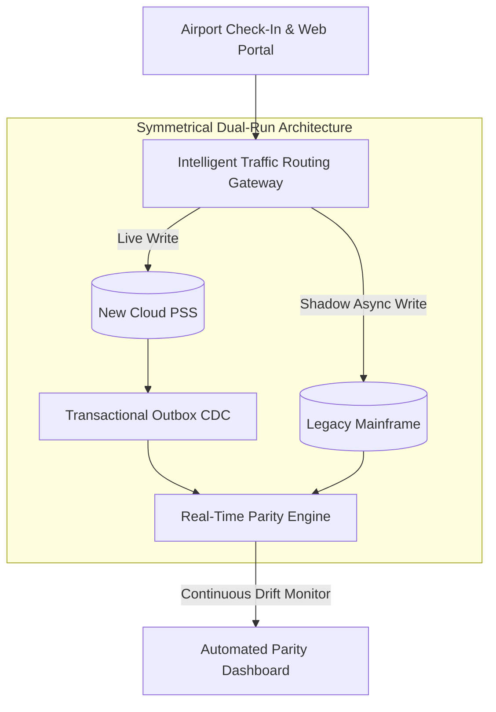

# Case Study: Airline Passenger Service System Cutover Collapse

> **Metadata**: ID: `CS-MIG-02` | Domain: Migration / Aviation | Type: Synthetic Forensic Case Study | Complexity: Expert

---

## 01. Executive Summary
A major international airline operating 1,800 daily flights executed a cutover of its legacy Passenger Service System (PSS) to a modern cloud-hosted reservations platform. During the 6-hour planned cutover window, data synchronization verification fell behind schedule. Under intense pressure from executive leadership to avoid flight delays, the Cutover Commander declared the **"Point of No Return"** and switched global DNS to the new cloud system without completing database reconciliation. The cloud platform immediately rejected 35% of passenger check-in transactions due to missing ticket status records. When engineering attempted an emergency rollback, they discovered that the reverse synchronization pipeline had failed, stranding the airline with irreconcilably diverged databases and causing a 36-hour global flight cancellation crisis.

---

## 02. Business & System Context
- **Organization**: Global Commercial Airline (45M Annual Passengers, $12B Revenue).
- **System Role**: Passenger Service System (PSS) governing reservations, inventory, ticketing, check-in, and aircraft weight & balance.
- **Scale**: 1,800 daily flights across 140 global airports.

---

## 03. Scope & Stakeholders
- **Executive Leadership**: Chief Operating Officer (COO), Chief Information Officer (CIO).
- **Cutover Command Center**: Incident Commander, Lead Migration Architect, Airport Operations Directors.
- **External Partners**: Global Distribution Systems (Sabre / Amadeus), Airport Authority CUTE Terminals.

---

## 04. Requirements & NFRs
- **Maximum Cutover Maintenance Window**: 6 hours (00:00 to 06:00 Local Time).
- **Data Parity Guarantee**: Zero missing ticket records ($100\%$ validation).
- **Rollback SLA**: Rollback to legacy mainframe possible within 60 minutes if go-live abort criteria met.

---

## 05. Constraints & Assumptions
- **The "Point of No Return" Fallacy**: The cutover plan assumed that once the new platform accepted live production writes, rolling back would be impossible unless bidirectional CDC replication worked flawlessly.

---

## 06. Architecture Before: Cutover Without Bidirectional Safety
```mermaid
graph TD
    subgraph Cutover Execution (Night of Incident)
        LegacyMainframe[(Legacy PSS Mainframe)]
        ForwardCDC[Forward CDC Sync: IBM MQ]
        CloudPSS[(New Cloud PSS: Aurora)]
        ReverseCDC[Reverse CDC Sync: UNTESTED!]
        
        LegacyMainframe -->|Sync Pushed| ForwardCDC
        ForwardCDC --> CloudPSS
        CloudPSS -.->|Failed to Sync Back!| ReverseCDC
        ReverseCDC -.->|Broken| LegacyMainframe
    end
    
    DNS[Global Traffic Director] -->|Cutover Switch Executed!| CloudPSS
```

---

## 07. Architecture Decisions
| Decision | Rationale | Downstream Failure |
| :--- | :--- | :--- |
| **Premature "Point of No Return" Declaration** | Feared morning flight departure bank would suffer catastrophic delays if cutover was aborted. | Switched traffic onto an unverified database missing 120,000 passenger records. |
| **Untested Reverse-Replication Pipeline** | Team focused 99% of effort on forward migration; assumed rollback would not be needed. | Once live writes hit the cloud DB, rolling back to the mainframe was impossible without corrupting data. |

---

## 08. Timeline
```mermaid
timeline
    title PSS Cutover Disaster Timeline
    00:00 : Planned maintenance window begins; legacy mainframe set to read-only
    03:30 : Forward data verification detects 4% discrepancy in ticket coupon states
    05:15 : Scheduled 6-hour window expires; COO demands go/no-go decision
    05:30 : Cutover Commander declares Point of No Return; DNS switched to Cloud PSS
    06:05 : Morning flights begin: Airport kiosks crash on "Ticket Not Found" errors
    07:15 : 35% of check-in transactions failing globally; terminal riots reported
    08:30 : CIO orders emergency rollback to legacy mainframe
    09:15 : Reverse CDC fails: 42,000 cloud check-in records cannot sync back to mainframe!
    Day 2  : Airline completely grounded for 36 hours; manual passenger rebooking
```

---

## 09. Incident Event
At 05:30, facing the imminent morning departure bank in major European and US hubs, the Cutover Commander overrode architecture validation checkpoints and directed the DNS cutover to the new Cloud PSS. Within minutes, airport ticket agents around the world reported that kiosks and boarding gates were throwing fatal errors: 120,000 electronic tickets purchased in the preceding 72 hours had failed to migrate due to an unhandled timezone offset bug in the CDC pipeline. When management ordered an immediate rollback to the legacy mainframe, the reverse CDC replication worker crashed on unmapped database triggers. The airline was trapped in a catastrophic split-brain state.

---

## 10. Symptoms & Evidence
- **Fact**: 120,000 passengers booked on flights that morning had missing ticket records in the new cloud database.
- **Fact**: 850 flights were canceled globally over 36 hours; 180,000 passengers were stranded.
- **Inference**: Declaring a Point of No Return based on schedule pressure rather than validated technical criteria guarantees disaster.

---

## 11. Failure Forensics
```
[05:30: Cutover Commander executes DNS switch despite 4% validation gap]
                               │
                               ▼
[120,000 Passenger Tickets missing in Cloud Database]
                               │
                               ▼
[Morning Passengers arrive at airport -> Kiosks display "Ticket Not Found"]
                               │
                               ▼
[Management orders Rollback -> Reverse Replication crashes on trigger error]
                               │
                               ▼
[SPLIT-BRAIN DISASTER: Cloud has new check-ins; Mainframe has historical tickets]
                               │
                               ▼
             [Total Grounding of Airline for 36 Hours]
```

---

## 12. Root Cause Analysis (5-Whys)
1. **Why was the airline grounded?** -> Passengers could not be legally or safely checked into flights.
2. **Why could they not check in?** -> 120,000 tickets were missing in the new database, and the system could not roll back to the old one.
3. **Why could the system not roll back?** -> The reverse replication pipeline failed, creating an irreconcilable split-brain data state.
4. **Why was reverse replication untested?** -> Engineering prioritized forward migration deadlines and assumed rollback would never be necessary.
5. **Why was cutover approved with missing data?** -> Commercial schedule pressure overwhelmed architectural governance, bypassing formal go/no-go quality gates.

---

## 13. Contributing Factors
- **Psychological Sunk-Cost Fallacy**: Having spent $45M over 3 years, project leadership felt they "could not afford to abort."
- **Lack of Dry-Run Dress Rehearsals**: The project conducted unit tests but never executed an end-to-end "Abort & Rollback" dress rehearsal under live load.

---

## 14. Architecture After: Symmetrical Dual-Run Coexistence


---

## 15. Recovery & Remediation
- **Crisis Resolution**: Deployed 400 software engineers and DBAs on 24-hour shifts to execute manual data reconciliation scripts, cross-referencing credit card settlement logs with legacy booking logs to reconstruct passenger ticket records.
- **Symmetrical Dual-Run Architecture**: Re-architected cutover strategy to use a **Dual-Run Coexistence Engine**. The system ran in parallel for 60 days, with the legacy mainframe as the warm standby shadow, continuously verified by an automated reconciliation daemon.
- **Immutable Go/No-Go Checkpoints**: Established an automated architectural circuit breaker: if data parity drops below **99.999%**, the cutover script automatically aborts and rolls back with zero human discretion permitted.

---

## 16. Business & Technical Impact
- **Financial**: $85M direct cost (passenger hotel vouchers, rebooking fees, EU261 regulatory compensation).
- **Executive Fallout**: The CIO and VP of Infrastructure were terminated by the board of directors.
- **Brand Reputation**: Stock dropped 12% over the subsequent trading week.

---

## 17. What Went Well
- Airport ground operations mobilized paper boarding passes and manual flight manifests to safely dispatch emergency long-haul flights.
- Post-incident forensic logging was sufficiently detailed to allow exact reconstruction of missing tickets.

---

## 18. Lessons Learned
- **Architecture**: A cutover plan without a tested, proven, push-button rollback plan is not a migration plan; it is a reckless gamble.
- **Governance**: The decision to abort a cutover must be automated or owned exclusively by the Chief Architect, insulated from commercial executive pressure.

---

## 19. Architectural Recommendations
| Horizon | Action Item | Owner | Target |
| :--- | :--- | :--- | :--- |
| **Immediate** | Mandate tested bidirectional replication before any cutover approval | Enterprise Arch | 100% verified rollback |
| **30 Days** | Conduct non-negotiable "Chaos Cutover Drill" with forced rollback injection | SRE Lead | $< 30	ext{ min}$ rollback |
| **90 Days** | Implement automated data parity reconciliation daemons in all migrations | Data Lead | Zero manual drift checks |
