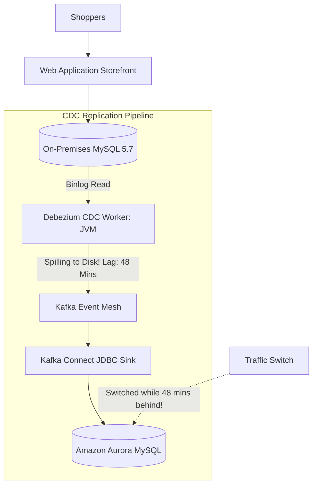
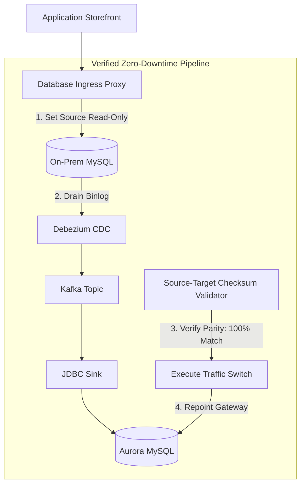

# Case Study: Change Data Capture Replication Lag & Silent Drift in E-Commerce

> **Metadata**: ID: `CS-MIG-03` | Domain: Migration / Data | Type: Synthetic Forensic Case Study | Complexity: Advanced

---

## 01. Executive Summary
A high-volume e-commerce platform processing $2.5B in annual sales attempted a zero-downtime database migration from on-premises MySQL 5.7 to cloud-hosted Amazon Aurora MySQL using **Change Data Capture (Debezium + Kafka)**. Under normal load, CDC replication lag was under 200ms. However, during the cutover weekend, an unannounced flash sale generated 12,000 write transactions/sec. The Debezium CDC buffer exhausted JVM memory, dropped into disk-spilling mode, and replication lag ballooned to 48 minutes. Unaware of the growing lag, the cutover script executed, repointing application traffic to the cloud database while 84,000 orders and customer balance updates were still trapped in the replication pipeline. The resulting silent data drift required an emergency 48-hour manual rollback and $1.2M in merchant compensation.

---

## 02. Business & System Context
- **Organization**: E-Commerce Digital Marketplace.
- **System Purpose**: Order processing, merchant escrow accounts, and customer checkout ledger.
- **Scale**: 8,000 peak write transactions/second; 4 TB relational database.

---

## 03. Scope & Stakeholders
- **Incident Commander**: Lead Cloud Data Architect.
- **Key Teams**: Database Administration (DBA), Core Commerce Engineering, SRE.
- **Technology Stack**: MySQL 5.7, Debezium 2.1, Apache Kafka, AWS Aurora MySQL.

---

## 04. Requirements & NFRs
- **Zero Downtime**: Continuous transaction processing throughout the migration.
- **Maximum Acceptable CDC Lag at Cutover**: $< 500\text{ ms}$.
- **Data Parity**: 100% byte-for-byte consistency across all financial ledger tables.

---

## 05. Constraints & Assumptions
- **Flawed Monitoring Metric**: The cutover automation script checked `mysql_replica_lag` from a legacy read replica rather than querying the true Kafka consumer group offset lag of the Debezium CDC worker.

---

## 06. Architecture Before: The Fragile CDC Pipeline


---

## 07. Architecture Decisions
| Decision | Rationale | Downstream Failure |
| :--- | :--- | :--- |
| **In-Memory CDC Buffering** | Maximized CDC throughput during initial baseline synchronization. | Flash sale write surge overwhelmed JVM heap; garbage collection pauses caused CDC worker to fall 48 minutes behind. |
| **Cutover Script Relied on MySQL Metric** | Standard DBA script checked `Seconds_Behind_Master` on read replica. | Read replica was not in the CDC path! The cutover script was checking the wrong database lag metric. |

---

## 08. Timeline
```mermaid
timeline
    title CDC Replication Disaster Timeline
    01:00 UTC : Cutover window begins; marketing unexpectedly launches promotional email blast
    01:30 UTC : Write volume surges to 12,000 TPS; Debezium CDC lag climbs to 48 minutes
    02:00 UTC : Cutover script queries local replica (`Seconds_Behind_Master: 0`) and proceeds
    02:05 UTC : App servers repointed to Aurora MySQL; new orders begin writing to cloud
    02:30 UTC : Customers report completed orders missing from "My Account" page
    03:15 UTC : DBAs discover 84,000 transactions from on-prem DB were never replicated to cloud!
    05:00 UTC : Split-brain state confirmed: writes occurring on both databases simultaneously
```

---

## 09. Incident Event
At 02:00 UTC, the automated cutover automation executed. The script validated that replication lag was zero by issuing `SHOW SLAVE STATUS` against an existing on-premises read replica, completely ignoring the Debezium Kafka CDC pipeline that was actually feeding the target Aurora database. In reality, the Debezium worker was 48 minutes behind, with 84,000 transactions buffered on disk. The moment application traffic switched to Aurora, customers began creating new orders that depended on account balances, loyalty points, and inventory that had never arrived from the on-premises database, corrupting the relational foreign key hierarchy.

---

## 10. Symptoms & Evidence
- **Fact**: Debezium JVM metrics showed 42-minute consumer group lag with 6.2GB of binlog data buffered in local container `/tmp` storage.
- **Fact**: 84,000 completed orders in the on-premise database had no matching records in Aurora.
- **Inference**: Measuring replication health at the wrong architectural boundary creates fatal false-positive validation signals.

---

## 11. Failure Forensics
```
[Flash Sale generates 12,000 writes/sec on On-Prem DB]
                           │
                           ▼
[Debezium CDC memory exhausts -> Spills to disk -> Lag hits 48 mins]
                           │
                           ▼
[Cutover script queries WRONG metric: Sees 0 lag on legacy replica]
                           │
                           ▼
[Cutover script repoints application traffic to Cloud Aurora DB]
                           │
  ┌────────────────────────┴────────────────────────┐
  ▼                                                 ▼
[New Cloud Writes arrive on Aurora]   [84,000 Old Writes trapped in CDC lag]
  │                                                 │
  └────────────────────────┬────────────────────────┘
                           ▼
         [SILENT DATA CORRUPTION & SPLIT-BRAIN]
```

---

## 12. Root Cause Analysis (5-Whys)
1. **Why did customer data corrupt?** -> The cloud database was missing 84,000 historical transactions when it became the primary.
2. **Why was it missing data?** -> Traffic was switched while the CDC replication pipeline was 48 minutes behind.
3. **Why did the cutover script switch traffic?** -> It reported zero lag based on an unrelated read replica metric.
4. **Why was the CDC pipeline lagging?** -> Debezium worker memory exhausted under an unannounced promotional traffic spike.
5. **Why was there no end-to-end verification?** -> The migration architecture lacked an authoritative source-to-target checksum validator prior to DNS execution.

---

## 13. Contributing Factors
- **Marketing & IT Disconnect**: Marketing launched an unannounced promotional blast during an active scheduled database cutover window.
- **Absence of Read-Only Locking**: The on-premises database was never placed in `read_only=ON` mode before switching traffic, allowing dual writes to continue.

---

## 14. Architecture After: Guarded CDC Cutover with Source Locking


---

## 15. Recovery & Remediation
- **Immediate Mitigation**: Terminated all cloud traffic; repointed application servers back to on-premises MySQL; ran custom differential merging scripts to reconcile 3,400 orders placed during the 50 minutes the cloud DB was live.
- **Permanent Architectural Fix**:
  - Re-architected cutover automation to enforce a strict **Source Lock & Drain Sequence**:
    1. Set source database to `read_only = ON`.
    2. Wait for Debezium partition consumer lag to reach **strictly 0**.
    3. Execute automated table row count and SHA-256 block checksums across both databases.
    4. Only after checksum equality is cryptographically confirmed does the script repoint the application connection string.

---

## 16. Business & Technical Impact
- **Financial**: $1.2M in merchant credits and manual reconciliation overtime expenses.
- **Customer Impact**: 3,400 orders had to be manually re-entered or verified by customer support agents.
- **Process Impact**: Created mandatory policy requiring marketing and sales freeze during all tier-1 infrastructure migrations.

---

## 17. What Went Well
- The database binlog files on the on-premises database were intact, preserving the mathematical ground truth for reconciliation.
- The engineering team successfully reconciled the split-brain records within 48 hours without filing an insurance claim.

---

## 18. Lessons Learned
- **Architecture**: A zero-downtime migration is impossible without a deliberate, controlled pause of writes (drain phase) to guarantee zero in-flight loss.
- **Telemetry**: Always measure lag at the *sink boundary*, not the source or intermediate stages.

---

## 19. Architectural Recommendations
| Horizon | Action Item | Owner | Target |
| :--- | :--- | :--- | :--- |
| **Immediate** | Update cutover scripts to check Kafka consumer offset lag directly | Data Lead | Zero false-positive checks |
| **30 Days** | Enforce mandatory `read_only` source drain protocol in all migration runbooks | Lead DBA | 100% drain validation |
| **90 Days** | Deploy automated continuous data drift detectors in all replication jobs | SRE Lead | Instant drift alerts |
