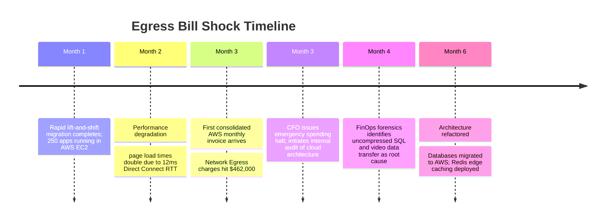

# Case Study: Lift-and-Shift Cloud Migration Egress Bill Shock

> **Metadata**: ID: `CS-MIG-04` | Domain: Migration / FinOps | Type: Synthetic Forensic Case Study | Complexity: Advanced

---

## 01. Executive Summary
A media and entertainment conglomerate migrated 250 enterprise web applications from an on-premises datacenter to Amazon Web Services (AWS) using a rapid "Lift-and-Shift" strategy. To minimize migration risk, enterprise architects opted to leave the core relational database clusters and video asset repositories in the on-premises datacenter, intending to migrate them in a subsequent phase. The resulting hybrid split-brain architecture generated 850 Terabytes of cross-boundary database queries and video rendering data transfers per month over AWS Direct Connect. Within 90 days, the enterprise received a surprise **$450,000/month cloud egress network bill**, completely wiping out projected cloud migration cost savings and triggering an emergency architectural re-alignment.

---

## 02. Business & System Context
- **Organization**: Global Media & Publishing Network ($4.5B Annual Revenue).
- **Core Applications**: 250 Content Management Systems (CMS), digital video publishing portals, and subscriber portals.
- **Migration Strategy**: 6-Month rapid lift-and-shift of application VMs using AWS Application Migration Service (MGN).

---

## 03. Scope & Stakeholders
- **Executive Leadership**: Chief Financial Officer (CFO), Chief Technology Officer (CTO).
- **Architecture Leadership**: Lead Cloud Solutions Architect, FinOps Practice Director.
- **External Network Providers**: Equinix Datacenter Colocation, AWS Direct Connect Partner.

---

## 04. Requirements & NFRs
- **Migration Velocity**: Move 250 web applications out of expiring datacenter lease in $< 6\text{ months}$.
- **Cost Target**: Achieve 25% reduction in total cost of ownership (TCO) compared to on-premises hardware refresh.
- **Application Latency**: Page render p95 $< 800\text{ ms}$.

---

## 05. Constraints & Assumptions
- **The "Data Moves Last" Fallacy**: The architecture team assumed that separating compute (in AWS) from data (on-premises) over a 10 Gbps Direct Connect circuit would carry negligible latency and minimal data transfer costs.

---

## 06. Architecture Before: The High-Egress Hybrid Trap
```mermaid
graph TD
    User[Web & Video Users] --> CloudApps[250 Web Applications: AWS EC2]
    
    subgraph AWS Cloud Region (us-east-1)
        CloudApps --> AppCompute[Application Worker Nodes]
    end
    
    subgraph AWS Direct Connect Dedicated Circuit ($0.02 / GB Egress)
        AppCompute <-->|Chatty SQL Queries: 15,000 Queries/sec| OnPremDB[(On-Prem Oracle & Video Repositories)]
        AppCompute <-->|Heavy Video Rendering Pipelines: 850 TB/mo| OnPremDB
    end
    
    subgraph On-Premises Datacenter
        OnPremDB
    end
```

---

## 07. Architecture Decisions
| Decision | Rationale | Downstream Failure |
| :--- | :--- | :--- |
| **Split Compute and Data Across Cloud Boundary** | Avoided migrating 400TB of complex database clusters in Phase 1. | Chatty ORM applications executed 50+ network roundtrips per web request across the 12ms Direct Connect link; generated 850TB of cross-boundary data transfer. |
| **Zero Egress Cost Modeling in FinOps Planning** | Assumed compute instance pricing was 90% of cloud costs; ignored network egress rates. | Incurred $450,000/month in unexpected data transfer charges, doubling total IT budget. |

---

## 08. Timeline


---

## 09. Incident Event
Sixty days after celebrating the "successful" early completion of the 250-app datacenter evacuation, corporate finance received the consolidated AWS invoice. Budgeted at $120,000/month, the actual bill was **$610,000**, with $462,000 explicitly categorized as `DataTransfer-Regional-Bytes` and `DirectConnect-Outbound-Bytes`. Applications built with Hibernate ORM were executing 40 to 80 sequential database queries per web page load, pulling uncompressed video metadata across the hybrid link thousands of times per second.

---

## 10. Symptoms & Evidence
- **Fact**: 850 Terabytes of outbound traffic transferred across Direct Connect interfaces monthly.
- **Fact**: Application P95 latency increased from 420ms (on-premises) to 1,450ms in the cloud.
- **Inference**: High-chattiness, tightly coupled application-database architectures cannot be split across geographic network boundaries without catastrophic financial and performance penalties.

---

## 11. Failure Forensics
```
[User loads single article page on media portal]
                          │
                          ▼
[Cloud Application Pod issues 65 Hibernate SQL queries]
                          │
  ┌───────────────────────┴───────────────────────┐
  ▼                                               ▼
[65 Roundtrips x 12ms Direct Connect RTT = 780ms pure network latency]
                          │
                          ▼
[Uncompressed SQL result sets transfer 4.5MB data per page view]
                          │
                          ▼
[Multiply by 60 Million monthly page views = 270TB SQL traffic alone!]
                          │
                          ▼
     [$462,000 Monthly AWS Network Egress Bill Shock]
```

---

## 12. Root Cause Analysis (5-Whys)
1. **Why did the AWS bill spike by $450,000/month?** -> Cloud applications transferred massive volumes of data back and forth to the on-premises datacenter.
2. **Why was data transferring continuously?** -> The applications ran in AWS while their underlying databases remained on-premises.
3. **Why did applications generate so much traffic?** -> Monolithic ORM frameworks executed dozens of unoptimized, uncompressed queries per page request.
4. **Why were databases not migrated with compute?** -> The migration was planned as a phased lift-and-shift prioritizing speed over architectural coupling analysis.
5. **Why was egress cost not anticipated?** -> Cloud architects modeled compute and storage costs but performed zero network egress data-flow modeling.

---

## 13. Contributing Factors
- **Absence of Application Caching**: Applications lacked a local Redis or Memcached tier, forcing every HTTP read to hit the database directly.
- **Lack of FinOps Cost Allocation**: Cloud networking costs were not attributed to individual application teams, concealing the financial drain during testing.

---

## 14. Architecture After: Co-Located Compute, Data & Edge Caching
```mermaid
graph TD
    User[Web Users] --> CloudFront[Amazon CloudFront CDN (Edge Cache)]
    CloudFront --> ALB[Application Load Balancer]
    
    subgraph Fully Co-Located AWS Cloud Region (Zero Cross-Boundary Egress)
        ALB --> AppCompute[Application Worker Nodes]
        AppCompute --> LocalCache[(ElastiCache Redis: 85% Cache Hit Ratio)]
        AppCompute --> CloudDB[(Amazon Aurora PostgreSQL Multi-AZ)]
    end
    
    subgraph On-Premises Datacenter
        Note[Datacenter Decommissioned; Egress = $0]
    end
```

---

## 15. Recovery & Remediation
- **Immediate Mitigation**: Deployed an emergency **AWS ElastiCache Redis cluster** in the cloud VPC to cache frequent metadata and query results, reducing cross-boundary database calls by 70% within 14 days.
- **Permanent Architectural Fix**: Accelerated the database migration phase: migrated all relational databases to **Amazon Aurora PostgreSQL** inside the same AWS Availability Zones as compute, completely eliminating Direct Connect cross-boundary traffic.
- **Edge CDN Integration**: Placed Amazon CloudFront in front of media assets, caching 85% of traffic at edge locations.

---

## 16. Business & Technical Impact
- **Financial**: Monthly cloud egress bill plummeted from $462,000 to **$14,200** (a $448k/month recurring savings).
- **Performance**: P95 page load latency improved from 1,450ms to **280ms** due to zero cross-boundary latency.
- **FinOps Culture**: Established a mandatory cloud data-flow and egress cost review before any workload migration.

---

## 17. What Went Well
- Deploying Redis as a tactical cache stopped the immediate financial bleeding within two weeks.
- The migration to Aurora successfully decommissioned the legacy datacenter ahead of contract renewal.

---

## 18. Lessons Learned
- **Architecture**: Data and compute have gravity. Never separate chatty application servers from their database across a hybrid cloud network boundary.
- **FinOps Standard**: Network egress is the most overlooked variable cost in cloud computing. Architectural diagrams must annotate expected data-transfer volumes on all cross-boundary arrows.

---

## 19. Architectural Recommendations
| Horizon | Action Item | Owner | Target |
| :--- | :--- | :--- | :--- |
| **Immediate** | Conduct data-flow egress cost audits on all active hybrid cloud connections | FinOps Lead | Identify top egress leaks |
| **30 Days** | Mandate local Redis caching for any hybrid application pending migration | Lead Cloud Arch | $> 75\%$ query offload |
| **90 Days** | Enforce "Co-Located Workload Units" policy: compute and data migrate together | Chief Arch | Zero split-boundary apps |
