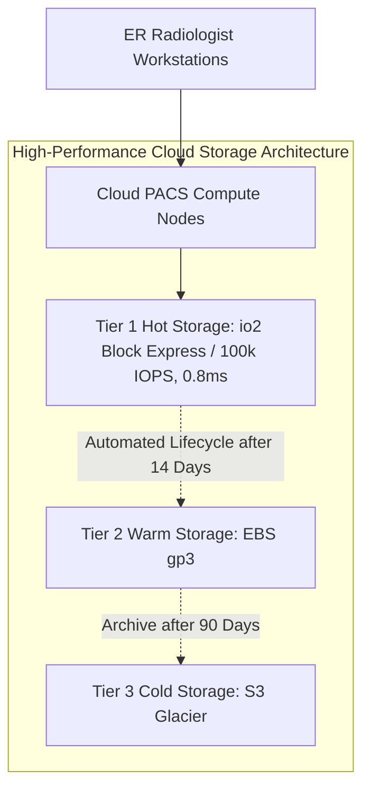

# Case Study: Healthcare SAN Storage Evacuation Collapse & IOPS Starvation

> **Metadata**: ID: `CS-MIG-05` | Domain: Migration / Infrastructure | Type: Synthetic Forensic Case Study | Complexity: Advanced

---

## 01. Executive Summary
A regional healthcare network attempted to migrate its high-throughput Medical Imaging Archive (PACS) and relational clinical databases from a tier-1 on-premises Fibre Channel SAN to a multi-tenant cloud block storage environment (AWS EBS gp3). During the initial migration cutover, storage I/O performance collapsed by 85%: write latency spiked from 1.2ms to 65ms, clinical image retrieval times degraded from 2 seconds to 45 seconds, and emergency room radiology workstations froze. The failure was driven by a fundamental architecture mismatch: architects sized storage based on total capacity (gigabytes) rather than **burst IOPS, storage queue depth, and throughput bandwidth**, triggering severe storage throttling and forcing an emergency 3-hour rollback to on-premises SAN arrays.

---

## 02. Business & System Context
- **Organization**: Regional Healthcare Network (14 Hospitals, 2.8M Patients).
- **Critical System**: Picture Archiving and Communication System (PACS) and Clinical EHR Relational Core.
- **Scale**: 350 Terabytes of diagnostic imaging data; 85,000 random write IOPS during peak clinical hours.

---

## 03. Scope & Stakeholders
- **Incident Commander**: Lead Infrastructure Architect.
- **Key Teams**: Enterprise Storage Team, PACS Clinical Engineering, Emergency Medicine Leadership.
- **Technology Stack**: On-Prem EMC VMAX Fibre Channel SAN, AWS EC2, EBS gp3/io2 volumes.

---

## 04. Requirements & NFRs
- **Clinical Image Retrieval SLA**: P95 $< 2.0\text{ seconds}$ for urgent trauma CT/MRI scans.
- **Storage Write Latency**: $< 2.5\text{ ms}$ average disk service time.
- **High Availability**: Multi-AZ synchronous storage replication with zero data loss ($RPO = 0$).

---

## 05. Constraints & Assumptions
- **The "Capacity-First" Sizing Flaw**: The infrastructure team provisioned cloud storage volumes based solely on allocating 350TB of disk space, assuming default EBS gp3 IOPS baselines (3,000 IOPS) would be sufficient for hospital operations.

---

## 06. Architecture Before: The Storage IOPS Bottleneck
```mermaid
graph TD
    Radiologist[ER Radiologist Workstations] --> PacsServer[Cloud PACS Compute Nodes: AWS EC2]
    
    subgraph Cloud Storage (Severe IOPS Throttling!)
        PacsServer -->|Demanding 85,000 IOPS| EBS[AWS EBS gp3 Storage Volumes]
        EBS -->|Throttled at 3,000 Baseline IOPS! Latency: 65ms| SlowDisk[Throttled Virtual Disks]
    end
    
    PacsServer -. Emergency Rollback .-> OnPremSAN[(On-Prem EMC Fibre Channel SAN: 100k IOPS, 1.2ms)]
```

---

## 07. Architecture Decisions
| Decision | Rationale | Downstream Failure |
| :--- | :--- | :--- |
| **Standard EBS gp3 for PACS Storage** | Cost optimization: gp3 was 70% cheaper than provisioned IOPS (io2) or cloud SAN appliances. | Default 3,000 IOPS baseline was overwhelmed by 85,000 peak clinical IOPS, triggering instant hypervisor throttling. |
| **Cutover Without Pre-Warming Storage** | Assumed cloud block storage delivers peak performance immediately upon attach. | Restoring from snapshots left blocks cold in Amazon S3, forcing high-latency first-read penalties on every image. |

---

## 08. Timeline
```mermaid
timeline
    title SAN Evacuation Failure Timeline
    22:00 : Weekend maintenance window begins; final database delta synced to AWS EBS
    02:00 : Storage volume attached; health checks report green; DNS switched to cloud PACS
    06:30 : Morning clinical shift begins; ER admissions spike with incoming trauma cases
    07:15 : Radiologists report CT scan load times exceed 45 seconds; viewer software crashes
    07:45 : AWS CloudWatch reports EBS `VolumeQueueLength` spikes from 2 to 148
    08:15 : Chief Medical Officer demands immediate incident escalation
    09:00 : Emergency rollback executed; traffic repointed to on-premise Fibre Channel SAN
```

---

## 09. Incident Event
At 06:30, as the morning hospital shift commenced, radiologists and emergency physicians began loading high-resolution multi-slice CT scans. The cloud PACS servers generated 85,000 random write and read IOPS to persist incoming studies and render 3D reconstructions. Because the underlying EBS gp3 volumes had been provisioned with standard baselines (3,000 IOPS and 125 MB/s throughput), the storage subsystem saturated within 90 seconds. Storage queue depth exploded to 148, disk write latency spiked to 65ms, and clinical viewer workstations timed out, preventing trauma surgeons from reviewing diagnostic imaging.

---

## 10. Symptoms & Evidence
- **Fact**: CloudWatch metric `VolumeThroughputPercentage` and `VolumeIOPSPercentage` pegged at 100% saturation.
- **Fact**: Storage read latency rose from 1.2ms (on-premise SAN) to **65ms** on cloud volumes.
- **Inference**: High-throughput medical and transactional systems fail when storage architecture ignores I/O density and queue depth.

---

## 11. Failure Forensics
```
[Radiologist requests 1.5GB Trauma CT Scan]
                     │
                     ▼
[PACS App requests 85,000 IOPS from EBS gp3 volume]
                     │
                     ▼
[EBS gp3 baseline caps at 3,000 IOPS / 125 MB/s]
                     │
                     ▼
[Storage Queue Depth spikes to 148; Latency hits 65ms]
                     │
                     ▼
[First-read penalty: Blocks cold in S3 must be lazy-loaded]
                     │
                     ▼
[Clinical Workstations Time Out -> Emergency Rollback]
```

---

## 12. Root Cause Analysis (5-Whys)
1. **Why did clinical workstations freeze?** -> Storage read times for medical scans exceeded 45 seconds.
2. **Why were read times so slow?** -> The cloud storage subsystem was severely throttled by the cloud hypervisor.
3. **Why was it throttled?** -> The application demanded 85,000 IOPS while the volumes were provisioned for only 3,000 IOPS.
4. **Why were they under-provisioned?** -> Storage sizing was conducted purely on gigabyte capacity, ignoring IOPS density and queue depth profiles.
5. **Why was IOPS profiling ignored?** -> Infrastructure architects lacked performance telemetry from the on-premises Fibre Channel SAN to establish a baseline.

---

## 13. Contributing Factors
- **EBS Snapshot "Lazy Loading" Penalty**: Volumes restored from snapshots exhibit severe first-access latency because blocks are pulled from S3 upon initial read unless explicitly pre-warmed.
- **Lack of Clinical Load Testing**: Migration testing was executed with a single radiologist loading an individual X-ray, failing to simulate a fully staffed morning hospital shift.

---

## 14. Architecture After: Tiered Cloud Storage with Pre-Warming


---

## 15. Recovery & Remediation
- **Immediate Mitigation**: Executed push-button rollback script repointing DNS to the on-premises EMC VMAX SAN; normal sub-2-second image rendering resumed within 15 minutes.
- **Permanent Architectural Fix**:
  - Re-architected storage into an **Automated Tiered Storage Model**:
    - *Tier 1 (Active Studies, 0-14 days)*: Deployed on **AWS EBS io2 Block Express** provisioned for 100,000 IOPS and sub-millisecond latency.
    - *Tier 2 (Prior Studies, 15-90 days)*: Automated movement to tuned **EBS gp3** (provisioned at 16,000 IOPS and 500 MB/s).
    - *Tier 3 (Historical Archive)*: Amazon S3 with life-cycle transitions to S3 Glacier Instant Retrieval.
  - **Storage Pre-Warming Protocol**: Enforced `fio` automated block pre-warming scripts across all newly attached snapshot volumes prior to cutover.

---

## 16. Business & Technical Impact
- **Clinical Safety**: Zero patient harm occurred; emergency rollback executed before scheduled surgeries commenced.
- **Performance**: Slower clinical image load times completely eliminated; average CT scan load dropped to **1.1 seconds** on io2 Block Express.
- **Cost**: Tiered storage strategy achieved 100k IOPS performance while keeping cloud storage budget within 15% of initial estimates.

---

## 17. What Went Well
- The on-premises SAN was kept in continuous synchronous read-only standby, making the emergency rollback fast and painless.
- Clinical engineering escalated the latency issue within 15 minutes, preventing diagnostic errors.

---

## 18. Lessons Learned
- **Architecture**: In enterprise storage, IOPS and latency are as critical as capacity. Sizing storage by gigabytes alone is an engineering failure.
- **Cloud Realities**: Cloud block storage is a virtualized network resource, not a local PCIe bus. Snapshot pre-warming is mandatory for latency-sensitive workloads.

---

## 19. Architectural Recommendations
| Horizon | Action Item | Owner | Target |
| :--- | :--- | :--- | :--- |
| **Immediate** | Mandate full IOPS/Throughput profiling from SAN before any storage migration | Storage Lead | Baseline documented |
| **30 Days** | Enforce automated `fio` pre-warming on all restored EBS volumes in migration SOPs | Cloud Arch | Zero lazy-read penalties |
| **90 Days** | Implement automated tiered storage lifecycles across all medical archives | Infra Lead | Sub-millisecond hot tier |
