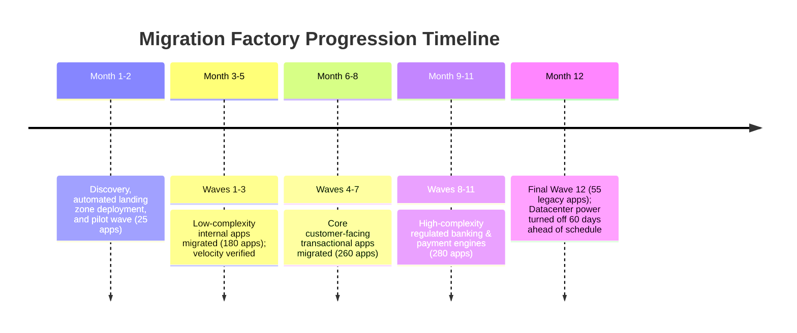
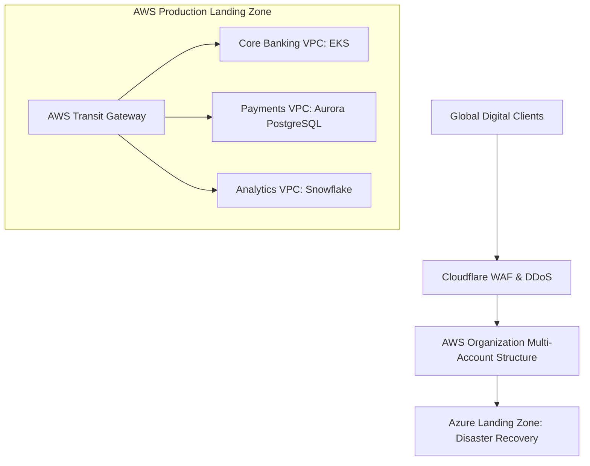

# Case Study: Industrialized Migration Factory — 800 Enterprise Workloads in 12 Months

> **Metadata**: ID: `CS-MIG-06` | Domain: Migration / Cloud | Type: Success Case Study | Complexity: Expert

---

## 01. Executive Summary
A global financial services provider ($11B Assets) faced a strict 14-month contractual deadline to vacate two primary enterprise datacenters following a corporate divestiture. Rather than executing disjointed ad-hoc migrations, enterprise architects designed an **Industrialized Cloud Migration Factory**: an automated, assembly-line migration framework utilizing codified landing zones, automated discovery tooling, standardized 7-R migration patterns, and automated wave planning. The initiative successfully migrated **800 enterprise workloads (3,200 VMs and 450 databases)** to AWS and Azure in 12 months with **zero P1 outages, zero data loss, and a 28% reduction in annual infrastructure TCO**.

---

## 02. Business & System Context
- **Organization**: Global Diversified Financial Services Holding Company.
- **Strategic Driver**: Hard datacenter lease termination penalty ($25M fine if not vacated by Month 14).
- **Scale**: 800 distinct business applications, 3,200 virtual machines, 1.2 Petabytes of transactional data.

---

## 03. Scope & Stakeholders
- **Executive Leadership**: Group CIO, Enterprise Architecture Steering Committee.
- **Migration Factory Pods**: 4 Autonomous Migration Pods (Discovery, Packaging, Cutover, Testing).
- **Cloud Hyperscalers**: AWS Professional Services, Azure FastTrack Architecture Team.

---

## 04. Requirements & NFRs
- **Throughput Velocity**: Migrate an average of 70 workloads per month across 12 scheduled waves.
- **Cutover Outage Budget**: Zero business-hour disruption; maximum 2-hour weekend cutover window per application.
- **Security Standard**: 100% compliance with PCI-DSS Level 1 and CIS Cloud Benchmark baselines from Day 1.

---

## 05. Constraints & Assumptions
- **Diverse Application Portfolio**: Applications spanned legacy Windows 2008 servers, Java monoliths, modern microservices, and mainframe integration gateways.

---

## 06. Architecture: The Industrialized Migration Factory Pipeline
```mermaid
graph TD
    subgraph Phase 1: Automated Discovery
        DC[On-Premises Datacenters] --> Discovery[Agentless Discovery: AWS Migration Hub / CAST]
        Discovery --> DependencyMap[Automated Dependency & Affinity Graph]
    end
    
    subgraph Phase 2: Wave Engine (7-R Decision Matrix)
        DependencyMap --> WavePlan[Wave Planning Engine: 12 Waves of ~70 Apps]
        WavePlan --> Archetypes{Architectural Archetype}
        Archetypes -->|Rehost: 55%| MGN[AWS MGN / Azure Migrate Block Sync]
        Archetypes -->|Replatform: 30%| Container[Container Factory: EKS / AKS]
        Archetypes -->|Retire: 15%| Decom[Decommission Server]
    end
    
    subgraph Phase 3: Automated Landing Zone
        MGN --> LZ[Terraform Landing Zone: Enforced Security Controls]
        Container --> LZ
    end
```

---

## 07. Key Architectural Decisions (Why It Succeeded)
| Architectural Decision | Strategic Context & Execution | Measurable Outcome |
| :--- | :--- | :--- |
| **Codified Landing Zones (IaC First)** | Pre-provisioned multi-account landing zones using Terraform with pre-configured VPC peering, transit gateways, and guardrails. | Applications migrated into hardened, compliant network environments in minutes; zero manual security ticketing. |
| **Automated Dependency Wave Mapping** | Discovered multi-tier network affinities using agentless network packet inspection. | Prevented split-brain network latency traps by ensuring dependent apps migrated in the same wave. |
| **Standardized 7-R Classification** | Enforced disciplined decision rubric: 55% Rehost (Lift-and-Shift), 30% Replatform (Containers/RDS), 15% Retire. | Eliminated analysis paralysis; development teams were barred from attempting complex rewrites during migration. |

---

## 08. Timeline


---

## 09. Transformation Highlights & Execution
The migration operated as an industrialized assembly line:
1. **Discovery & Affinity Mapping**: Tools mapped TCP socket dependencies across all 3,200 VMs. If Application A exchanged $> 100\text{ MB/day}$ with Application B, the algorithm automatically bound them to the same **Migration Wave**.
2. **Continuous Background Block Replication**: AWS Application Migration Service (MGN) continuously replicated disk blocks over encrypted Direct Connect circuits for weeks prior to cutover.
3. **Automated Cutover Scripting**: During the weekend window, automation scripts stopped on-prem services, verified the final 5-second disk delta sync, spun up target cloud instances, executed automated smoke tests, and switched DNS via Route 53 APIs in $< 12\text{ minutes}$.

---

## 10. Symptoms of Success (Observable Metrics)
- **Zero P1 Incidents**: Across 800 application migrations, not a single P1 production outage was declared.
- **Wave Predictability**: 11 out of 12 migration waves executed exactly on their scheduled calendar weekend.
- **Evidence of Hygiene**: 120 obsolete applications (15% of portfolio) were decommissioned, eliminating $3.2M in zombie server maintenance.

---

## 11. Success Forensics: What Made It Resilient?
```
[Automated Discovery Tooling detects hidden dependency]
                        │
                        ▼
[Engine assigns Web App + Core Database to Wave 6]
                        │
                        ▼
[Terraform provisions target VPC with security guardrails]
                        │
                        ▼
[Block replication runs asynchronously for 3 weeks prior]
                        │
                        ▼
[Cutover Weekend: Final delta sync takes 45 seconds]
                        │
                        ▼
[Automated Selenium smoke tests validate 100% endpoints]
                        │
                        ▼
[DNS updated via API -> Migration completed in 18 minutes]
```

---

## 12. Root Factors in Success
1. **Strict Separation of Migration from Modernization**: The team refused to refactor application code during the move. Applications were migrated as-is (Rehost/Replatform), with modernization scheduled as a distinct Day-2 activity.
2. **Executive Sponsorship & Freeze Authority**: The CIO instituted a mandatory corporate code freeze on non-essential feature development during an application's designated cutover month.
3. **Dedicated Cross-Functional Factory Pods**: Teams consisted of infrastructure engineers, DBAs, security specialists, and QA automation testers working in unified, dedicated pods rather than passing tickets between siloed departments.

---

## 13. Organizational Factors
- **Gamified Factory Velocity**: Migration pods competed on wave velocity, burn-down burndown rates, and automated test coverage.
- **Blameless Wave Retrospectives**: After every wave, the factory executed a 1-hour retrospective to tune automated migration scripts for the subsequent wave.

---

## 14. Architecture After: Multi-Account Cloud Foundation


---

## 15. Long-Term Business & Technical Impact
- **Financial**: Avoided the $25M datacenter lease termination penalty; achieved a **28% ongoing reduction in infrastructure operating costs** ($18.5M annual run-rate savings).
- **Security & Compliance**: Achieved 100% automated CIS Cloud Benchmark compliance across all 800 workloads.
- **Velocity**: Mean time to provision a new enterprise environment dropped from **8 weeks on-premises to 15 minutes in the cloud**.

---

## 16. Lessons Learned for Enterprise Architects
- **Don't Conflate Migration with Modernization**: If you try to rewrite applications while migrating them, you will miss your deadlines. First evacuate the datacenter; then modernize on the cloud.
- **Factory Model Wins**: High-volume migrations are logistics problems. Automate discovery, codify landing zones, and treat cutovers as a repeatable assembly line.

---

## 17. Architectural Recommendations
| Horizon | Action Item | Owner | Target |
| :--- | :--- | :--- | :--- |
| **Day-2 (Month 13-18)** | Initiate Wave 2 Modernization: Refactor top 20 transactional apps to cloud-native containers | Cloud Arch Lead | 35% cost optimization |
| **Day-2 (Month 18-24)** | Migrate self-managed EC2 databases to Amazon Aurora managed engines | Data Arch Lead | Zero OS patching |
| **Continuous** | Enforce automated FinOps cost anomaly alerts on all newly migrated accounts | FinOps Lead | Zero budget surprises |
