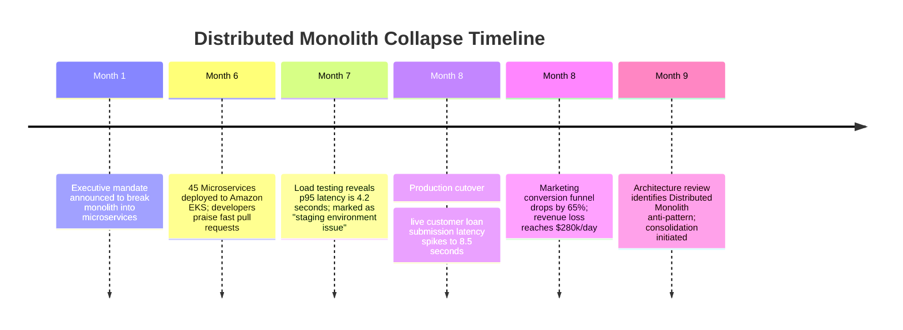

# Case Study: Distributed Monolith Latency Collapse in Fintech Lending

> **Metadata**: ID: `CS-MOD-01` | Domain: Modernization / Microservices | Type: Synthetic Forensic Case Study | Complexity: Expert

---

## 01. Executive Summary
A high-growth fintech loan origination platform ($3B in loan originations) decomposed its Java Spring Boot monolithic application into 45 fine-grained microservices to "increase team autonomy." However, the architecture team failed to establish asynchronous boundaries or coarse-grained domain aggregates. Instead, a single user loan application request triggered a synchronous chain of **45 consecutive REST HTTP calls** across microservices. In production, cumulative network transit time, serialization overhead, and thread starvation caused loan submission latency to explode from **180ms in the monolith to 8.5 seconds across microservices**, resulting in a 65% customer drop-off rate and an emergency architecture rollback.

---

## 02. Business & System Context
- **Organization**: Consumer Fintech Lending Platform.
- **Core Workflow**: Loan Application Underwriting, KYC Verification, Credit Bureau Query, and Offer Generation.
- **Scale**: 350 loan applications submitted per minute during peak marketing campaigns.

---

## 03. Scope & Stakeholders
- **Executive Leadership**: Chief Technology Officer (CTO), Head of Product.
- **Engineering Teams**: 8 Autonomous Feature Squads responsible for microservices.
- **Architecture Lead**: Champion of the "Pure Microservices" decomposition mandate.

---

## 04. Requirements & NFRs
- **Loan Decision SLA**: P99 $< 1.5\text{ seconds}$ for instant pre-qualification.
- **Availability Target**: 99.95% system uptime.
- **Scalability**: Handle 10x marketing surge traffic without manual pod re-provisioning.

---

## 05. Constraints & Assumptions
- **The "Network is Free" Fallacy**: The engineering team treated internal Kubernetes pod-to-pod REST calls as if they were in-memory method invocations, ignoring the latency implications of sequential synchronous chains.

---

## 06. Architecture Before vs. Decomposed Anti-Pattern
```mermaid
graph TD
    subgraph Monolith (Before: 180ms Total Latency)
        Client[Mobile App] --> Mono[Monolith App: In-Memory Method Calls]
        Mono --> MonoDB[(Single Database)]
    end
    
    subgraph Distributed Monolith (After: 8,500ms Total Latency!)
        Client2[Mobile App] --> Svc1[App Ingress Svc]
        Svc1 -->|HTTP REST| Svc2[KYC Svc]
        Svc2 -->|HTTP REST| Svc3[Credit Scoring Svc]
        Svc3 -->|HTTP REST| Svc4[Risk Svc]
        Svc4 -->|HTTP REST... 45 Hops!| Svc45[Notification Svc]
    end
```

---

## 07. Architecture Decisions
| Decision | Rationale | Downstream Failure |
| :--- | :--- | :--- |
| **Decompose by Entity (Nano-Services)** | Squads wanted isolated repositories and independent CI/CD pipelines. | Created extreme chattiness; an order required orchestrating 45 tiny services sequentially. |
| **Synchronous HTTP/REST for All Inter-Service Calls** | Familiar to developers; avoided adopting message brokers or event-driven patterns. | Failure probabilities compounded: if 45 services each have 99.9% availability, total system availability drops to $0.999^{45} = 95.6\%$. |

---

## 08. Timeline


---

## 09. Incident Event
On the day of the production cutover, the marketing department launched a major national television advertising campaign. As concurrent applicants surged to 350 per minute, the 45-hop synchronous service chain completely collapsed. Each inbound HTTP request held open an active connection and worker thread across all 45 microservices simultaneously. As upstream services waited for downstream services, thread pools exhausted across the cluster, triggering cascading 504 Gateway Timeouts and dropping 65% of loan applications.

---

## 10. Symptoms & Evidence
- **Fact**: End-to-end loan application latency increased from 180ms to an average of **8,500ms**.
- **Fact**: Distributed tracing (Jaeger) revealed that 78% of the total request duration was spent in network transit, TLS handshakes, and JSON marshaling/unmarshaling across the 45 hops.
- **Inference**: Microservices that cannot execute independently without synchronous orchestration across dozens of peers are not microservices; they are a distributed monolith.

---

## 11. Failure Forensics
```
[User clicks "Submit Loan Application"]
                  │
                  ▼
[Hop 1: Ingress Gateway (2ms)] ──► [Hop 2: User Svc (15ms)]
                                          │
                                          ▼
[Hop 3: Address Validation Svc (85ms)] ──► [Hop 4: Employment Svc (120ms)]
                                          │
                                          ▼
[... Hops 5 through 44: Cumulative Network Transit = 4,200ms ...]
                                          │
                                          ▼
[Hop 45: Notification Svc exhausts thread pool -> Timeout!]
                                          │
                                          ▼
[Cascading 504 Gateway Timeout propagated back to User]
```

---

## 12. Root Cause Analysis (5-Whys)
1. **Why did loan applications time out?** -> Upstream microservices exceeded their 5.0-second gateway timeout budget.
2. **Why was latency so high?** -> A single request was serialized and deserialized across 45 consecutive network hops.
3. **Why were there 45 hops?** -> Every business entity was isolated into its own independent microservice.
4. **Why was communication synchronous?** -> Teams used REST APIs because they lacked an asynchronous event backbone.
5. **Why was the architecture chosen?** -> The organization copied big-tech microservice patterns without having the organizational scale, domain boundaries, or asynchronous infrastructure to support it.

---

## 13. Contributing Factors
- **Premature Decomposition**: The original monolith had good modular code; splitting it was driven by architectural fashion rather than clear domain boundaries.
- **Missing Distributed Tracing in CI**: Performance regressions were not tested under multi-tier load conditions prior to production rollout.

---

## 14. Architecture After: Coarse-Grained Domain Services with Event Streaming
```mermaid
graph TD
    Client[Mobile App] --> APIGW[API Gateway]
    
    subgraph Coarse-Grained Domain Services (Only 3 Hops!)
        APIGW -->|1. Submit Application| UnderwritingSvc[Underwriting & Risk Service]
        UnderwritingSvc -->|2. In-Memory Processing| LocalEngine[Local Scoring Engine]
        UnderwritingSvc -->|3. Async Event: ApplicationSubmitted| Kafka[Apache Kafka Backbone]
    end
    
    Kafka --> DocumentSvc[Document Generation Service]
    Kafka --> NotificationSvc[Notification Service]
    Kafka --> LedgerSvc[Core Banking Ledger]
```

---

## 15. Recovery & Remediation
- **Domain Re-Aggregation**: Re-consolidated 38 fine-grained nano-services back into **4 Coarse-Grained Domain Services** (Underwriting, Servicing, Identity, and Communications). In-process function calls replaced 41 network hops.
- **Asynchronous Decoupling**: Converted all downstream side-effects (document generation, CRM updates, email notifications) into asynchronous **Kafka event consumers**.
- **High-Performance RPC**: Replaced internal REST/JSON with **gRPC and Protocol Buffers** for the remaining cross-service inter-process communications.

---

## 16. Business & Technical Impact
- **Latency**: Loan application p95 latency plummeted from 8,500ms down to **240ms**.
- **Conversion Rate**: Customer conversion funnel fully recovered, increasing loan issuance revenue by $18M in the subsequent quarter.
- **Operational Simplicity**: Reduced Kubernetes pod count by 60%, saving $35,000/month in cloud compute overhead.

---

## 17. What Went Well
- Distributed tracing was active, allowing architects to produce an undeniable visual trace diagram showing the exact 45-hop network bottleneck.
- Engineering squads recognized the failure quickly and collaborated constructively to re-consolidate domain boundaries.

---

## 18. Lessons Learned
- **Architecture**: In-memory method calls take nanoseconds; network hops take milliseconds. Replacing memory with the network without changing communication semantics guarantees failure.
- **Domain Boundaries**: Never decompose software based on database tables or code files. Decompose strictly by bounded business contexts that can execute autonomously.

---

## 19. Architectural Recommendations
| Horizon | Action Item | Owner | Target |
| :--- | :--- | :--- | :--- |
| **Immediate** | Impose maximum 3-hop synchronous call depth rule in architecture governance | Chief Arch | 100% trace compliance |
| **60 Days** | Migrate remaining synchronous cross-domain notifications to Kafka events | Platform Lead | Zero sync notifications |
| **90 Days** | Enforce automated latency-budget checks in CI/CD integration testing | QA Lead | Automated PR blocks |
