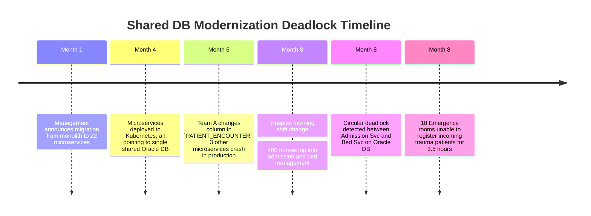
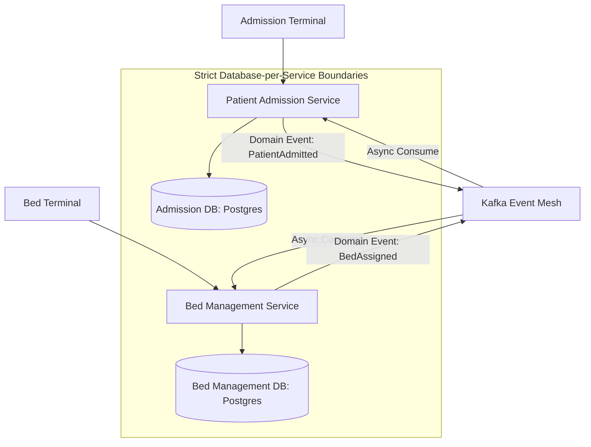

# Case Study: Shared Database Microservices Deadlock in Healthcare

> **Metadata**: ID: `CS-MOD-02` | Domain: Modernization / Healthcare | Type: Synthetic Forensic Case Study | Complexity: Advanced

---

## 01. Executive Summary
A hospital management software vendor modernized its monolithic clinical platform by deploying 22 independent containerized microservices (Patient Admission, Bed Management, Pharmacy, Billing, Lab Orders). However, to avoid a complex data migration, all 22 microservices were connected to the **exact same legacy Oracle relational database**, sharing tables and executing cross-domain SQL transactions. During a morning shift change, concurrent writes from the Patient Admission service and the Bed Management service triggered a circular distributed lock deadlock on the shared `PATIENT_ENCOUNTER` table, freezing clinical workstations across 18 emergency rooms.

---

## 02. Business & System Context
- **Organization**: Healthcare Clinical Systems Vendor (Serving 120 Acute Care Hospitals).
- **Core Workflow**: Inpatient Emergency Room Admissions, Bed Assignment, and Medication Dispensing.
- **Modernization Driver**: Fast-track containerization to satisfy hospital client RFPs demanding "modern microservice architecture."

---

## 03. Scope & Stakeholders
- **Incident Commander**: Lead Healthcare Systems Architect.
- **Key Teams**: Microservices Feature Teams, DBA Group, Clinical Risk Officers.
- **Impacted Systems**: Emergency Room Admissions Workstations across 18 regional hospitals.

---

## 04. Requirements & NFRs
- **Clinical Safety**: Zero downtime for patient emergency room registration.
- **Transaction Latency**: Admission record creation in $< 500\text{ ms}$.
- **Data Isolation**: Microservices must not corrupt or lock each other's data domains.

---

## 05. Constraints & Assumptions
- **The "Database-First" Shortcut**: Management believed they could achieve the benefits of microservices (rapid independent deployment) while keeping a single monolithic database to avoid distributed data management.

---

## 06. Architecture Before: The "Database as an Integration Hub" Anti-Pattern
```mermaid
graph TD
    subgraph Containerized Microservices Tier (Decoupled on Outside)
        AdmSvc[Patient Admission Svc]
        BedSvc[Bed Management Svc]
        PharmSvc[Pharmacy Svc]
        BillSvc[Billing Svc]
    end
    
    subgraph Monolithic Shared Database (Tightly Coupled on Inside)
        SharedDB[(Shared Oracle Database: 850 Tables)]
        AdmSvc -->|Exclusive Row Locks| SharedDB
        BedSvc -->|Exclusive Row Locks| SharedDB
        PharmSvc -->|Unindexed Queries| SharedDB
        BillSvc -->|Long-Running Batch Locks| SharedDB
    end
```

---

## 07. Architecture Decisions
| Decision | Rationale | Downstream Failure |
| :--- | :--- | :--- |
| **Shared Database for All Microservices** | Avoided distributed data management, event streaming, and eventual consistency. | Completely defeated microservice autonomy; microservices deadlocked on shared foreign keys and database triggers. |
| **Cross-Service Database Joins in Code** | Allowed developers to join patient, billing, and lab tables in raw SQL queries. | Schema changes by one team broke queries in 4 other un-notified microservice repositories. |

---

## 08. Timeline


---

## 09. Incident Event
At 07:15, during the hospital morning shift handover, 400 clinical triage nurses began registering new admissions while bed coordinators reassigned inpatient beds. The Admission microservice executed `UPDATE PATIENT_ENCOUNTER` followed by `UPDATE BED_ASSIGNMENT`. Simultaneously, the Bed Management microservice executed `UPDATE BED_ASSIGNMENT` followed by `UPDATE PATIENT_ENCOUNTER`. Because both services ran within distributed transactions without standardized lock acquisition ordering, Oracle threw `ORA-00060: deadlock detected while waiting for resource`. Connection pools quickly maxed out, paralyzing all hospital admission terminals.

---

## 10. Symptoms & Evidence
- **Fact**: Oracle database alert log recorded 280 `ORA-00060` circular deadlock events within 15 minutes.
- **Fact**: HikariCP connection pools across all 22 microservice pods reached 100% saturation.
- **Inference**: Microservices that share a database are not decoupled; they are simply a monolith with distributed network latency and shared database lock contention.

---

## 11. Failure Forensics
```
[Admission Svc: Transaction 1]          [Bed Management Svc: Transaction 2]
               │                                        │
               ▼                                        ▼
[Acquires Lock on PATIENT_ENCOUNTER]     [Acquires Lock on BED_ASSIGNMENT]
               │                                        │
               ▼                                        ▼
[Requests Lock on BED_ASSIGNMENT]        [Requests Lock on PATIENT_ENCOUNTER]
               │                                        │
               └───────────────────┬────────────────────┘
                                   ▼
                 [CIRCULAR DEADLOCK: ORA-00060]
                                   ▼
                 [Both Transactions Frozen by Engine]
                                   ▼
         [Connection Pools Max Out -> 18 ERs Paralyzed]
```

---

## 12. Root Cause Analysis (5-Whys)
1. **Why did hospital triage terminals freeze?** -> Microservice API calls were timing out waiting for database connections.
2. **Why were database connections unavailable?** -> Hundreds of threads were blocked waiting on row locks.
3. **Why were rows locked?** -> Admission and Bed Management services engaged in a circular transaction deadlock.
4. **Why did separate services lock the same tables?** -> Both microservices directly accessed and mutated the exact same shared relational tables.
5. **Why were they sharing tables?** -> The modernization project containerized compute but refused to modernize the data architecture (Database-per-Service was omitted).

---

## 13. Contributing Factors
- **Inconsistent Lock Ordering**: Squads had zero coordination on SQL statement sequencing within transactions.
- **Hidden Database Triggers**: Legacy Oracle triggers executed secondary updates behind the scenes without the microservice developers' knowledge.

---

## 14. Architecture After: Database-per-Service with Asynchronous Domain Events


---

## 15. Recovery & Remediation
- **Immediate Mitigation**: DBAs manually killed hanging database sessions; implemented an emergency code patch standardizing transaction lock acquisition ordering across both services.
- **Permanent Architectural Fix**: Enforced the **Database-per-Service Pattern**:
  - Split the shared database into dedicated schemas, granting credentials exclusively to the owning microservice.
  - Replaced synchronous cross-table updates with **Domain Events over Apache Kafka**.
  - Decommissioned all legacy database triggers, moving business validation into application code.

---

## 16. Business & Technical Impact
- **Patient Safety**: Critical incident review launched; hospital clients demanded external architectural audits before renewing software contracts.
- **System Stability**: Deadlocks dropped to **zero** following the database schema decoupling.
- **Engineering Velocity**: Teams can now alter their database schemas without coordinating with or breaking other engineering squads.

---

## 17. What Went Well
- Clinical staff utilized paper emergency triage procedures to ensure patient care was maintained during the outage.
- Oracle trace files explicitly pinpointed the competing SQL statements and lock identifiers.

---

## 18. Lessons Learned
- **Golden Rule of Microservices**: You cannot have microservices without **decoupled data persistence**. A shared database creates a distributed monolith with all of the operational complexity of microservices and none of the benefits.
- **Encapsulation**: Private data storage is the only way to enforce domain boundaries.

---

## 19. Architectural Recommendations
| Horizon | Action Item | Owner | Target |
| :--- | :--- | :--- | :--- |
| **Immediate** | Revoke cross-schema SQL permissions on legacy shared database | Lead DBA | Zero cross-domain joins |
| **90 Days** | Migrate Top-5 critical microservices to dedicated PostgreSQL databases | Lead Arch | 100% DB isolation |
| **6 Months** | Implement asynchronous Saga pattern for cross-service data workflows | Core Eng | Zero distributed lockups |
