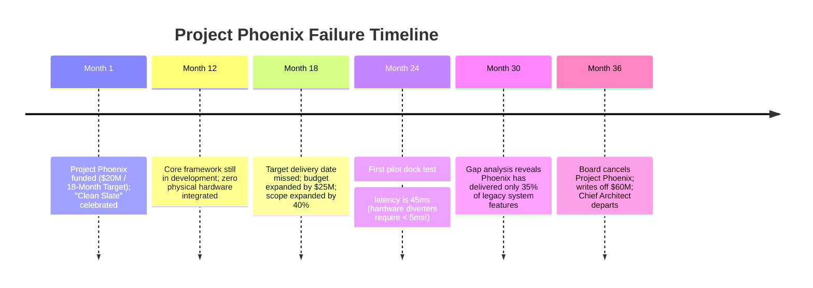

# Case Study: Second-System Syndrome & $60M Ground-Up Rewrite Abandonment

> **Metadata**: ID: `CS-MOD-03` | Domain: Modernization / Strategy | Type: Synthetic Forensic Case Study | Complexity: Expert

---

## 01. Executive Summary
A global supply chain and warehouse automation company ($7B Annual Revenue) initiated "Project Phoenix," a ground-up rewrite of its 15-year-old legacy warehouse execution system. Convinced that the legacy system was "unfixable spaghetti code," architects promised a revolutionary cloud-native, microservices, event-driven platform that would solve all historical business problems. Over three years, the project suffered from textbook **Second-System Syndrome**: runaway scope creep, an ever-shifting target as the legacy system continued to evolve, perfectionist architectural abstraction, and zero working software delivered to warehouse docks. After consuming $60M, the board of directors cancelled the project, wrote off the investment, and pivoted to an incremental evolutionary architecture.

---

## 02. Business & System Context
- **Organization**: Global Warehouse Automation & Logistics Solutions ($7B Revenue).
- **Core System**: Warehouse Execution System (WES) directing automated conveyor belts, robotic sorting arms, and picker terminals across 80 distribution hubs.
- **The Modernization Mandate**: Replace the "legacy C++/Java monolith" with a modern Go/Rust microservices architecture.

---

## 03. Scope & Stakeholders
- **Executive Leadership**: Chief Executive Officer (CEO), Board Audit Committee.
- **Project Leadership**: Chief Architect of "Project Phoenix," VP of Engineering.
- **Operating Units**: 80 Distribution Warehouse General Managers waiting for promised features.

---

## 04. Requirements & NFRs
- **Throughput**: Support 150,000 package barcode sorting events per minute across 80 hubs.
- **Latency**: Sub-5ms response time for high-speed conveyor belt diverter gates.
- **Delivery Commitment**: Full cutover within 18 months of project kick-off.

---

## 05. Constraints & Assumptions
- **The "Clean Slate" Fallacy**: The architecture team assumed that rewriting from scratch would be faster and cleaner than incrementally refactoring the legacy codebase.

---

## 06. Architecture Before: The Working Monolith vs. The Fantasy Second System
```mermaid
graph TD
    subgraph Legacy Monolith (Ugly, Technical Debt, BUT WORKING)
        Conveyor1[Conveyor Hardware] --> C_Monolith[C++ Monolith: Direct Socket Comm]
        C_Monolith --> LocalDB[(Local SQLite / In-Memory Table)]
        Note1[Delivered 150k sorts/min reliably for 15 years]
    end
    
    subgraph Project Phoenix (The Over-Engineered Fantasy)
        Conveyor2[Conveyor Hardware] --> EdgeK8s[Edge Kubernetes Pods]
        EdgeK8s --> ServiceMesh[Istio Service Mesh]
        ServiceMesh --> Micro1[Rust Diverter Svc]
        ServiceMesh --> Micro2[Go Sort Engine]
        Micro1 --> DistributedRaft[(Distributed Raft Consensus)]
        Note2[Consumed $60M; Never sorted a single physical box]
    end
```

---

## 07. Architecture Decisions
| Decision | Rationale | Downstream Failure |
| :--- | :--- | :--- |
| **Big-Bang Ground-Up Rewrite** | Team believed refactoring legacy code was impossible due to technical debt. | Trapped team in a 3-year race against a moving target: the legacy system kept adding new business features that Phoenix had to chase. |
| **Premature Architectural Abstraction** | Designed generic frameworks and universal event meshes before understanding dock mechanics. | Built 12 layers of indirection and domain-specific languages; failed to meet sub-5ms diverter timing budgets. |

---

## 08. Timeline


---

## 09. Incident Event
At Month 24, Phoenix attempted its first live integration test in a test warehouse facility in Columbus, Ohio. A robotic conveyor belt traveling at 4 meters per second required a gate-divert command within 5 milliseconds of barcode detection. Due to the overhead of TLS handshakes across the Istio service mesh, distributed Raft consensus replication, and JSON serialization, Phoenix took 45 milliseconds to respond. Packages smashed into closed diverter gates, crashing the physical conveyor line within 90 seconds of testing.

---

## 10. Symptoms & Evidence
- **Fact**: After 36 months and $60M in expenditure, Project Phoenix was deployed in **zero** production warehouses.
- **Fact**: The legacy system team delivered 140 new customer-requested features during the same period, creating an ever-widening parity gap that Phoenix could never close.
- **Inference**: Big-bang rewrites ignore the immense tribal knowledge and edge-case handling embedded in legacy software over decades.

---

## 11. Failure Forensics
```
[Conveyor Scanner detects package barcode] (T = 0ms)
                     │
                     ▼
[Socket Ingress to Istio Service Mesh Proxy] (T = 2.5ms)
                     │
                     ▼
[JSON Deserialization & Domain Policy Engine] (T = 12ms)
                     │
                     ▼
[Distributed Consensus Write across 3 Raft Nodes] (T = 28ms)
                     │
                     ▼
[Gate Divert Signal dispatched at T = 45ms]
                     │
                     ▼
[PHYSICAL CRASH: Package passed gate 35 milliseconds ago!]
```

---

## 12. Root Cause Analysis (5-Whys)
1. **Why was the project cancelled?** -> It failed to deliver working software after 3 years and $60M.
2. **Why was no software delivered?** -> The architecture could not achieve the latency required by physical conveyor hardware.
3. **Why was latency so high?** -> The team built an over-engineered distributed microservice mesh for a real-time embedded problem.
4. **Why did they choose that architecture?** -> The architects suffered from **Second-System Syndrome**, striving to build the "ultimate flexible system" loaded with unneeded abstractions.
5. **Why was a big-bang rewrite chosen?** -> Leadership falsely believed that rewriting from scratch is faster than evolutionary, incremental refactoring.

---

## 13. Contributing Factors
- **Disconnected Ivory-Tower Architecture**: Phoenix architects worked in corporate headquarters without spending time on warehouse dock floors observing hardware constraints.
- **Moving Target Problem**: The business could not freeze operations for 3 years; the legacy system continued to evolve, rendering Phoenix's specifications obsolete upon completion.

---

## 14. Architecture After: Strangler Fig Evolutionary Modernization
```mermaid
graph TD
    Conveyor[Conveyor Hardware] --> LegacyCore[Preserved C++ Core: Sub-5ms Real-Time Routing]
    
    LegacyCore -->|Non-Intrusive Shm Bridge| EdgeModern[Modern Edge Microservices]
    
    subgraph Incremental Modernization (Strangler Fig)
        EdgeModern --> CloudAnalytics[Cloud Predictive Maintenance]
        EdgeModern --> ModernUI[Modern Next.js Operator Tablet]
        EdgeModern --> InventorySync[Real-Time Inventory Stream: Kafka]
    end
```

---

## 15. Recovery & Remediation
- **The Strangler Fig Strategy**: Rather than rewriting the core, architects adopted an incremental **Strangler Fig Pattern**:
  - Preserved the battle-tested, high-speed C++ routing loop on the warehouse edge, maintaining sub-5ms physical responsiveness.
  - Modernized the user interface and reporting layers on the outside, using lightweight shared-memory bridges to extract telemetry.
  - Added new warehouse automation capabilities as standalone modular sidecars.

---

## 16. Business & Technical Impact
- **Financial**: $60M total balance sheet write-off; executive restructuring.
- **Operational Reality**: The incremental refactoring program delivered modern cloud reporting to all 80 warehouses in **9 months for $4.5M**.
- **Governance Reform**: All future enterprise modernization projects mandated a maximum delivery milestone cycle of **90 days**.

---

## 17. What Went Well
- The board acted decisively to halt the project before an additional $30M was wasted.
- The experience established a pragmatic engineering culture prioritizing working software over architectural perfectionism.

---

## 18. Lessons Learned
- **The Second-System Syndrome Axiom**: Fred Brooks' classic law remains absolute. The second system is the most dangerous system an architect will ever design because of the irresistible urge to include every idea ever conceived.
- **Evolution over Revolution**: Never do a big-bang rewrite of a functioning legacy system. Modernize incrementally via the Strangler Fig pattern while keeping the core running.

---

## 19. Architectural Recommendations
| Horizon | Action Item | Owner | Target |
| :--- | :--- | :--- | :--- |
| **Immediate** | Ban all big-bang "ground-up rewrite" proposals across the enterprise | Chief Arch | 100% incremental policy |
| **60 Days** | Mandate 90-day production milestone delivery gates for all modernization | PMO Lead | Zero multi-year dark launches |
| **1 Year** | Implement Strangler Fig facades on all legacy warehouse subsystems | Platform Arch | Safe incremental rollout |
