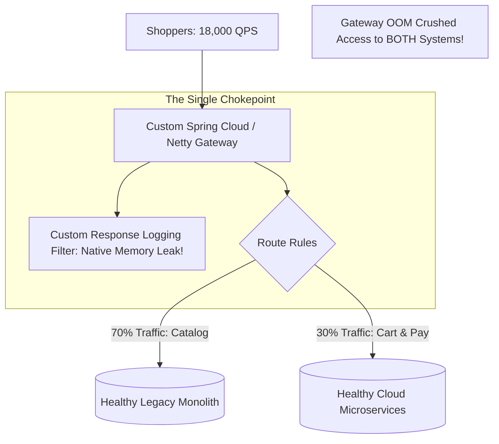
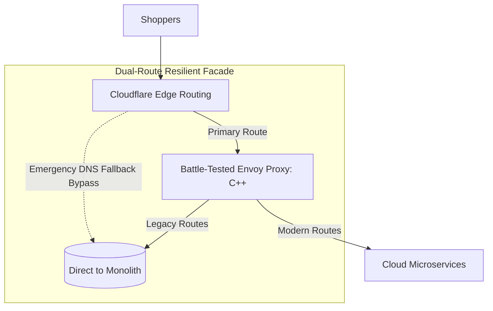

# Case Study: Strangler Fig Facade Gateway Memory Leak & Cyber Monday Blackout

> **Metadata**: ID: `CS-MOD-04` | Domain: Modernization / Retail | Type: Synthetic Forensic Case Study | Complexity: Advanced

---

## 01. Executive Summary
A major department store retailer modernized its monolithic e-commerce core by implementing the **Strangler Fig Pattern**, inserting a custom Spring Cloud Gateway reverse proxy to intercept user traffic and route requests between the legacy Java monolith and new cloud microservices. On Cyber Monday, under 18,000 requests/sec peak traffic, a subtle reactive memory leak in the gateway's custom Netty HTTP response buffering filter triggered JVM native memory exhaustion. The gateway crashed across all 48 container instances, severing access to both the new microservices and the healthy legacy monolith, resulting in a 4-hour e-commerce blackout and $12M in lost holiday revenue.

---

## 02. Business & System Context
- **Organization**: Retail E-Commerce Enterprise ($3.8B Annual Sales).
- **Architecture Strategy**: Strangler Fig pattern migrating Cart and Checkout to microservices while Catalog remained on legacy monolith.
- **Critical Scale**: 18,000 HTTP requests/second on peak shopping days.

---

## 03. Scope & Stakeholders
- **Incident Commander**: Lead Platform Architect.
- **Key Teams**: Edge Gateway Engineering, Core Commerce SRE, Cloud Infrastructure.
- **Impacted Workload**: 100% of global website and mobile application digital revenue.

---

## 04. Requirements & NFRs
- **Gateway Overhead**: P99 routing latency $< 10\text{ ms}$.
- **Throughput**: Support 25,000 peak concurrent HTTP connections.
- **Availability**: 99.99% during the Q4 peak shopping holiday window.

---

## 05. Constraints & Assumptions
- **The "Thin Gateway" Illusion**: The engineering team assumed that a reverse proxy is inherently lightweight, neglecting to load-test custom authentication and response-transformation filters under high concurrency.

---

## 06. Architecture Before: The Fragile Facade Gateway


---

## 07. Architecture Decisions
| Decision | Rationale | Downstream Failure |
| :--- | :--- | :--- |
| **Custom In-House API Gateway Code** | Required custom legacy cookie translation and HMAC request signing. | Implemented custom non-blocking Netty filters that retained byte buffers in native memory without calling `ReferenceCountUtil.release()`. |
| **Centralized Facade for ALL Traffic** | Single DNS endpoint to execute seamless Strangler Fig cutovers. | Created a single point of failure (SPOF) that took down healthy legacy systems when the facade failed. |

---

## 08. Timeline
```mermaid
timeline
    title Facade Gateway Blackout Timeline
    08:00 UTC : Cyber Monday flash sales begin; traffic surges from 4,000 QPS to 18,000 QPS
    08:30 UTC : Gateway pods report memory climbing linearly; CPU remains low (25%)
    08:52 UTC : Kubernetes node out-of-memory killer (OOMKilled) terminates 12 gateway pods
    08:55 UTC : Remaining gateway pods absorb load; memory leak accelerates; all 48 pods crash
    09:00 UTC : Complete e-commerce blackout: site returns HTTP 502 Bad Gateway
    11:30 UTC : SREs identify Netty byte buffer leak; deploy emergency config bypassing custom filter
    13:00 UTC : Gateway stabilized; full traffic restored after 4 hours of total downtime
```

---

## 09. Incident Event
At 08:00 UTC on Cyber Monday, traffic surged as marketing launched hourly doorbuster sales. Inside the custom Spring Cloud Gateway, a developer had implemented a response-auditing filter to log payload bodies during the Strangler migration. The filter cloned Netty `ByteBuf` structures using `DataBufferUtils.retain()`, but under high connection concurrency, early client disconnects bypassed the reactive `doFinally` cleanup handler. Unreleased direct byte buffers accumulated in off-heap native memory. At 08:52, the Linux kernel OOM killer terminated the gateway pods in rapid succession, disconnecting millions of shoppers from both the legacy and modern platforms.

---

## 10. Symptoms & Evidence
- **Fact**: JVM heap memory was stable at 35% utilization, while container resident set size (RSS) native memory hit 100% of limits.
- **Fact**: Linux system logs (`dmesg`) showed repeated `invoked oom-killer: gfp_mask=0x100cca... killed process java`.
- **Inference**: A modernization facade that crashes takes down both the old world and the new world simultaneously.

---

## 11. Failure Forensics
```
[18,000 Clients connect concurrently]
                  │
                  ▼
[Netty Reactive Event Loop allocates DirectByteBuffer]
                  │
                  ▼
[Custom Audit Filter calls DataBufferUtils.retain()]
                  │
                  ▼
[Shopper mobile connection drops / times out]
                  │
                  ▼
[Reactive Pipeline aborts -> cleanup block bypassed]
                  │
                  ▼
[Native Off-Heap Memory Leaks: 250MB/minute per pod]
                  │
                  ▼
[Linux OOM Killer executes -> ALL 48 GATEWAY PODS CRASH]
```

---

## 12. Root Cause Analysis (5-Whys)
1. **Why was the e-commerce site down for 4 hours?** -> The API Gateway pods crashed repeatedly in a CrashLoop.
2. **Why were the gateway pods crashing?** -> The Linux kernel terminated them due to native out-of-memory exhaustion.
3. **Why was memory exhausted?** -> Unreleased Netty direct byte buffers accumulated off-heap.
4. **Why were they unreleased?** -> A custom response logging filter failed to release reference-counted buffers upon client disconnects.
5. **Why was custom code in the critical facade path?** -> The team built a bespoke Java gateway rather than using hardened, production-tested native reverse proxies like Envoy or NGINX.

---

## 13. Contributing Factors
- **Monitoring Blind Spot**: SRE dashboards tracked JVM Heap Memory (`jvm_memory_used_bytes{area="heap"}`), completely missing the off-heap native memory explosion until the OOM killer struck.
- **Missing Chaos Testing**: Pre-holiday load tests tested steady-state traffic but never simulated high rates of client-aborted connections.

---

## 14. Architecture After: Hardened Envoy Proxy with DNS Bypass Safeguard


---

## 15. Recovery & Remediation
- **Immediate Mitigation**: SREs deployed an emergency configuration setting disabling the custom response-auditing filter, halting the memory leak immediately.
- **Permanent Architectural Fix**:
  - Replaced the custom Java/Spring Cloud Gateway with **Envoy Proxy (written in C++)**, eliminating JVM garbage collection and off-heap memory management vulnerabilities.
  - **Emergency DNS Bypass**: Configured edge routing rules in Cloudflare allowing instant traffic re-pointing directly to the legacy monolith in $< 30\text{ seconds}$ if the modernization facade ever degrades.
  - Added comprehensive **cgroup RSS memory alerting** in Prometheus.

---

## 16. Business & Technical Impact
- **Financial**: $12M in lost gross merchandise value (GMV) during peak Cyber Monday shopping hours.
- **Brand Reputation**: Trending topic on social media as thousands of frustrated holiday shoppers were blocked.
- **Architecture Standard**: Mandated that all future Strangler Fig facades must be built using hardened, off-the-shelf reverse proxies (Envoy / NGINX).

---

## 17. What Went Well
- Disabling the single filter hot-reloaded without requiring a full code re-compilation.
- The underlying legacy monolith and modern microservices were completely healthy throughout the incident.

---

## 18. Lessons Learned
- **Architecture**: The Strangler Fig facade is the most critical component in a modernization program. If the facade fails, your entire business fails.
- **Proxy Technology**: Do not write custom API gateways in application-layer languages (Java/Node.js) with complex reference-counted memory models. Use proven C/C++ proxies like Envoy.

---

## 19. Architectural Recommendations
| Horizon | Action Item | Owner | Target |
| :--- | :--- | :--- | :--- |
| **Immediate** | Audit all reactive gateway filters for proper reference-count release | Gateway Team | Zero memory leaks |
| **60 Days** | Migrate modernization routing layer to Envoy Proxy | Edge Arch | Sub-3ms routing p99 |
| **90 Days** | Implement automated emergency facade bypass routing in CDN edge | Cloud Lead | $< 60	ext{s}$ failover |
