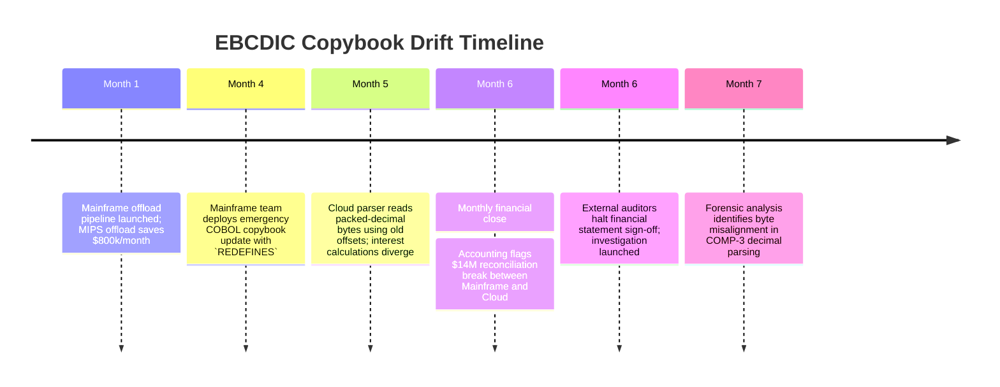
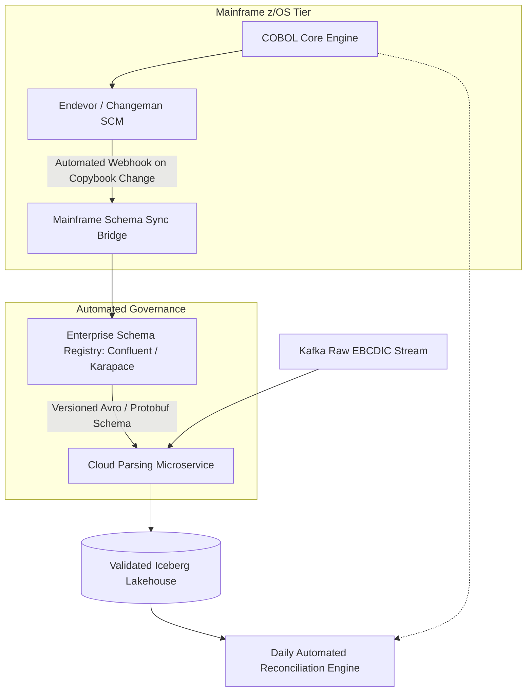

# Case Study: Mainframe Offload EBCDIC Copybook Drift & Ledger Corruption

> **Metadata**: ID: `CS-MOD-05` | Domain: Modernization / Mainframe | Type: Synthetic Forensic Case Study | Complexity: Advanced

---

## 01. Executive Summary
A national commercial bank initiated a mainframe offload program to stream core deposit transactions from an IBM z15 mainframe into an AWS cloud data lakehouse using Change Data Capture (CDC). The modernization team utilized an open-source COBOL copybook parser to translate raw IBM EBCDIC packed-decimal data (`COMP-3`) into JSON. Unknown to the cloud team, mainframe COBOL developers deployed an updated copybook introducing a conditional `REDEFINES` clause for a commercial interest calculation field. The offload parser misaligned binary byte offsets, silently corrupting commercial loan interest balances across 650,000 corporate accounts and causing a **$14M monthly accounting reconciliation break**.

---

## 02. Business & System Context
- **Organization**: National Commercial Bank ($140B Assets Under Management).
- **Core System**: IBM z15 Mainframe running COBOL core deposit and commercial lending applications.
- **Modernization Driver**: Offload expensive mainframe MIPS consumption to AWS cloud analytics.

---

## 03. Scope & Stakeholders
- **Incident Commander**: Principal Data Integrity Architect.
- **Key Teams**: Mainframe Systems Engineering, Cloud Data Platform Team, Financial Accounting.
- **Impacted Systems**: Corporate Loan Interest Accrual Ledger and Regulatory Capital Models.

---

## 04. Requirements & NFRs
- **Data Precision**: 100% mathematical parity with mainframe binary arithmetic.
- **Streaming Latency**: CDC replication lag $< 5\text{ seconds}$.
- **Audit Lineage**: Complete byte-level provenance from VSAM / Db2 z/OS datasets to cloud Iceberg tables.

---

## 05. Constraints & Assumptions
- **The "Copybooks are Static" Fallacy**: The cloud engineering team assumed COBOL copybook schemas were static, failing to establish an automated schema versioning and change-notification handshake with the mainframe operations team.

---

## 06. Architecture Before: The Fragile EBCDIC Parsing Pipeline
```mermaid
graph TD
    Mainframe[IBM z15 Mainframe: VSAM / Db2] --> CDC[Mainframe CDC Agent]
    CDC -->|Raw EBCDIC Binary Stream: COMP-3 Packed Decimal| Kafka[Kafka Event Mesh]
    
    subgraph Cloud Modernization (Offload Engine)
        Kafka --> Parser[Offload Parser Pod: Java Copybook Converter]
        Parser -->|Static Copybook v1.2: LACKS REDEFINES CLAUSE!| JSON[JSON Events: Corrupted Offsets!]
        JSON --> CloudDWH[(AWS S3 Iceberg Lakehouse: Corrupted Balances)]
    end
```

---

## 07. Architecture Decisions
| Decision | Rationale | Downstream Failure |
| :--- | :--- | :--- |
| **Offload EBCDIC Parsing to Cloud Workers** | Saved expensive mainframe CPU MIPS by parsing binary data on cheap cloud EC2 instances. | Shifted deep mainframe domain complexity (packed decimals, sign nibbles, REDEFINES clauses) to cloud developers who lacked mainframe expertise. |
| **Manual Copybook File Sync (Email / Wiki)** | Copybooks rarely changed, so teams synced `.cpy` files via shared Git repositories manually. | Mainframe team deployed an emergency production patch modifying byte offsets without notifying the cloud team. |

---

## 08. Timeline


---

## 09. Incident Event
During a routine regulatory interest rate adjustment, the mainframe systems team modified the core COBOL copybook (`LOAN-RECORD.cpy`). They added a `REDEFINES` structure allowing field `INTEREST-RATE` to be interpreted either as a 5-digit fixed rate or a 7-digit floating rate index. The cloud offload parser, running an outdated copybook specification, continued parsing the byte stream using fixed 5-digit offsets. Because COBOL `COMP-3` stores two decimal digits per byte plus a sign nibble, the 2-byte shift caused the parser to interpret floating-point basis points as whole percentage integers, inflating interest accruals by a factor of 100 on affected corporate accounts.

---

## 10. Symptoms & Evidence
- **Fact**: Cloud data lakehouse calculated $28.4M in monthly commercial loan interest, while the mainframe ledger calculated $14.4M (a $14M discrepancy).
- **Fact**: Raw binary hex dumps from Kafka showed byte sequence `0x00 0x14 0x5C`, which was misinterpreted by the cloud parser as `145.0%` instead of `1.45%`.
- **Inference**: Binary-level data translation across disparate machine architectures (EBCDIC big-endian to ASCII/UTF-8 little-endian) requires formal cryptographic schema registries.

---

## 11. Failure Forensics
```
[Mainframe writes COMP-3 Packed Decimal: 1.45% interest]
                          │
                          ▼
[EBCDIC Byte Stream: 0x00 0x14 0x5C emitted to Kafka]
                          │
                          ▼
[Cloud Parser uses outdated copybook without REDEFINES]
                          │
                          ▼
[Parser misinterprets byte offset by 2 bytes]
                          │
                          ▼
[Decodes 0x00145C as whole integer: 145.0% Interest!]
                          │
                          ▼
[$14,000,000 Accounting Reconciliation Break in Lakehouse]
```

---

## 12. Root Cause Analysis (5-Whys)
1. **Why was there a $14M accounting break?** -> The cloud lakehouse recorded wildly inflated interest rates for commercial loans.
2. **Why were interest rates inflated?** -> The cloud parser decoded binary packed decimal bytes using incorrect field offsets.
3. **Why were field offsets incorrect?** -> The mainframe copybook was modified in production without updating the cloud parser.
4. **Why was the parser not updated?** -> There was no automated pipeline connecting mainframe copybook changes to cloud parsers.
5. **Why was there no automated pipeline?** -> The organizational gap between the Mainframe team (z/OS) and the Cloud Data team (AWS) led to manual, ad-hoc governance.

---

## 13. Contributing Factors
- **COMP-3 Complexity**: Packed decimal binary format requires specialized decoding logic that standard cloud ETL tools do not handle natively.
- **Absence of Dual-Run Reconciliation**: The cloud lakehouse was used for commercial risk reporting without a daily automated reconciliation check against the mainframe General Ledger.

---

## 14. Architecture After: Governed Schema Registry for Mainframe Offload


---

## 15. Recovery & Remediation
- **Immediate Mitigation**: Re-processed 90 days of raw Kafka archival topics using the correct updated copybook, restoring mathematical balance parity.
- **Permanent Architectural Fix**:
  - Built an automated **Mainframe Schema Registry Bridge**: Any copybook committed to mainframe SCM (Endevor) automatically triggers a pipeline compiling the copybook into a versioned **Apache Avro Schema**.
  - **Dynamic Schema Matching**: Each message in Kafka includes the exact copybook version hash in its header; the parser dynamically fetches the corresponding schema version from the registry.
  - Deployed an **Automated Daily Reconciliation Daemon** comparing mainframe G/L balances against cloud lakehouse balances, flagging any variance $> $0.01 immediately.

---

## 16. Business & Technical Impact
- **Financial**: Avoided financial restatements; $450k spent on external forensic accounting audit fees.
- **Regulatory**: Satisfied Federal Reserve and OCC liquidity reporting requirements through automated daily reconciliation.
- **Modernization Confidence**: Mainframe offload program resumed safely, successfully reducing mainframe MIPS licensing by $12M annually.

---

## 17. What Went Well
- The raw binary Kafka topic retained 180 days of historical data, allowing 100% lossless replay and re-parsing.
- Financial controllers flagged the discrepancy during monthly close before false reports were filed with regulators.

---

## 18. Lessons Learned
- **Architecture**: You cannot offload data without offloading schema governance. Binary data formats require strict, version-controlled contract registries.
- **Organizational Silos**: Modernization fails when mainframe engineers and cloud engineers operate in disconnected technological vacuums.

---

## 19. Architectural Recommendations
| Horizon | Action Item | Owner | Target |
| :--- | :--- | :--- | :--- |
| **Immediate** | Implement daily automated reconciliation between mainframe and cloud | Data Lead | Zero manual recon |
| **60 Days** | Deploy automated Endevor-to-Schema-Registry CI/CD pipeline | Mainframe Arch | 100% automated schemas |
| **90 Days** | Mandate Avro contract wrappers for all mainframe CDC event streams | Lead EA | Zero binary offset drift |
