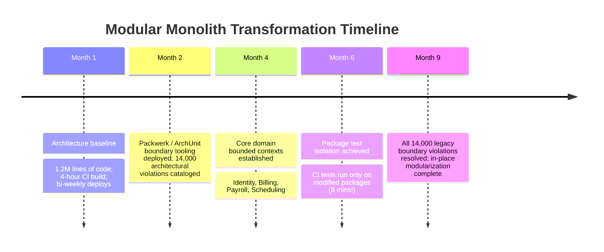
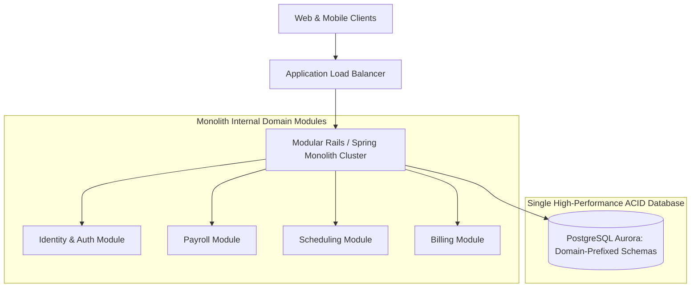

# Case Study: Modular Monolith Refactoring — Saving SaaS Engineering Velocity

> **Metadata**: ID: `CS-MOD-06` | Domain: Modernization / Architecture | Type: Success Case Study | Complexity: Expert

---

## 01. Executive Summary
A B2B SaaS platform ($180M Annual Recurring Revenue) experienced catastrophic engineering velocity decline: a 1.2-million-line Ruby on Rails monolith had degraded into an untestable "big ball of mud." Feature releases took 6 weeks, flaky test suites took 4 hours to run, and unexpected side effects were rampant. Rather than embarking on a risky, multi-year microservices rewrite, the enterprise architecture leadership executed an **In-Place Modular Monolith Refactoring**. Using compile-time boundary enforcement (Packwerk), strict Domain-Driven Design (DDD) bounded contexts, and internal public API contracts, the team revitalized the monolith in 9 months: **deployment frequency surged by 400%, test execution dropped to 8 minutes, and the business saved an estimated $15M in microservice infrastructure overhead**.

---

## 02. Business & System Context
- **Organization**: B2B Workforce Management SaaS (12,000 Corporate Customers, 1.5M Daily Users).
- **The Modernization Dilemma**: Competitors were moving faster; engineering teams were bogged down in regression bugs and slow CI pipelines.
- **Scale**: Monolithic codebase with 4,500 database models and 180 engineers committing to a single repository.

---

## 03. Scope & Stakeholders
- **Executive Sponsor**: Chief Technology Officer (CTO).
- **Modernization Leadership**: Principal Architecture Guild, Developer Experience (DevEx) Team.
- **Engineering Teams**: 18 Product Engineering Squads across 4 global hubs.

---

## 04. Requirements & NFRs
- **Deployment Velocity**: Increase release frequency from bi-weekly to multiple times per day.
- **CI Test Suite Runtime**: Reduce end-to-end test suite execution from 4 hours to $< 10\text{ minutes}$.
- **Zero Downtime**: Execute the entire architectural transformation without halting customer feature delivery.

---

## 05. Constraints & Assumptions
- **Rejecting the Microservices Trap**: Architecture leadership recognized that splitting into 40 microservices would introduce distributed transactions, network latency, and massive Kubernetes operational overhead that the 180-person engineering team was not equipped to manage.

---

## 06. Architecture: Monolithic Mud to Modular Monolith
```mermaid
graph TD
    subgraph Chaotic Monolith (Before: Big Ball of Mud)
        Entangle1[Billing Model] <--> Entangle2[Payroll Model]
        Entangle2 <--> Entangle3[Employee Model]
        Entangle3 <--> Entangle1
        Note1[Spaghetti Dependencies: Direct DB Queries Anywhere!]
    end
    
    subgraph Modular Monolith (After: Strict Bounded Contexts)
        subgraph Billing Package [package: billing]
            BillingAPI[Billing Public API Contract]
            BillingInternal[Private Billing Logic]
            BillingAPI --> BillingInternal
        end
        
        subgraph Payroll Package [package: payroll]
            PayrollAPI[Payroll Public API Contract]
            PayrollInternal[Private Payroll Logic]
            PayrollAPI --> PayrollInternal
        end
        
        PayrollInternal -->|Compile-Time Enforced Call| BillingAPI
        Note2[Enforced via Packwerk & ArchUnit: Zero Cross-Package Table Leakage]
    end
```

---

## 07. Key Architectural Decisions (Why It Succeeded)
| Architectural Decision | Strategic Context & Execution | Measurable Outcome |
| :--- | :--- | :--- |
| **In-Place Modular Monolith over Microservices** | Kept a single deployment artifact and single database, eliminating distributed network failures, 2PC transactions, and Kubernetes sprawl. | Saved $15M in infrastructure tooling; achieved microservice boundary benefits with in-memory execution speeds. |
| **Automated Boundary Enforcement (Packwerk / ArchUnit)** | Implemented static analysis tools in CI that mathematically failed pull requests if a package touched another package's private classes. | Permanently halted architectural erosion; eliminated spaghetti coupling. |
| **Package-Level Public Interface Contracts** | Each domain package exposed a clean public API (`Billing::PublicAPI`); all internal ActiveRecord models were made strictly private. | Decoupled domain implementations; allowed teams to refactor internals without breaking other squads. |

---

## 08. Timeline


---

## 09. Transformation Highlights & Execution
1. **Automated Architectural Linters**: Deployed Shopify's **Packwerk** to enforce static boundary analysis. The tool mapped existing dependencies and generated `deprecated_references.yml` baselines. A strict CI gate prevented *any new* circular or unapproved cross-domain references.
2. **Package-Level Test Execution**: By isolating domain packages, the CI runner could determine precisely which packages were modified in a pull request. Developers working on the Scheduling package only ran Scheduling tests, dropping local test runs from 4 hours to **8 minutes**.
3. **Database Schema Modularization**: Split database tables into domain-prefixed namespaces (`billing_*`, `payroll_*`). Prohibited cross-domain SQL joins in ActiveRecord code; cross-domain queries were routed through package API interfaces.

---

## 10. Symptoms of Success (Observable Metrics)
- **Deployment Frequency**: Surged from once every 2 weeks to **6 deployments per day**.
- **CI Build Duration**: Slashed by 96%, from 240 minutes down to **8.5 minutes**.
- **Change Failure Rate**: Production bug escape rate dropped from 18% to **2.4%**.

---

## 11. Success Forensics: Why Did In-Place Modularization Work?
```
[Developer edits Payroll logic]
                 │
                 ▼
[CI detects mutation strictly within packages/payroll/]
                 │
                 ▼
[Runs unit & integration tests ONLY for Payroll (6 mins)]
                 │
                 ▼
[Packwerk verifies zero private calls into packages/billing/]
                 │
                 ▼
[Single Monolithic Binary built and deployed in 2 mins]
                 │
                 ▼
[Feature in Production within 15 minutes of PR approval]
```

---

## 12. Root Factors in Success
1. **No Distributed System Complexity**: The system retained in-memory function calls, ACID database transactions, and simple local debugging, avoiding the massive cognitive and operational overhead of distributed microservices.
2. **Strong Developer Ergonomics**: Developers continued working in a single Git repository with simple local setup (`docker-compose up` launched the entire company's software stack).
3. **Incremental Migration with Deprecation Gates**: The team did not halt feature development. They drew a boundary line, grandfathered old violations, and burned down tech debt gradually during sprint cycles.

---

## 13. Organizational Factors
- **Ownership Alignment**: Each modular package mapped 1-to-1 with a cross-functional squad. Squads owned their package's public API and internal database schema.
- **Architectural Guild Governance**: Domain architects met bi-weekly to review package API evolution and resolve boundary ownership disputes.

---

## 14. Architecture After: High-Performance Modular Monolith


---

## 15. Long-Term Business & Technical Impact
- **Financial**: Avoided an estimated $15M in microservices Kubernetes tooling, service meshes, distributed tracing infrastructure, and dedicated platform teams.
- **Developer Retention**: Engineering turnover dropped from 22% to 4%; developer satisfaction scores rose to all-time highs.
- **Future-Proofing**: If a specific module (e.g., Scheduling) ever requires independent scaling in the future, its strict package boundaries allow it to be extracted into a standalone microservice in **under 2 weeks**.

---

## 16. Lessons Learned for Enterprise Architects
- **Microservices are an Organizational Tool, Not a Technical Goal**: You do not need microservices to achieve clean domain boundaries and rapid developer velocity. A Modular Monolith delivers 90% of the benefits with 10% of the complexity.
- **Enforce Boundaries with Tools, Not Good Intentions**: Software architecture degrades unless mathematically verified in CI/CD. Automated architectural fitness functions (Packwerk / ArchUnit) are mandatory.

---

## 17. Architectural Recommendations
| Horizon | Action Item | Owner | Target |
| :--- | :--- | :--- | :--- |
| **Immediate** | Install Packwerk / ArchUnit in legacy monoliths to map boundary violations | DevEx Lead | Violation baseline |
| **60 Days** | Enforce CI pull-request blocks on any new cross-domain table queries | Lead Arch | Zero new debt |
| **1 Year** | Complete package-level domain isolation across core monolith | Platform Lead | Sub-10m CI builds |
