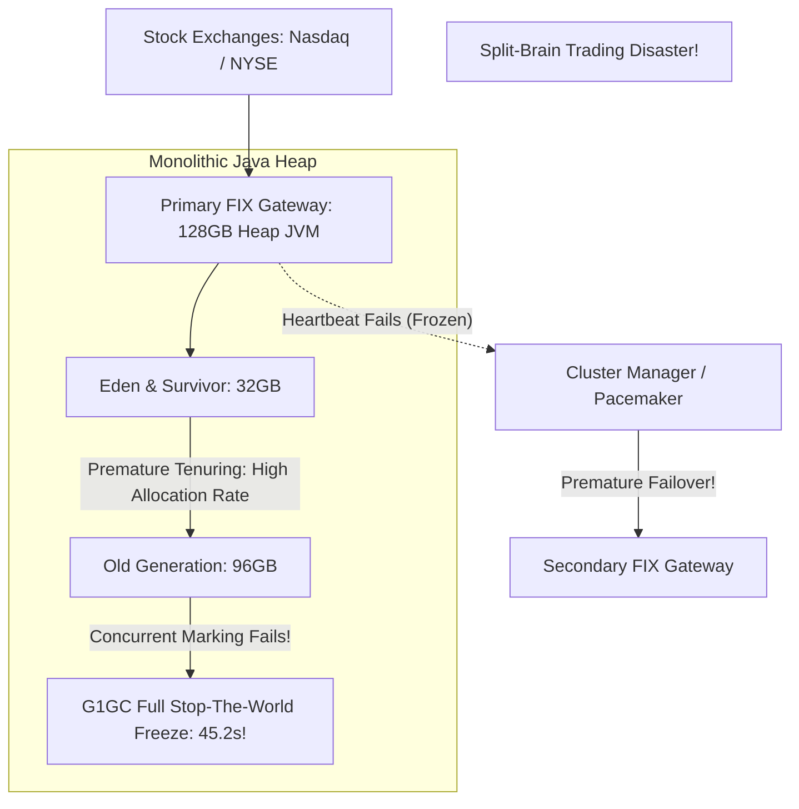

# Case Study: 45-Second JVM Garbage Collection Pause in Trading Gateway

> **Metadata**: ID: `CS-PERF-03` | Domain: Performance / Financial Markets | Type: Synthetic Forensic Case Study | Complexity: Expert

---

## 01. Executive Summary
A high-frequency institutional trading execution gateway ($40B daily volume) deployed a Java-based FIX protocol routing engine configured with a monolithic 128-Gigabyte JVM heap. The architecture team utilized the G1GC garbage collector, assuming modern hardware could manage 128GB without operational impact. During high market volatility, millions of short-lived market quote objects promoted into the Old Generation. When concurrent marking fell behind the allocation rate, the G1 collector collapsed into a single-threaded **Full GC Stop-The-World (STW) pause lasting 45.2 seconds**. The trading cluster classified the paused node as dead, triggered a violent split-brain failover, desynchronized market order books, and incurred $2.8M in errant trade execution losses.

---

## 02. Business & System Context
- **Organization**: Electronic Market Maker & Institutional Broker-Dealer.
- **Core Engine**: FIX Protocol Matching & Order Routing Gateway.
- **Scale**: 850,000 FIX order messages per second; sub-millisecond execution requirements.

---

## 03. Scope & Stakeholders
- **Incident Commander**: Head of Electronic Trading Architecture.
- **Key Teams**: Trading Systems Engineering, Low-Latency SRE, Market Risk Officers.
- **Impacted Systems**: Active-Passive Low-Latency Matching Gateway Cluster.

---

## 04. Requirements & NFRs
- **Order Execution Latency**: P99 $< 2.0\text{ ms}$; Maximum acceptable pause $< 10\text{ ms}$.
- **Cluster Heartbeat Timeout**: 3,000ms before triggering automated cluster node failover.
- **Zero Loss**: Zero duplicate or misrouted market orders.

---

## 05. Constraints & Assumptions
- **The "Large Heap Solves Everything" Fallacy**: Engineers believed that allocating 128GB of RAM would eliminate GC overhead by ensuring the application had "infinite room" to run without collecting memory.

---

## 06. Architecture Before: The 128GB JVM Trap


---

## 07. Architecture Decisions
| Decision | Rationale | Downstream Failure |
| :--- | :--- | :--- |
| **128GB Monolithic JVM Heap** | Avoided running out of memory during massive market data quote spikes. | Massive heap size turned minor full GC pauses from 100ms into catastrophic 45-second freezes. |
| **G1GC with Default Settings on Huge Heap** | Standard enterprise GC collector; believed to be self-tuning. | G1GC's single-threaded full GC fallback took nearly a minute to compact 96GB of fragmented heap objects. |

---

## 08. Timeline
```mermaid
timeline
    title 45-Second GC Incident Timeline
    09:30:00 : US Market opens; Federal Reserve interest rate announcement triggers extreme trading volatility
    09:30:15 : Inbound FIX quote rate surges from 150k/sec to 850k/sec
    09:30:45 : Object allocation rate hits 4.5 GB/sec; young gen tenuring threshold drops to 1
    09:31:00 : Old generation fills to 95%; concurrent marking threads cannot keep pace
    09:31:10 : G1GC triggers Full GC: ENTIRE JVM PROCESS FREEZES IN STOP-THE-WORLD
    09:31:13 : Pacemaker cluster manager misses 3 consecutive heartbeats (3s timeout); triggers failover
    09:31:15 : Secondary gateway activates; begins sending orders while primary is STILL FROZEN
    09:31:55 : Primary gateway unfreezes (45.2s pause); sends duplicate stale orders into market
```

---

## 09. Incident Event
At 09:31:10, during an unprecedented surge of 850,000 market quotes/sec, the primary trading gateway's object allocation rate overwhelmed G1GC's background marking cycles. The JVM initiated a fallback Full Stop-The-World Garbage Collection. The operating system suspended all application threads for 45.2 seconds while traversing 96GB of fragmented memory. Because the node was completely frozen, it stopped transmitting UDP cluster heartbeats. The standby node assumed the primary had crashed and promoted itself to active. When the primary unfroze at 09:31:55, both nodes operated simultaneously for 2 minutes, submitting competing, duplicate trade orders to market exchanges.

---

## 10. Symptoms & Evidence
- **Fact**: JVM GC log recorded: `[GC pause (G1 Evacuation Pause) (mixed)... [Full GC (Allocation Failure) 124G->18G(128G), 45.2104521 secs]`.
- **Fact**: 4,200 duplicate trade executions executed across Nasdaq and NYSE before risk gates intervened.
- **Inference**: High-throughput, low-latency financial systems cannot tolerate multi-gigabyte managed heaps using traditional generational garbage collectors.

---

## 11. Failure Forensics
```
[850,000 Quotes/sec generate 4.5 GB/sec of short-lived objects]
                             │
                             ▼
[Eden space fills in 800ms -> Tenuring threshold collapses to 1]
                             │
                             ▼
[Millions of temporary objects promoted into Old Gen]
                             │
                             ▼
[Old Gen reaches 96GB -> G1 Concurrent Marking falls behind]
                             │
                             ▼
[G1GC triggers Emergency Single-Threaded Full GC Compaction]
                             │
                             ▼
[STOP-THE-WORLD: All threads frozen for 45.21 Seconds]
                             │
                             ▼
[Pacemaker assumes node dead -> Promotes secondary -> SPLIT-BRAIN]
```

---

## 12. Root Cause Analysis (5-Whys)
1. **Why did the trading gateway split-brain?** -> The standby gateway took over while the primary was still running.
2. **Why did the standby take over?** -> The primary missed its 3.0-second cluster heartbeat deadline.
3. **Why did the primary miss heartbeats?** -> The entire JVM process was frozen in a Stop-The-World garbage collection pause.
4. **Why did the GC pause take 45.2 seconds?** -> The JVM had to traverse and compact a massive 128-Gigabyte heap.
5. **Why was the heap so large and fragmented?** -> Developers created millions of temporary `String` and `BigDecimal` objects per second instead of using off-heap memory and object pooling.

---

## 13. Contributing Factors
- **Premature Object Allocation**: Market quote parsing instantiated new Java objects for every tick rather than reusing pre-allocated ring buffers.
- **Coarse Cluster Heartbeat**: Heartbeats were executed from within the application JVM rather than an isolated external operating system daemon.

---

## 14. Architecture After: Zero-Allocation Off-Heap & ZGC
```mermaid
graph TD
    Exchange[Market Exchanges] --> Ingress[C++ / Java Low-Latency Ingress]
    
    subgraph Zero-Allocation Architecture
        Ingress --> RingBuffer[LMAX Disruptor Ring Buffer: Pre-Allocated]
        RingBuffer --> OffHeap[Off-Heap Chronicle Queue: Shared Memory]
        RingBuffer --> Worker[Single-Threaded Trading Core: Zero GC Allocations]
    end
    
    subgraph Modern Garbage Collector (Sub-Millisecond Pauses)
        Worker --> SmallJVM[Tuned 8GB JVM using ZGC: Generational]
        SmallJVM --> Note[Max STW Pause: < 1.0 Millisecond!]
    end
    
    HardwareHeartbeat[External Hardware BMC / OS Heartbeat] --> Pacemaker[Cluster Manager]
```

---

## 15. Recovery & Remediation
- **Immediate Mitigation**: Emergency trading halt called; trade reconciliation bots cancelled errant orders, absorbing a $2.8M loss.
- **Permanent Architectural Fix**:
  - **Zero-Allocation Memory Architecture**: Refactored the core trading loop to use the **LMAX Disruptor Pattern** and **Chronicle Queue** off-heap storage. Market quotes are processed in pre-allocated byte buffers without creating a single new Java heap object during normal processing.
  - **Modern Low-Latency GC**: Migrated from G1GC to **Generational ZGC** on a dramatically right-sized **8GB heap** (down from 128GB). Maximum GC pause times dropped from 45,000ms to **$< 0.8\text{ milliseconds}$**.
  - **Isolated Heartbeating**: Heartbeat monitoring moved to an independent OS daemon running in C with elevated real-time priority (`SCHED_FIFO`).

---

## 16. Business & Technical Impact
- **Financial**: $2.8M direct trade execution losses; avoided regulatory suspension by self-reporting the incident within 24 hours.
- **Performance**: Latency consistency achieved: P99.99 dropped from 45 seconds to **1.2 milliseconds**.
- **Engineering Standard**: Zero-allocation coding standards enforced across all electronic trading repositories.

---

## 17. What Went Well
- Exchange-level drop-copy execution feeds allowed real-time detection of duplicate orders within 120 seconds.
- Risk management circuit breakers halted trading before the duplicate order volume exceeded capital reserves.

---

## 18. Lessons Learned
- **Architecture**: A large JVM heap is not a performance feature; it is a liability. For low-latency systems, keep the heap small, or move memory off-heap entirely.
- **Cluster Heartbeats**: Never monitor node health from within a managed runtime (JVM/CLR). Garbage collection will eventually freeze the runtime and trigger a false-positive failover.

---

## 19. Architectural Recommendations
| Horizon | Action Item | Owner | Target |
| :--- | :--- | :--- | :--- |
| **Immediate** | Migrate all latency-critical JVM services to Generational ZGC | Trading Arch | Max pause $< 5	ext{ms}$ |
| **60 Days** | Decouple cluster heartbeats from JVM runtimes into OS daemons | SRE Lead | Zero false failovers |
| **1 Year** | Refactor core order book matching engine to off-heap memory | Core Eng | 100% zero-allocation |
