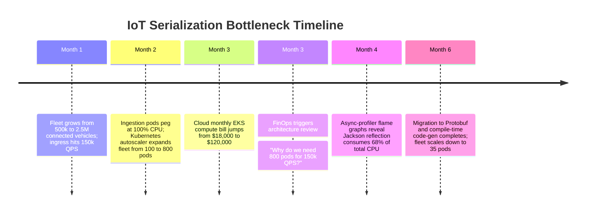

# Case Study: Reflection JSON Serialization CPU Bottleneck in IoT Telematics

> **Metadata**: ID: `CS-PERF-05` | Domain: Performance / IoT | Type: Synthetic Forensic Case Study | Complexity: Advanced

---

## 01. Executive Summary
A commercial connected-vehicle fleet tracking platform ingesting 150,000 telemetry messages/second experienced severe CPU saturation across its Kubernetes container fleet. To handle the load, the Horizontal Pod Autoscaler (HPA) continuously expanded the ingestion tier to **800 container pods**, yet pods remained pegged at 95% CPU while processing only 180 messages/sec per pod. CPU flame graphs revealed that **68% of total CPU cycles** were consumed by Java reflection and dynamic field introspection inside the Jackson JSON deserializer. By refactoring the ingestion pipeline to compile-time code-generated serializers and Protocol Buffers, the enterprise reduced its compute fleet from **800 pods down to 35 pods**, cutting cloud infrastructure costs by $1.1M annually.

---

## 02. Business & System Context
- **Organization**: Connected Fleet Telematics Provider (2.5M Commercial Trucks).
- **Core Workflow**: Real-Time GPS Tracking, Engine Diagnostic Telemetry, and Fuel Efficiency Analytics.
- **Scale**: 150,000 JSON telemetry payloads per second ($1.2\text{ Gbps}$ ingress).

---

## 03. Scope & Stakeholders
- **Incident Commander**: Principal IoT Systems Architect.
- **Key Teams**: Edge Device Firmware Team, Ingestion Platform Team, FinOps Council.
- **Technology Stack**: Java 17, Spring Boot, Jackson ObjectMapper, Kubernetes (EKS).

---

## 04. Requirements & NFRs
- **Ingestion Latency**: P99 $< 50\text{ ms}$ from edge gateway receipt to Kafka topic commit.
- **Compute Efficiency**: Target throughput of $\ge 2,500\text{ messages/second}$ per container core.
- **Cost Target**: Ingestion compute budget capped at $< $20,000/month.

---

## 05. Constraints & Assumptions
- **The "JSON is Standard" Assumption**: The original architecture team selected human-readable JSON payloads with standard Jackson reflection-based deserialization, assuming CPU consumption would be negligible compared to network I/O.

---

## 06. Architecture Before: The Reflection CPU Sink
```mermaid
graph TD
    Trucks[2.5M Connected Trucks] --> EdgeGW[Ingress Load Balancers: 150k QPS]
    EdgeGW --> PodFleet[Massive Kubernetes Fleet: 800 Pods!]
    
    subgraph CPU Sink inside Ingestion Pod (Java Jackson)
        PodFleet --> Reflection[Java Dynamic Reflection & Class Scanning]
        Reflection --> DateParser[Custom Regex Date Parser]
        DateParser --> GC[Temporary Object Allocations: 1.2 GB/sec/pod]
        Note[68% of CPU Spent in Deserialization Overhead!]
    end
    
    PodFleet --> Kafka[Kafka Event Mesh]
    CloudWatch[AWS Bill: $120k/month for Ingestion Fleet alone!]
```

---

## 07. Architecture Decisions
| Decision | Rationale | Downstream Failure |
| :--- | :--- | :--- |
| **Dynamic Reflection Deserialization** | Allowed easy addition of new vehicle sensor fields without recompiling client schemas. | Inspecting Java annotations via runtime reflection consumed 4.2 milliseconds of pure CPU per payload. |
| **Uncompressed Verbose JSON Over Cellular** | Easy for mobile developers and third-party telematics vendors to debug. | Transferred 25x more data over cellular networks than binary formats; saturated container memory with string allocations. |

---

## 08. Timeline


---

## 09. Incident Event
During Month 3, an executive review flagged that the IoT ingestion microservice had grown into the company's single largest cloud expense, running on 800 c6i.2xlarge Kubernetes worker nodes. Despite adding hundreds of compute nodes, end-to-end telemetry ingestion latency was degrading, with Kafka commit times rising to 450ms. Profiling revealed that the system was suffering from **Compute Starvation**: pods spent so much CPU time in reflection and regex string parsing that Kafka producer network threads were starved of CPU slices, causing thread queue backlogs.

---

## 10. Symptoms & Evidence
- **Fact**: Linux `perf` and Java `async-profiler` flame graphs demonstrated:
  - `com.fasterxml.jackson.databind.deser`: **42.4% CPU**
  - `java.lang.reflect.Method.invoke`: **16.2% CPU**
  - `java.text.SimpleDateFormat`: **9.4% CPU**
- **Fact**: Each pod processed an abysmal 187 messages/second per vCPU core.
- **Inference**: High-throughput distributed ingestion pipelines must never rely on runtime reflection or dynamic typing.

---

## 11. Failure Forensics
```
[Inbound Telemetry JSON: {"truckId":"TR-9901","speed":65.4,"coords":[-97.4,32.8]...}]
                               │
                               ▼
[Jackson introspects Java class annotations via Reflection API: 16.2% CPU]
                               │
                               ▼
[Jackson dynamically scans 48 fields; validates getters/setters: 42.4% CPU]
                               │
                               ▼
[Regex Date Parsing allocates 18 temporary Strings per message: 9.4% CPU]
                               │
                               ▼
[TOTAL CPU TIME: 4.2ms PER PAYLOAD]
                               │
                               ▼
[1 Pod with 2 vCPUs can only handle ~180 msgs/sec -> Demands 800 Pods!]
```

---

## 12. Root Cause Analysis (5-Whys)
1. **Why did the system require 800 pods?** -> Each individual container pod could only process 187 messages per second.
2. **Why was per-pod throughput so low?** -> 68% of CPU cycles were consumed by JSON deserialization overhead.
3. **Why did deserialization take so much CPU?** -> Jackson inspected Java class metadata dynamically via runtime reflection on every message.
4. **Why was dynamic reflection used?** -> The application utilized default Jackson configurations without compile-time code generation.
5. **Why was JSON chosen over binary formats?** -> Early architecture prioritized human readability during initial prototyping and never transitioned to binary protocols before scaling to millions of devices.

---

## 13. Contributing Factors
- **Thread-Unsafe Date Parsers**: Developers used un-pooled, legacy date formatters inside loops, allocating millions of ephemeral objects and creating constant GC allocation pressure.
- **Autoscaling as a Crutch**: Kubernetes HPA masked the software inefficiency for months by blindly spinning up more expensive cloud instances to satisfy traffic.

---

## 14. Architecture After: Protocol Buffers & Compile-Time Deserialization
```mermaid
graph TD
    Trucks[2.5M Connected Trucks] --> EdgeGW[Ingress Load Balancers]
    
    subgraph High-Efficiency Ingestion Tier (Only 35 Pods!)
        EdgeGW -->|Binary Protobuf Stream: 85% Smaller| PodFleet[Optimized Fleet: 35 Pods]
        PodFleet --> CodeGen[Compile-Time Code-Generated Deserializer: Zero Reflection!]
        CodeGen --> Kafka[Kafka Event Mesh]
    end
    
    subgraph Zero-Allocation Efficiency
        CodeGen --> OffHeap[Direct Memory Buffering]
        Note[Throughput: 4,500 msgs/sec per pod! CPU at 40%]
    end
```

---

## 15. Recovery & Remediation
- **Phase 1: Compile-Time JSON Code Generation**: Replaced Jackson reflection with **DSL-JSON / Jackson Blackbird**, which generates bytecode parsers at compile time. This immediately increased per-pod throughput by **350%** and reduced pod count from 800 to 220 within 3 weeks.
- **Phase 2: Protocol Buffers Transition**: Deployed an updated edge firmware package updating trucks to serialize telemetry via **Google Protocol Buffers (Protobuf)**. Protobuf payload sizes were 85% smaller than JSON, and binary deserialization consumed **92% less CPU**.
- **Result**: The entire 150,000 message/sec stream was consolidated onto **35 container pods**, running comfortably at 40% CPU.

---

## 16. Business & Technical Impact
- **Financial**: Cloud infrastructure bill plunged from $120,000/month to **$8,500/month** (saving $1,338,000 annually).
- **Cellular Bandwidth**: Reducing payload size saved the enterprise $2.4M annually in cellular carrier SIM data charges across the 2.5M truck fleet.
- **Latency**: P99 ingestion latency dropped from 450ms to **14 milliseconds**.

---

## 17. What Went Well
- Flame graphs created with `async-profiler` provided unambiguous mathematical evidence, immediately ending debate between dev and infra teams.
- The transition to Protobuf contracts established a clean, versioned schema foundation across edge and cloud teams.

---

## 18. Lessons Learned
- **Architecture**: Autoscaling is an operational safety net, not an architecture strategy. Masking software algorithmic inefficiency with cloud infrastructure autoscaling is a recipe for fiscal disaster.
- **Protocol Sizing**: Never use human-readable JSON for high-throughput machine-to-machine IoT telemetry. Always use compact, binary, schema-compiled formats (Protobuf / Avro).

---

## 19. Architectural Recommendations
| Horizon | Action Item | Owner | Target |
| :--- | :--- | :--- | :--- |
| **Immediate** | Ban runtime reflection parsers in any service processing $> 1,000$ QPS | Core Arch | Zero reflection in hot paths |
| **60 Days** | Mandate Protocol Buffers for all high-volume device-to-cloud streams | IoT Lead | 80% bandwidth reduction |
| **90 Days** | Add automated CPU flame-graph profiling to CI/CD canary deployments | Performance Eng| Detect CPU regressions |
