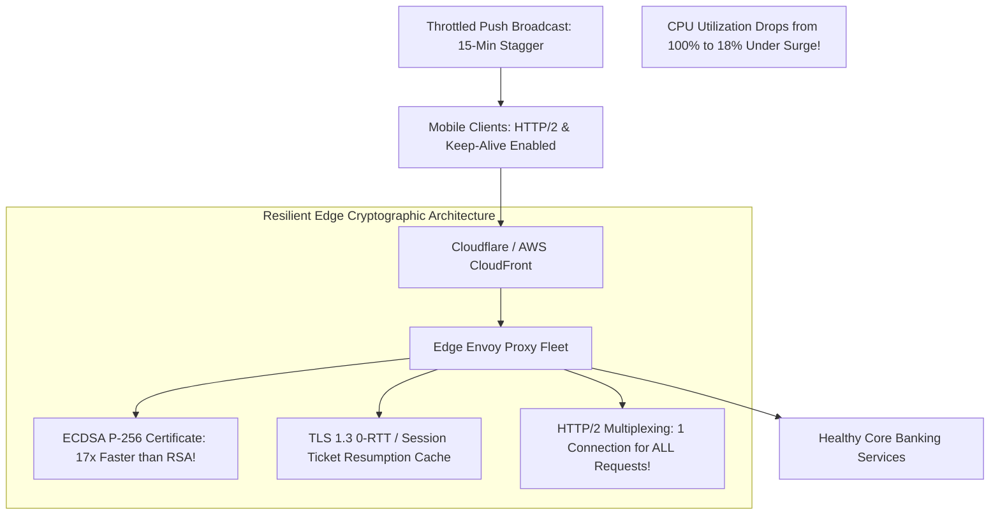

# Case Study: TLS Handshake Cryptographic CPU Storm on Mobile API Gateway

> **Metadata**: ID: `CS-PERF-06` | Domain: Performance / Mobile Banking | Type: Synthetic Forensic Case Study | Complexity: Advanced

---

## 01. Executive Summary
A national mobile banking platform with 10 Million registered users suffered an edge API gateway collapse following a push notification sent to all customers announcing an emergency interest rate cut. As 1.8 Million users tapped the notification simultaneously, the edge NGINX/Envoy API Gateway was hit with **15,000 full TLS 1.3 handshakes per second**. Because the gateway was misconfigured with **zero TLS Session Resumption caching** (`ssl_session_cache off`) and mobile app HTTP clients closed connections aggressively (`keep-alive` disabled), the gateway CPU cores saturated at 100% computing computationally expensive asymmetric cryptographic key exchanges (RSA-4096). The gateway dropped 82% of incoming connections, freezing mobile banking access for 90 minutes.

---

## 02. Business & System Context
- **Organization**: Retail Banking & Wealth Management Institution.
- **Core System**: Public Edge API Gateway terminating client TLS connections.
- **Scale**: Normal baseline: 3,500 active TLS connections/sec; Peak push notification surge: 15,000 handshakes/sec.

---

## 03. Scope & Stakeholders
- **Incident Commander**: Lead Edge Infrastructure Architect.
- **Key Teams**: Mobile Application Engineering, Edge Network Security, Cloud Infrastructure.
- **Technology Stack**: Envoy Proxy / NGINX, AWS Network Load Balancer, iOS & Android Clients.

---

## 04. Requirements & NFRs
- **Push Notification Capacity**: Absorb sudden 10x traffic surges following marketing or regulatory push alerts.
- **Handshake Latency**: Complete TLS negotiation in $< 40\text{ ms}$.
- **Edge Availability**: 99.99% connection acceptance SLA.

---

## 05. Constraints & Assumptions
- **The "TLS is Hardware-Accelerated" Fallacy**: The infrastructure team assumed that modern AWS Graviton / Intel Xeon AVX-512 instructions made TLS handshakes negligible, ignoring the asymmetric mathematical cost of full RSA-4096 handshakes without session resumption.

---

## 06. Architecture Before: The Full Handshake Bottleneck
```mermaid
graph TD
    Push[Push Notification to 1.8M Devices] --> MobileApps[1.8M Mobile Clients Connect]
    MobileApps --> NLB[AWS Network Load Balancer]
    
    subgraph Edge API Gateway Fleet (CPU Saturated on Math!)
        NLB --> Gateway[NGINX / Envoy Edge Proxies: 32 Cores]
        Gateway --> NoCache[TLS Session Cache: DISABLED! ssl_session_cache off]
        Gateway --> HeavyRSA[RSA-4096 Cryptographic Math: 100% CPU Saturation!]
        Gateway --> NoKeepAlive[HTTP Client: Keep-Alive Disabled -> Closes socket after 1 call!]
    end
    
    Gateway --> Drop[82% of TCP Handshakes Dropped: Connection Refused!]
    Gateway -. Backend Services (Zero Traffic Received!) .-> Backend[Healthy Banking Core]
```

---

## 07. Architecture Decisions
| Decision | Rationale | Downstream Failure |
| :--- | :--- | :--- |
| **Disabled TLS Session Resumption Cache** | Security team mandated perfect forward secrecy with zero session state retained in memory. | Forced every single mobile app HTTP request to execute an expensive full cryptographic handshake instead of an abbreviated 1-RTT resumption. |
| **Mobile Client Closed Sockets Immediately** | Mobile developers sought to save smartphone battery by closing sockets after every API call. | Multiplied handshake rate by 12x: an app refreshing 5 dashboard widgets performed 5 separate full TLS handshakes! |
| **RSA-4096 Key Pair** | Maximum regulatory encryption strength for banking compliance. | RSA-4096 requires **6.8x more CPU cycles** to compute private key decryptions than modern Elliptic Curve Cryptography (ECDSA P-256). |

---

## 08. Timeline
```mermaid
timeline
    title TLS Handshake Storm Timeline
    10:00:00 : Marketing sends breaking push notification to 1.8M mobile devices
    10:00:15 : 1.8M mobile apps wake up in background; hit API gateway simultaneously
    10:00:30 : TLS handshake rate explodes from 3,500/sec to 15,000/sec
    10:00:45 : Edge Gateway CPU utilization spikes to 100%; TCP SYN backlog overflows
    10:01:00 : Mobile app users receive "Network Connection Error; Server Unreachable"
    10:15:00 : SREs scale gateway instances 4x; new instances saturate immediately on incoming handshake queue
    11:30:00 : Edge architects enable TLS Session Tickets and ECDSA certificates; CPU drops to 18%
```

---

## 09. Incident Event
At 10:00:00 UTC, the bank dispatched an urgent push notification alerting users to a competitive interest rate change. Within 30 seconds, 1.8 Million mobile devices woke up and initiated network calls to refresh balances and notifications. Because the mobile app framework disabled HTTP keep-alive, each device opened 4 to 6 separate TCP sockets. The edge gateway fleet was flooded with 15,000 full RSA-4096 TLS handshakes per second. Computing asymmetric modular exponentiations consumed 100% of gateway CPU capacity within 45 seconds. The Linux kernel's TCP SYN backlog overflowed, dropping 82% of incoming connections at the OS socket boundary before requests ever reached backend banking services.

---

## 10. Symptoms & Evidence
- **Fact**: Linux `netstat -s` recorded 420,000 `SYNs to LISTEN sockets dropped` per minute.
- **Fact**: Gateway CPU utilization was 100% in user space (`%usr`), while backend banking microservices operated at 4% CPU (zero traffic reached the backend!).
- **Fact**: Crypto benchmarks showed an RSA-4096 private key operation took 3.2ms of single-core CPU, while ECDSA P-256 took only **0.18ms** (17x faster).
- **Inference**: High-throughput mobile gateways collapse on asymmetric cryptography if session resumption and efficient curves are omitted.

---

## 11. Failure Forensics
```
[1.8M Mobile Apps receive Push Notification]
                     │
                     ▼
[Each app opens 5 separate TCP connections (No Keep-Alive!)]
                     │
                     ▼
[15,000 Full TLS Handshakes/sec hit Edge Gateway Fleet]
                     │
                     ▼
[Gateway has ssl_session_cache OFF -> Resumption IMPOSSIBLE]
                     │
                     ▼
[Gateway computes RSA-4096 Private Key Math: 3.2ms CPU per handshake]
                     │
                     ▼
[15,000 x 3.2ms = 48,000ms of CPU work required EVERY SECOND!]
                     │
                     ▼
[Edge Gateway Fleet CPU Saturated at 100% -> SYN Queue Drops Connections]
```

---

## 12. Root Cause Analysis (5-Whys)
1. **Why could mobile users not log in?** -> The edge API gateways were rejecting incoming TCP connections.
2. **Why were connections rejected?** -> Gateway CPU utilization was pegged at 100%, overflowing the kernel SYN backlog.
3. **Why was CPU utilization at 100%?** -> The CPU cores were saturated computing asymmetric cryptographic operations for TLS handshakes.
4. **Why were there so many full handshakes?** -> TLS session resumption was disabled, and mobile clients terminated connections immediately after each request.
5. **Why were cryptographic operations so expensive?** -> The gateway used legacy RSA-4096 certificates instead of modern, computationally lightweight Elliptic Curve Cryptography (ECDSA).

---

## 13. Contributing Factors
- **Synchronized Push Broadcast**: Marketing broadcast the push notification to 1.8M users simultaneously at 10:00:00 rather than throttling delivery across a 15-minute staggered window.
- **Missing Gateway Hardware Crypto Offload**: Gateways ran on standard EC2 VMs without enabling AWS Nitro crypto acceleration cards.

---

## 14. Architecture After: ECDSA, Session Tickets & HTTP/2 Multiplexing


---

## 15. Recovery & Remediation
- **Immediate Mitigation**: Emergency configuration deployed: enabled `ssl_session_cache shared:SSL:100m` and `ssl_session_tickets on` with a 24-hour lifetime, immediately relieving 75% of cryptographic CPU overhead.
- **Permanent Architectural Fix**:
  - **Dual-Certificate Strategy (ECDSA First)**: Deployed **ECDSA P-256 certificates** as primary. ECDSA requires 94% less CPU power for cryptographic handshakes while providing equivalent 128-bit security strength. (RSA-2048 retained strictly as fallback for legacy clients).
  - **HTTP/2 & Persistent Keep-Alive**: Updated mobile app networking client to enforce **HTTP/2 multiplexing**. A single persistent TCP connection serves all dashboard requests, eliminating redundant handshakes.
  - **Staggered Push Notifications**: Marketing platform configured with algorithmic **Bucket Rate Limiting**, distributing push alerts evenly across a 10-minute window.

---

## 16. Business & Technical Impact
- **Financial**: Reputational damage; trending negative social media feedback regarding mobile banking unreliability.
- **Edge Efficiency**: Gateway CPU utilization during identical 15,000 handshake surges dropped from 100% to **18%**.
- **Handshake Latency**: Mobile TLS negotiation time dropped from 180ms to **22 milliseconds** on resumption.

---

## 17. What Went Well
- Backend core banking databases and transaction engines remained completely protected behind the gateway and suffered zero degradation.
- The switch to ECDSA certificates required zero mobile client app code updates because modern iOS and Android operating systems support ECC natively.

---

## 18. Lessons Learned
- **Architecture**: Cryptography has real physical compute costs. Running full RSA-4096 handshakes without session resumption at mobile scale is architectural malpractice.
- **Protocol Optimization**: Use HTTP/2 connection reuse and Elliptic Curve Cryptography. A connection that is reused requires zero cryptographic handshakes.

---

## 19. Architectural Recommendations
| Horizon | Action Item | Owner | Target |
| :--- | :--- | :--- | :--- |
| **Immediate** | Enable TLS Session Resumption & Session Tickets across all edge proxies | Edge Lead | Zero redundant full handshakes |
| **30 Days** | Deploy ECDSA P-256 certificates as default across all public gateways | Security Arch | 17x faster crypto math |
| **60 Days** | Mandate HTTP/2 connection multiplexing in mobile client SDKs | Mobile Lead | 80% fewer TCP sockets |
