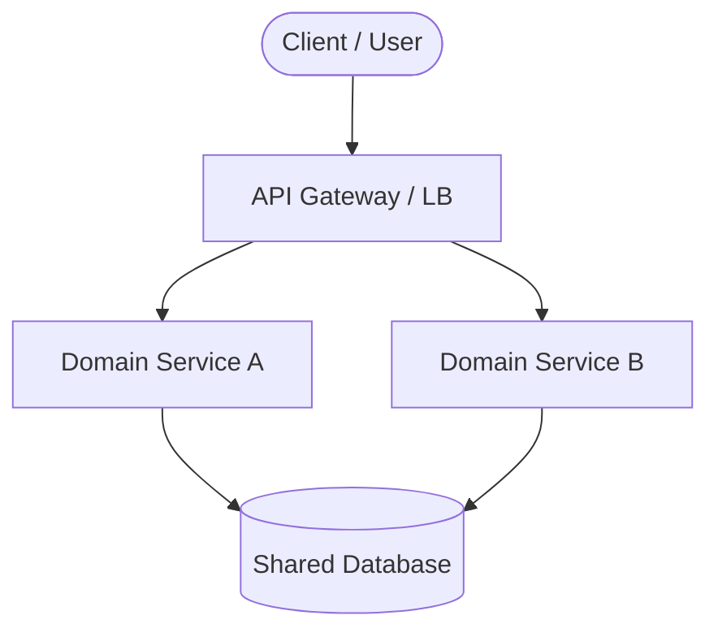
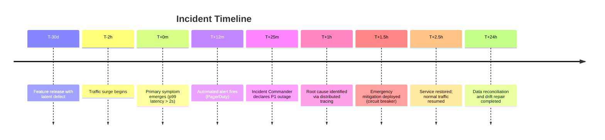
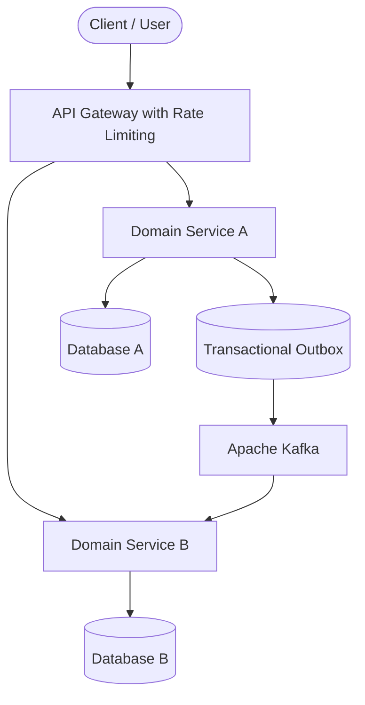

# Enterprise Architecture Post-Mortem Template (19-Section Standard)

> **Document Classification**: Internal Architecture Deliverable  
> **Investigation Standard**: Blameless Forensic Post-Mortem (19-Section Specification)

---

## 01. Executive Summary
- **Incident / Event Title**: [Brief, descriptive title]
- **Date & Duration**: [Incident start, detection, and mitigation timestamps]
- **Affected Systems**: [Primary and secondary systems impacted]
- **Business Impact**: [Quantified revenue loss, SLA breaches, customer volume affected]
- **Primary Architectural Root Cause**: [High-level technical or systemic root cause]
- **Core Lesson for Architects**: [Key architectural takeaway in one sentence]

---

## 02. Business & System Context
- **Organization & Industry**: [Organization type, regulatory environment]
- **System Role**: [Purpose of the system in the enterprise value chain]
- **Critical Workflows**: [Revenue-critical or life-critical paths involved]
- **User Personas & Scale**: [Active users, baseline transactions per second]

---

## 03. Scope & Stakeholders
- **Executive Owner**: [VP of Engineering / Principal Architect]
- **Investigation Commander**: [Lead Forensic Architect]
- **Participating Teams**: [Platform, SRE, Database, Application, Security]
- **External Dependencies**: [Third-party SaaS, Cloud Hyperscalers, Payment Rails]

---

## 04. Requirements & Non-Functional Requirements (NFRs)
- **Functional Scope**: [Expected normal behavior of the system]
- **Target SLOs / NFRs**:
  - Availability Target: [e.g., 99.95%]
  - P95 / P99 Latency Budget: [e.g., < 200ms]
  - Recovery Time Objective (RTO): [e.g., < 15 min]
  - Recovery Point Objective (RPO): [e.g., < 1 min]

---

## 05. Constraints & Assumptions
- **Historical Technical Debt**: [Legacy databases, unmaintained libraries]
- **Operational & Budgetary Constraints**: [Staffing limits, maintenance windows]
- **Original Architecture Assumptions**: [Assumptions that proved false during incident]

---

## 06. Architecture Before

*Provide a detailed explanation of data flows, network boundaries, and state management prior to the incident.*

---

## 07. Architecture Decisions
| Decision ID | Architectural Choice | Original Rationale | Hidden Trade-Off / Failure Mode |
| :--- | :--- | :--- | :--- |
| **AD-01** | [e.g., Shared DB] | [e.g., Immediate consistency] | [e.g., Cross-domain lock contention] |
| **AD-02** | [e.g., Sync HTTP] | [e.g., Simplicity] | [e.g., Cascading latency amplification] |

---

## 08. Timeline


---

## 09. Incident / Transformation Event
*Detailed chronological narrative describing the specific event, trigger, or transformation that precipitated the failure.*

---

## 10. Symptoms & Evidence
### Observable Facts
- **Fact 1**: [Metric or log evidence, e.g., CPU spiked to 98% on primary DB]
- **Fact 2**: [Connection pool timeout errors logged at rate of 4,500/sec]

### Inferences vs. Disproven Hypotheses
- **Inference**: [Logical deduction drawn from evidence]
- **Disproven Hypothesis**: [Initial theory investigated and ruled out]

---

## 11. Failure Forensics
```
[Triggering Event]
       │
       ▼
[Subsystem Saturation]
       │
       ▼
[Feedback Loop / Retry Storm]
       │
       ▼
[Cascading Dependency Collapse]
```
*Deep technical analysis of memory dumps, connection pools, query plans, lock graphs, or network packets.*

---

## 12. Root Cause Analysis (5-Whys)
1. **Why did the service fail?** -> [Immediate cause]
2. **Why did the immediate cause occur?** -> [Direct trigger]
3. **Why was the trigger uncontained?** -> [Missing backpressure / circuit breaker]
4. **Why was there no backpressure?** -> [Architectural decision prioritizing throughput over resilience]
5. **Why was that decision made?** -> [Systemic / Organizational root cause]

---

## 13. Contributing Factors
- **Observability Deficits**: [Missing metrics, noisy alerts]
- **Testing Deficits**: [Lack of production-scale soak/chaos testing]
- **Process & Governance Deficits**: [Missing architectural review of critical changes]

---

## 14. Architecture After / Resolution

*Detail all components added, decoupled, or refactored to eliminate the root cause.*

---

## 15. Recovery / Migration / Remediation
- **Phase 1: Immediate Mitigation**: [Steps taken during incident to restore traffic]
- **Phase 2: Permanent Architectural Fix**: [Code, infrastructure, and schema fixes]
- **Phase 3: Preventive Hardening**: [Long-term guardrails and chaos experiments]

---

## 16. Business & Technical Impact
- **Financial Cost**: [Direct lost revenue, chargeback fees, compensation]
- **SLA Breach**: [Monthly uptime degradation, contractual penalty liability]
- **Customer Sentiment**: [Impact on brand reputation, churn risk]

---

## 17. What Went Well
- [Effective monitoring alert that notified team before customer escalations]
- [Fast communication in incident bridge]
- [Clean rollback or feature flag deactivation]

---

## 18. What Went Wrong / Lessons Learned
- **Architecture**: [Architectural anti-pattern uncovered]
- **Data**: [Inconsistency or reconciliation failure]
- **Operations**: [Runbook gap or diagnostic delay]
- **Organization**: [Silo or communication breakdown]

---

## 19. Architectural Recommendations & Long-Term Actions
| Time Horizon | Action Item | Owner | Priority | Success Metric |
| :--- | :--- | :--- | :--- | :--- |
| **Immediate (0-7d)** | [e.g., Cap connection pools] | SRE Lead | P0 | Zero pool exhaustion |
| **30 Days** | [e.g., Implement Circuit Breaker] | Arch Lead | P1 | Automated shedding |
| **90 Days** | [e.g., Decompose Shared DB] | Data Arch | P1 | Independent schemas |
| **6 Months** | [e.g., Chaos Engineering drills] | Platform | P2 | Automated recovery |
