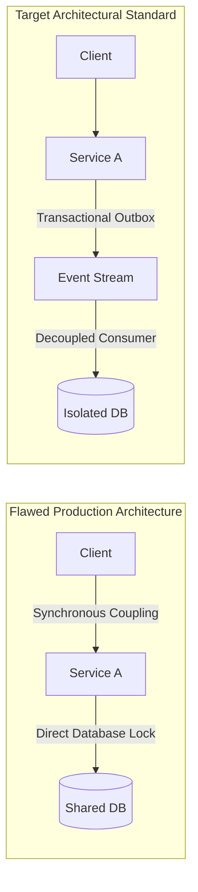

# Architecture Review Board (ARB) Incident Submission Template

> **Submission Metadata**:  
> **ARB Review ID**: `ARB-INC-XXXX` | **Related Incident**: `INC-XXXXX`  
> **Sponsoring Architect**: `Lead Architect Name` | **Review Date**: `YYYY-MM-DD`  
> **Affected Architectural Domain**: `Cloud / Integration / Data / Security`

---

## 1. Executive Problem Statement
*Describe the systemic architectural vulnerability that triggered the incident. Explain why existing architectural guidelines or review gates failed to detect or mitigate this vulnerability prior to production deployment.*

---

## 2. Structural Architecture Defect Analysis
*Provide a technical diagram contrasting the flawed architecture with the proposed target state.*



---

## 3. Failure Mode and Effects Analysis (FMEA)

| Failure Mode | Severity (1-10) | Likelihood (1-10) | Detectability (1-10) | Risk Priority Number (RPN) | Proposed Architectural Control |
| :--- | :--- | :--- | :--- | :--- | :--- |
| Database connection starvation during latency spikes | 9 | 8 | 6 | **432** | AWS RDS Proxy connection multiplexer + 1.5s fast-fail timeouts |
| Unbounded client retry storm knocking partner APIs offline | 8 | 7 | 7 | **392** | Mandatory Envoy circuit breakers with full jitter backoff |
| Cross-tenant data leak from missing ORM query filter | 10 | 4 | 8 | **320** | Enforced PostgreSQL Row-Level Security (RLS) at engine tier |

---

## 4. Proposed Policy, Standard, or Guardrail Amendment
*Draft the exact wording of the architectural standard or fitness function to be added to the enterprise handbook.*

> **New Enterprise Architecture Standard [STD-XXXX]**:  
> *"All relational databases serving multi-tenant SaaS workloads in a shared-schema model must enforce PostgreSQL Row-Level Security (RLS) directly within the database engine. Application-level `WHERE tenant_id = ?` clauses shall not be considered an acceptable security boundary."*

---

## 5. Automated Fitness Function & Verification Gate
*How will compliance with this new standard be automatically enforced in CI/CD without relying on human committee reviews?*

```java
// Example: ArchUnit Automated Fitness Function Rule
@ArchTest
public static final ArchRule no_direct_database_locks = 
    noClasses().that().resideInAPackage("..service..")
    .should().dependOnClassesThat().resideInAPackage("..legacy.database.locks..")
    .because("All multi-service transactions must use asynchronous Sagas per STD-XXXX");
```

---

## 6. ARB Decision & Disposition
- [ ] **Approved As Policy**: Added to Enterprise Architecture Handbook; automated CI gates enabled.
- [ ] **Approved with Amendments**: Subject to revisions detailed in meeting minutes.
- [ ] **Rejected**: Team directed to evaluate alternative architectural remediations.

**Chief Architect Signature**: ___________________________ **Date**: `YYYY-MM-DD`
