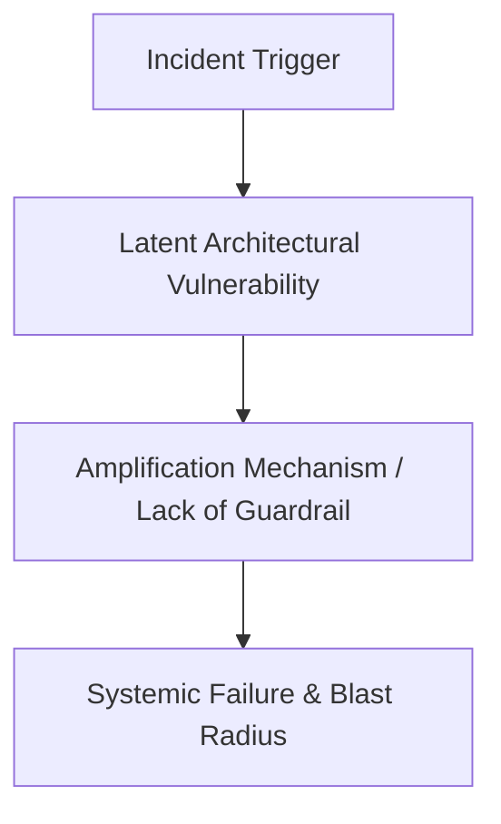

# Blameless Post-Mortem Incident Report

> **Incident Metadata**:  
> **Incident ID**: `INC-XXXXX` | **Date of Incident**: `YYYY-MM-DD` | **Severity**: `P0 / P1 / P2`  
> **Incident Commander**: `Name / Title` | **Lead Architect**: `Name / Title` | **Scribe**: `Name / Title`  
> **Impacted Systems**: `List of affected services, databases, regions`

---

## 1. Executive Summary
*Provide a concise 2-paragraph summary written for executive leadership describing what broke, the business and customer impact, the duration of the outage, and the high-level technical remediation.*

---

## 2. Business & Customer Impact
- **Financial Impact**: $`0.00` in lost revenue, refunds, or SLA penalties.
- **Customer Experience**: `Number of users affected, error rates observed, customer support tickets filed`.
- **Operational Impact**: `Internal operations paralyzed, manual workarounds required`.
- **Regulatory / Compliance**: `Were reporting deadlines missed? Was any PII/PHI exposed?`

---

## 3. Incident Timeline (Reconstructed UTC)
*List the precise sequence of events with exact timestamps. Focus on telemetry signals, alerts, decisions, and system state transitions.*

| Timestamp (UTC) | Elapsed | Actor / System | Event / Observation / Action |
| :--- | :--- | :--- | :--- |
| `00:00:00` | T+0 | System Event | Incident trigger initiates (e.g., code deployment, traffic surge, fiber cut). |
| `00:04:15` | T+4m | PagerDuty | Automated alert fires on P99 latency threshold breach. |
| `00:10:00` | T+10m | On-Call SRE | Incident response bridge opened; Incident Commander assigned. |
| `00:35:00` | T+35m | Engineering Team | Diagnostic hypothesis formed; telemetry confirms root component. |
| `01:15:00` | T+75m | Incident Commander | Mitigation action approved and deployed (e.g., rollback, traffic shed). |
| `01:45:00` | T+105m | SRE Lead | System metrics return to baseline; all health checks reporting green. |
| `02:00:00` | T+120m | Incident Commander | Incident officially closed; post-mortem owner assigned. |

---

## 4. Technical Architecture: What Happened?

### 4.1 Latent System Conditions
*What structural conditions existed in the architecture that allowed this trigger to cause failure?*

### 4.2 Trigger Event
*What immediate event activated the latent condition?*

### 4.3 Propagation & Amplification Mechanics
*Why did the failure cascade? Why did upstream or downstream systems fail to isolate the blast radius?*

---

## 5. Root Cause Analysis (5-Whys)
1. **Why did the system fail?** -> `Immediate symptom`
2. **Why did that symptom occur?** -> `Direct technical cause`
3. **Why did that technical cause happen?** -> `Underlying design or scaling limit`
4. **Why was that limit exceeded without mitigation?** -> `Missing architectural guardrail or circuit breaker`
5. **Why was the guardrail missing?** -> `Fundamental architecture, governance, or testing deficiency`

---

## 6. What Went Well vs. Where We Got Lucky vs. Where We Failed

### What Went Well
- *Tools, alerts, or procedures that functioned as intended.*

### Where We Got Lucky
- *Circumstances that prevented worse impact through coincidence rather than design.*

### Where We Failed
- *Monitoring blind spots, delayed communication, missing runbooks, or faulty assumptions.*

---

## 7. Action Items & Remediation Roadmap (CAPA)
*Every action item must have a single directly responsible individual (DRI), a clear delivery horizon, and a verification test.*

| Action ID | Priority | Category | Remediation Action Description | Owner (DRI) | Target Date | Verification Gate |
| :--- | :--- | :--- | :--- | :--- | :--- | :--- |
| `ACT-01` | P0 | Immediate | Add circuit breaker to prevent retry cascade | Jane Doe | `YYYY-MM-DD` | Chaos load test in staging |
| `ACT-02` | P1 | Architecture | Migrate DB connection pools to AWS RDS Proxy | John Smith | `YYYY-MM-DD` | Max connection saturation test |
| `ACT-03` | P2 | Telemetry | Deploy Prometheus alert on queue consumer lag | Alex Ray | `YYYY-MM-DD` | Simulated backlog injection |
