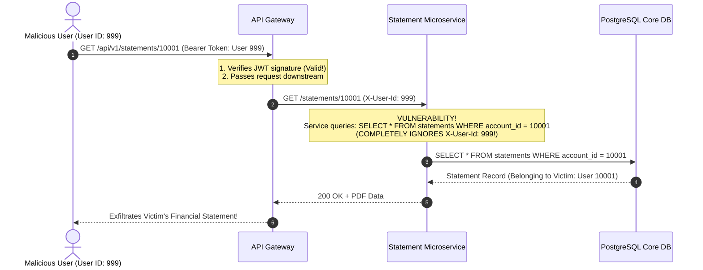

# Case Study: Broken Object-Level Authorization (BOLA) Exposing 3.5M Banking Records

> **Metadata**: ID: `CS-SEC-01` | Domain: Security / Fintech | Type: Synthetic Forensic Case Study | Complexity: Advanced

---

## 01. Executive Summary
A digital mobile neobank serving 3.5 Million active depositors suffered a massive data breach when a malicious actor discovered a **Broken Object-Level Authorization (BOLA / IDOR)** vulnerability in the mobile document retrieval endpoint (`GET /api/v1/statements/{account_id}`). While the API Gateway verified that the user's JWT token was cryptographically valid (Authentication), the backend microservice failed to verify whether the authenticated user actually owned the requested `account_id` (Authorization). Using sequential account identifiers, the attacker scraped 3.5 Million monthly statements containing customer Social Security numbers, home addresses, and bank balances over a 72-hour holiday weekend, leading to an $18M regulatory penalty.

---

## 02. Business & System Context
- **Organization**: Retail Digital Neobank ($4B in Deposits).
- **Core Workflow**: Mobile Account Management, Statement PDF Generation, and Transaction History.
- **Scale**: 3.5 Million customer accounts; 25,000 statement downloads per day.

---

## 03. Scope & Stakeholders
- **Incident Commander**: Chief Information Security Officer (CISO).
- **Key Teams**: Application Security (AppSec), Core Banking API Squad, Fraud Operations, Legal & Compliance.
- **Regulatory Authorities**: Consumer Financial Protection Bureau (CFPB), Federal Reserve Board.

---

## 04. Requirements & NFRs
- **Zero Trust Data Access**: No user may access data belonging to another account under any circumstance.
- **Authorization Enforcement**: Every database query must strictly validate caller ownership.
- **Audit Logging**: 100% immutable audit trails on sensitive PII document access.

---

## 05. Constraints & Assumptions
- **The "Gateway Auth is Enough" Fallacy**: The engineering squad assumed that because the API Gateway validated the OAuth2/JWT token, downstream microservices were "inside the trusted perimeter" and did not need to re-verify object ownership.

---

## 06. Architecture Before: The BOLA Vulnerability


---

## 07. Architecture Decisions
| Decision | Rationale | Downstream Failure |
| :--- | :--- | :--- |
| **Authentication at Gateway; Authorization in Service** | Standard microservice separation of concerns. | Services treated gateway validation as blanket authorization, failing to cross-check object-level ownership. |
| **Sequential Auto-Incrementing Primary Keys** | Simple database indexing and sorting (`account_id = 1, 2, 3...`). | Allowed attacker to write a trivial 5-line Python script incrementing `account_id` to systematically scrape the entire database. |

---

## 08. Timeline
```mermaid
timeline
    title BOLA Data Breach Timeline
    Day 1, 18:00 : Security researcher / attacker registers valid $5 test checking account
    Day 1, 20:30 : Attacker inspects mobile app traffic; notices sequential `account_id` in URL
    Day 1, 21:00 : Attacker launches automated scraping script rotating user-agent headers
    Day 3, 09:00 : Scraper completes: 3,500,000 PDF statements downloaded over 60 hours
    Day 4, 14:00 : Dark web intelligence notifies bank that entire customer database is for sale
    Day 4, 15:30 : CISO declares P0 breach; API endpoint disabled; incident response bridge opened
```

---

## 09. Incident Event
Over a three-day holiday weekend, an attacker registered a legitimate checking account, received a valid JWT session token, and reverse-engineered the mobile banking app's HTTPS traffic. In the document retrieval API, the endpoint URL was formatted as `GET /statements/{account_id}`. The backend service extracted the `{account_id}` from the path and executed `SELECT * FROM statements WHERE account_id = ?`, completely ignoring the authenticated user ID embedded in the JWT claim. The attacker iterated through sequential integers from `1` to `3,500,000`, exfiltrating every bank statement in the system without triggering a single authentication error.

---

## 10. Symptoms & Evidence
- **Fact**: The API Gateway logged 3,500,000 requests to `/statements/*` originating from a single IP subnet over 60 hours.
- **Fact**: 100% of the requests returned HTTP 200 OK because the attacker possessed a valid authenticated JWT.
- **Inference**: High-volume exfiltration disguised as authenticated traffic cannot be detected by perimeter authentication alone; it requires behavioral anomaly detection and object authorization checks.

---

## 11. Failure Forensics
```
[Attacker registers account -> Obtains Valid JWT for User #999]
                               │
                               ▼
[Attacker scripts: for i in range(1, 3500000): GET /statements/{i}]
                               │
                               ▼
[API Gateway verifies JWT: Signature Valid! (Passes Downstream)]
                               │
                               ▼
[Service executes: SELECT * FROM statements WHERE account_id = {i}]
                               │
                               ▼
[ZERO OWNERSHIP VERIFICATION: "Does User #999 own Account {i}?"]
                               │
                               ▼
[3,500,000 Customer Bank Statements Exfiltrated Losslessly]
```

---

## 12. Root Cause Analysis (5-Whys)
1. **Why was customer financial data leaked?** -> The API returned statements for accounts the caller did not own.
2. **Why did the API return the statements?** -> The backend service failed to check if the caller was the owner of the requested `account_id`.
3. **Why was ownership not verified?** -> The developer assumed the API Gateway handled security by verifying the JWT token.
4. **Why did the developer make that assumption?** -> The organization confused **Authentication** (who you are) with **Authorization** (what you are allowed to access).
5. **Why was this not caught in code review or testing?** -> The security review process lacked automated DAST/SAST testing for OWASP API Top 10 vulnerabilities (specifically BOLA).

---

## 13. Contributing Factors
- **Predictable Identifiers**: Using sequential integer primary keys (`1001, 1002`) made enumeration trivial.
- **Missing Egress Rate Limiting**: The API Gateway had no per-account or per-IP rate limit on document downloads, allowing 3.5M downloads without throttling.

---

## 14. Architecture After: Cryptographic GUIDs & Policy-as-Code Authorization
```mermaid
graph TD
    User[Client Request] --> APIGW[API Gateway]
    
    subgraph Zero Trust Defense in Depth
        APIGW --> RateLimit[Per-User Rate Limiter: Max 20 Statements/Hour]
        APIGW --> OpaAuth[Open Policy Agent (OPA) / PDP Gateway]
    end
    
    OpaAuth --> StatementSvc[Statement Microservice]
    
    subgraph Secure Persistence Layer
        StatementSvc --> SecureQuery[Row-Level Security SQL: SELECT * FROM statements WHERE account_uuid = :id AND owner_user_id = :caller_id]
        SecureQuery --> DB[(PostgreSQL with UUIDv4 Primary Keys)]
    end
```

---

## 15. Recovery & Remediation
- **Immediate Mitigation**: Revoked the attacker's account; blocked source IP subnets; patched the SQL query to include `AND owner_user_id = :caller_id`.
- **Permanent Architectural Fix**:
  - **Non-Enumerable Cryptographic Identifiers**: Migrated all public API identifiers from sequential integers to **UUIDv4 / ULID** identifiers (`acc_01h8x...`), making brute-force enumeration computationally impossible.
  - **Policy-as-Code Authorization (OPA)**: Integrated **Open Policy Agent** sidecars enforcing fine-grained Attribute-Based Access Control (ABAC). Every request must evaluate: `permit == true if caller.user_id == resource.owner_id`.
  - **Automated OWASP DAST Scanning**: Integrated automated **API security fuzzers (42Crunch / OWASP ZAP)** into CI/CD pipelines to automatically test every API endpoint for BOLA before release.

---

## 16. Business & Technical Impact
- **Financial**: $18M regulatory settlement fine with federal banking authorities; $12M spent on mandatory 3-year identity theft monitoring for all customers.
- **Executive Restructuring**: The CISO and Head of Core Banking Engineering were replaced.
- **Security Posture**: Established an internal Red Team performing continuous automated object-authorization penetration testing.

---

## 17. What Went Well
- Database query access logs were immutable and stored in S3, allowing forensic investigators to identify the exact 3,500,000 statements exfiltrated within 6 hours.
- Core ledger money transfer systems were isolated and suffered zero unauthorized financial withdrawals.

---

## 18. Lessons Learned
- **Architecture**: Authentication is not Authorization. Never trust downstream services to assume caller legitimacy without explicit resource ownership verification.
- **API Design**: Never expose sequential database primary keys in public REST APIs. Always use unguessable cryptographic UUIDs.

---

## 19. Architectural Recommendations
| Horizon | Action Item | Owner | Target |
| :--- | :--- | :--- | :--- |
| **Immediate** | Audit all REST endpoints for missing resource ownership verification | AppSec Lead | 100% BOLA remediation |
| **60 Days** | Migrate all external entity IDs from sequential integers to UUIDv4 | Core Arch | Zero enumerable IDs |
| **90 Days** | Enforce Open Policy Agent (OPA) authorization checks across all gateways | Lead EA | Policy-as-Code verified |
