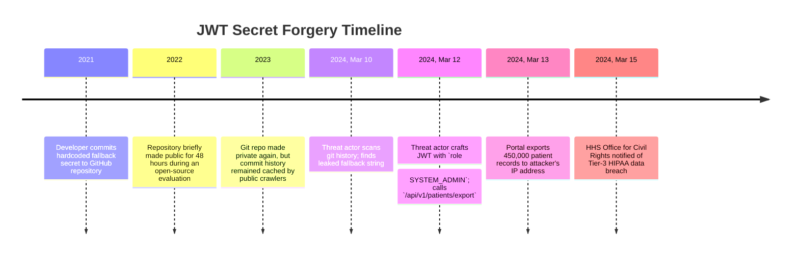

# Case Study: Hardcoded JWT Secret Token Forgery in Healthcare Portal

> **Metadata**: ID: `CS-SEC-04` | Domain: Security / Healthcare | Type: Synthetic Forensic Case Study | Complexity: Advanced

---

## 01. Executive Summary
A national healthcare provider operating a patient medical portal for 450,000 patients suffered a catastrophic data exposure when an external attacker gained administrative superuser access to the entire platform. The vulnerability originated from an architectural shortcut: developers configured JSON Web Token (JWT) authentication using the **symmetric HMAC-SHA256 (HS256)** algorithm with a hardcoded signing secret (`"SuperSecretHospitalKey2021!"`) committed directly into a public GitHub repository 3 years prior. The attacker discovered the leaked secret in historical git commit logs, forged an administrative JWT claiming `{"role": "SYSTEM_ADMIN"}`, bypassed all portal access controls, and accessed 450,000 sensitive electronic health records (EHRs) containing diagnoses, lab results, and prescription histories.

---

## 02. Business & System Context
- **Organization**: Regional Healthcare Network (450,000 Active Patients).
- **Core System**: Patient & Clinician Web Portal (Next.js Frontend, Go Backend API).
- **Scale**: 450,000 Patient Profiles; 18,000 Daily Clinical Logins.

---

## 03. Scope & Stakeholders
- **Incident Commander**: Enterprise Information Security Officer.
- **Key Teams**: Web Engineering Squad, Identity & Access Management (IAM), HIPAA Compliance Office.
- **Regulatory Authorities**: U.S. Department of Health and Human Services (HHS Office for Civil Rights).

---

## 04. Requirements & NFRs
- **Cryptographic Token Integrity**: Tokens must be cryptographically unforgable by any party lacking authorized private keys.
- **Asymmetric Key Separation**: Public keys for verification; strictly guarded private keys for signing.
- **HIPAA Compliance**: Zero unauthorized disclosure of Protected Health Information (PHI).

---

## 05. Constraints & Assumptions
- **The "Symmetric Key Simplicity" Fallacy**: The development squad chose symmetric HS256 over asymmetric RS256/ES256 because symmetric signing was simpler to implement in local developer environments without managing X.509 certificate pairs.

---

## 06. Architecture Before: The Leaked Symmetric Key
```mermaid
graph TD
    Attacker[Attacker] --> PublicGit[Public GitHub Commit History: Leaked Secret in 2021!]
    PublicGit --> Secret[HMAC Secret: SuperSecretHospitalKey2021!]
    
    subgraph Attacker Machine (Token Forgery)
        Attacker --> Forge[jwt.sign role: SYSTEM_ADMIN using Leaked Secret]
        Forge --> StolenJWT[Forged Admin JWT Bearer Token]
    end
    
    subgraph Hospital Production Portal (Validates with Same Secret!)
        StolenJWT --> APIGW[API Gateway: jwt.verify with Leaked Secret]
        APIGW -->|Signature Matches Mathematically!| AdminAPI[Clinician Admin API]
        AdminAPI --> EHR_DB[(EHR Database: 450,000 Medical Records)]
    end
```

---

## 07. Architecture Decisions
| Decision | Rationale | Downstream Failure |
| :--- | :--- | :--- |
| **Symmetric HS256 for JWT Signing** | Single shared string; avoided public/private key infrastructure (PKI) complexity. | In symmetric crypto, anyone who can verify a token can also *forge* a token. Once the secret leaked, the entire identity system collapsed. |
| **Hardcoded Fallback in Code** | `secret = os.Getenv("JWT_SECRET") || "SuperSecretHospitalKey2021!"` prevented local dev setup crashes. | When production environment variables failed to inject properly, the application silently fell back to the hardcoded leaked string. |

---

## 08. Timeline


---

## 09. Incident Event
In March 2024, an attacker used an automated git commit history scanner (TruffleHog) to analyze historical repositories associated with the healthcare organization. The scanner identified a 2021 commit containing the fallback string `"SuperSecretHospitalKey2021!"`. The attacker inspected the production web portal, confirmed that incoming session cookies contained an HS256-signed JWT, and crafted a forged token with claims:
```json
{
  "sub": "admin-001",
  "name": "Super Administrator",
  "role": "SYSTEM_ADMIN",
  "exp": 1893456000
}
```
Signed with the leaked string, the token was submitted via the `Authorization: Bearer` header. The Go backend API validated the signature using the exact same secret, granted full administrative rights, and allowed the attacker to download the complete 450,000-patient EHR database.

---

## 10. Symptoms & Evidence
- **Fact**: The API log recorded a single authenticated user session downloading 450,000 clinical charts via the bulk export API within 4 hours.
- **Fact**: Backend application configuration dump confirmed `JWT_SECRET` environment variable had failed to mount during a Kubernetes ConfigMap migration, causing the application to revert to its hardcoded fallback.
- **Inference**: Symmetric cryptography in distributed identity architectures creates systemic fragility because verification keys cannot be safely decentralized.

---

## 11. Failure Forensics
```
[Historical Git Commit contains fallback secret: "SuperSecretHospitalKey2021!"]
                                  │
                                  ▼
[Kubernetes ConfigMap misconfiguration causes app to use hardcoded fallback]
                                  │
                                  ▼
[Attacker uses jwt.io to forge JWT with {"role": "SYSTEM_ADMIN"}]
                                  │
                                  ▼
[API Gateway verifies signature: HMAC_SHA256(header.payload, leaked_secret)]
                                  │
                                  ▼
[Signature MATCHES! Gateway assumes token was issued by identity server]
                                  │
                                  ▼
[450,000 Electronic Health Records Exfiltrated Losslessly]
```

---

## 12. Root Cause Analysis (5-Whys)
1. **Why was patient medical data stolen?** -> An attacker gained administrative superuser access using a forged JWT token.
2. **Why was the token accepted by the portal?** -> The token was signed using the legitimate secret key recognized by the backend.
3. **How did the attacker obtain the secret key?** -> The key was hardcoded as a fallback in source code and committed to a Git repository.
4. **Why was a hardcoded fallback present?** -> Developers implemented default fallbacks to simplify local developer environment setup.
5. **Why was symmetric cryptography used for identity tokens?** -> Architecture governance failed to enforce **Asymmetric Cryptography (RS256 / ES256)** and automated secret scanning.

---

## 13. Contributing Factors
- **Absence of Pre-Commit Secret Hooks**: The engineering team lacked tools like `git-secrets` or TruffleHog in developer pre-commit hooks to block hardcoded secrets.
- **Silent Failure on Missing Environment Variables**: The application was designed to fall back gracefully rather than crashing fast (`panic()`) when critical secrets were missing from the environment.

---

## 14. Architecture After: Asymmetric PKI with OIDC & HashiCorp Vault
```mermaid
graph TD
    subgraph Identity Provider (Keycloak / Auth0 / Vault)
        IdP[Identity Provider Engine] --> PrivateKey[(Private Key: RS256 / EdDSA - SECURE IN HSM)]
        IdP -->|Sign JWT using Private Key| IssuedToken[Signed JWT Token]
        IdP --> JWKS[Public JWKS Endpoint: https://auth.hospital.org/.well-known/jwks.json]
    end
    
    subgraph Consumer Applications (Can ONLY Verify; CANNOT FORGE!)
        IssuedToken --> Gateway[API Gateway / Microservices]
        Gateway -->|Fetch Public Keys from JWKS| JWKS
        Gateway -->|Verify Signature using Public Key| Success[Authorized Access]
    end
    
    Note[Even if Public Key is Known to World: FORGERY IS IMPOSSIBLE!]
```

---

## 15. Recovery & Remediation
- **Immediate Mitigation**: Revoked all active patient and clinician sessions; rotated production secrets; removed fallback code.
- **Permanent Architectural Fix**:
  - **Asymmetric Token Signing (RS256 / ES256)**: Migrated the entire authentication architecture to **Asymmetric Cryptography**. The identity server signs tokens using a private RSA key stored in an AWS KMS / HashiCorp Vault Hardware Security Module (HSM).
  - **Public JWKS Verification**: Backend microservices only possess the **Public Key** (fetched dynamically via `/.well-known/jwks.json`). Microservices can verify signatures, but it is mathematically impossible to forge a token without the private key.
  - **Crash-Fast Secret Ingestion**: Removed all hardcoded fallbacks:
    ```go
    secret := os.Getenv("JWT_KEY")
    if secret == "" {
        log.Fatal("FATAL: JWT_KEY environment variable missing; aborting startup.")
    }
    ```
  - **Automated Secret Scanning**: Deployed **GitHub Advanced Security / TruffleHog** blocking any commit containing high-entropy strings.

---

## 16. Business & Technical Impact
- **Regulatory Penalties**: $6.5M settlement with the HHS Office for Civil Rights for HIPAA Security Rule violations.
- **Legal Liabilities**: Settled class-action patient privacy lawsuit for $9.2M.
- **Security Maturity**: Implemented complete enterprise-wide transition to OpenID Connect (OIDC) standards.

---

## 17. What Went Well
- Database access logging was fully enabled, allowing forensic examiners to confirm exactly which patient records were accessed.
- The hospital's executive team notified patients and regulators within statutory deadlines, avoiding punitive bad-faith fines.

---

## 18. Lessons Learned
- **Architecture**: In identity systems, symmetric token signing (HS256) is an anti-pattern. Always use asymmetric algorithms (RS256 / ES256 / EdDSA) with public JWKS endpoints.
- **Operational Rule**: Applications must fail fast. Never provide a "convenient fallback string" for cryptographic security parameters.

---

## 19. Architectural Recommendations
| Horizon | Action Item | Owner | Target |
| :--- | :--- | :--- | :--- |
| **Immediate** | Ban HS256 symmetric JWT signing across all enterprise software | Chief Arch | 100% RS256/ES256 |
| **30 Days** | Deploy TruffleHog secret scanning in all Git pre-commit hooks and CI pipelines | DevSecOps | Zero committed secrets |
| **60 Days** | Mandate crash-fast startup (`os.Exit(1)`) on any missing security environment variable | Lead Java/Go | Zero fallback secrets |
