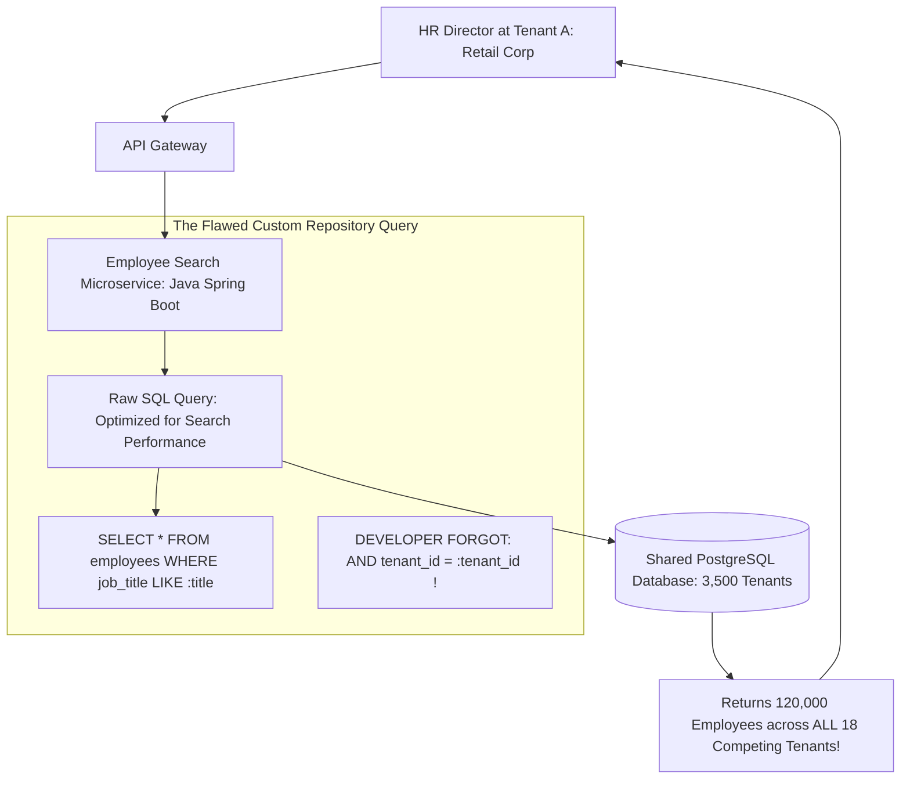

# Case Study: Enterprise SaaS Cross-Tenant Data Leak via Missing ORM Filter

> **Metadata**: ID: `CS-SEC-06` | Domain: Security / Multi-Tenancy | Type: Synthetic Forensic Case Study | Complexity: Advanced

---

## 01. Executive Summary
A multi-tenant human resources and payroll SaaS platform ($140M ARR) suffered a catastrophic cross-tenant data exposure. Following a minor performance optimization in the employee search microservice, a developer bypassed the standard multi-tenant data layer to execute a raw SQL query. The developer omitted the mandatory **`WHERE tenant_id = :tenant_id`** filter clause. When a human resources director at a major national retail chain logged into the portal and performed an employee salary search, the API returned the confidential payroll, Social Security numbers, and compensation packages of **18 competing corporate enterprises**, exposing 120,000 executive salary records and triggering an SEC insider trading inquiry.

---

## 02. Business & System Context
- **Organization**: Enterprise HR & Payroll SaaS (3,500 Corporate Tenants).
- **Core Workflow**: Employee Compensation Management, Payroll Calculation, and Performance Reviews.
- **Scale**: 3,500 Corporate Tenants; 2.5 Million Employee Records.

---

## 03. Scope & Stakeholders
- **Incident Commander**: Chief Privacy & Security Officer.
- **Key Teams**: Core SaaS Engineering, Data Privacy Office, Corporate External Communications.
- **Impacted Customers**: 18 Major Corporate Tenants whose executive payroll was exposed.

---

## 04. Requirements & NFRs
- **Absolute Tenant Isolation**: It must be mathematically impossible for one tenant to query, view, or mutate another tenant's data.
- **Query Governance**: All database interactions must automatically enforce tenant boundaries without relying on developer discipline.
- **Audit Lineage**: Complete logging of all employee salary data views.

---

## 05. Constraints & Assumptions
- **The "Developer Discipline" Fallacy**: The architecture relied on individual software engineers remembering to append `WHERE tenant_id = :id` to every custom repository query, rather than enforcing tenant isolation at the database engine or ORM interceptor tier.

---

## 06. Architecture Before: The Omitted Filter Vulnerability


---

## 07. Architecture Decisions
| Decision | Rationale | Downstream Failure |
| :--- | :--- | :--- |
| **Manual `tenant_id` Clauses in Custom Queries** | Permitted developers to write raw, highly tuned SQL queries for complex reporting. | Relied on human perfection: a single omitted clause in one query exposed all corporate customers simultaneously. |
| **Pooled Database with Logical Separation Only** | Maximized resource utilization and simplified migrations across 3,500 tenants. | No physical or database-engine-level boundary existed to catch human coding errors. |

---

## 08. Timeline
```mermaid
timeline
    title Cross-Tenant Data Leak Timeline
    Day 1, 14:00 : Developer deploys "Optimized Employee Search" PR to production
    Day 2, 09:15 : HR Director at Retailer A searches for "Vice President" in portal
    Day 2, 09:16 : Portal UI renders 1,400 results, including salaries of executives at Retailer B, C, and D
    Day 2, 09:30 : HR Director takes screenshots; contacts SaaS Chief Executive Officer directly
    Day 2, 10:00 : Emergency P0 bridge opened; search microservice rolled back within 15 minutes
    Day 3        : Forensic audit confirms 42 users accessed the endpoint during the 20-hour window
```

---

## 09. Incident Event
At 14:00 on Day 1, an engineering squad deployed a performance optimization to accelerate the `/api/v1/employees/search` endpoint. To bypass Hibernate ORM entity overhead, the developer utilized a Spring Data `@Query(nativeQuery = true)` annotation:
```sql
SELECT * FROM employees 
WHERE (first_name ILIKE :term OR last_name ILIKE :term OR job_title ILIKE :term)
ORDER BY hire_date DESC LIMIT 100;
```
The developer neglected to append `AND tenant_id = :tenantId`. When an HR Director at a major retail client searched for "Vice President", the database returned executive payroll records spanning 18 distinct corporate customers, complete with home addresses, base salaries, bonus payouts, and Social Security numbers. The customer immediately alerted executive leadership.

---

## 10. Symptoms & Evidence
- **Fact**: Database query logs confirmed 1,240 invocations of the raw SQL statement lacking the `tenant_id` predicate.
- **Fact**: 42 individual user accounts received search payloads containing data belonging to other corporate organizations.
- **Inference**: Multi-tenant systems that rely on developer memory to append tenant filters are mathematically guaranteed to leak data.

---

## 11. Failure Forensics
```
[HR Admin at Tenant A searches: "Director"]
                     │
                     ▼
[Microservice invokes nativeQuery without tenant_id filter]
                     │
                     ▼
[PostgreSQL executes full index scan across entire multi-tenant table]
                     │
                     ▼
[Matches records for Tenant A, Tenant B, Tenant C... Tenant Z]
                     │
                     ▼
[JSON payload delivered to Tenant A browser: 18 Competitors Exposed]
                     │
                     ▼
[CRITICAL CROSS-TENANT DATA BREACH]
```

---

## 12. Root Cause Analysis (5-Whys)
1. **Why did Tenant A see Tenant B's executive salaries?** -> The search query returned records without filtering by tenant.
2. **Why was there no tenant filter?** -> The developer omitted `tenant_id = :tenant_id` in a native SQL query.
3. **Why was a native SQL query used?** -> The developer wanted to bypass Hibernate ORM mapping overhead to optimize search latency.
4. **Why did the database engine execute the cross-tenant query?** -> The database connection was authenticated as a generic superuser without row-level security boundaries.
5. **Why was tenant isolation not enforced at the database tier?** -> The architecture team implemented multi-tenancy as an application-level concern rather than an architectural, database-enforced constraint.

---

## 13. Contributing Factors
- **Inadequate Code Review Checklist**: The PR was reviewed by two senior engineers who focused on indexing and regex syntax, failing to notice the missing `tenant_id` parameter.
- **Flawed Automated Testing**: Unit tests ran against an in-memory database with data for only a single test tenant (`tenant_id = 1`), masking the cross-tenant exposure.

---

## 14. Architecture After: PostgreSQL Row-Level Security (RLS) & Automated Interceptors
```mermaid
graph TD
    Client[Tenant Request] --> APIGW[API Gateway: Extracts Tenant ID]
    APIGW --> Svc[Employee Service]
    
    subgraph Database-Enforced Isolation (PostgreSQL RLS)
        Svc -->|1. Connection Pool checks out connection| SessionInit[SET LOCAL app.current_tenant_id = 'tenant_123']
        SessionInit --> SvcQuery[Any SQL Query (Even Raw SQL without WHERE tenant_id!)]
        
        SvcQuery --> RLS_Engine[PostgreSQL Kernel Row-Level Security Engine]
        RLS_Engine -->|Enforces Rule: WHERE tenant_id = current_setting('app.current_tenant_id')| FilteredData[(Filtered Data: IMPOSSIBLE TO LEAK!)]
    end
```

---

## 15. Recovery & Remediation
- **Immediate Mitigation**: Rolled back the search service deployment within 15 minutes; engaged external forensic investigators to review access logs and verify that no bulk exfiltration occurred.
- **Permanent Architectural Fix**:
  - **PostgreSQL Row-Level Security (RLS)**: Enforced **Row-Level Security** at the database engine tier across all multi-tenant tables:
    ```sql
    ALTER TABLE employees ENABLE ROW LEVEL SECURITY;
    CREATE POLICY tenant_isolation_policy ON employees
        USING (tenant_id = current_setting('app.current_tenant_id')::UUID);
    ```
    Every database connection checks out with `SET LOCAL app.current_tenant_id = :tenantId`. Even if a developer writes `SELECT * FROM employees` with zero filters, the PostgreSQL kernel **mathematically hides all rows belonging to other tenants**.
  - **Multi-Tenant Integration Tests**: Updated the test framework to seed multiple tenants in every automated test. Any query that returns cross-tenant data automatically fails the build.

---

## 16. Business & Technical Impact
- **Financial**: $4.5M in customer contract concessions, legal retainers, and audit disclosures.
- **Customer Churn**: Retained all 18 affected enterprise clients due to radical transparency, immediate CEO disclosure, and third-party verification of database-enforced RLS.
- **Engineering Standard**: Row-Level Security was codified as a mandatory architecture standard for all pooled multi-tenant databases.

---

## 17. What Went Well
- The customer who discovered the leak reported it responsibly directly to the CEO, preventing public disclosure or dark-web exploitation.
- The 15-minute rollback stopped exposure before malicious automated scraping occurred.

---

## 18. Lessons Learned
- **Architecture**: Tenant isolation must never depend on developer discipline. If your multi-tenant security relies on engineers remembering a `WHERE` clause, you will eventually suffer a cross-tenant data leak.
- **Enforce at the Data Tier**: Implement Row-Level Security (RLS) directly in the database engine. Let the database enforce isolation.

---

## 19. Architectural Recommendations
| Horizon | Action Item | Owner | Target |
| :--- | :--- | :--- | :--- |
| **Immediate** | Audit all native SQL queries in codebase for missing `tenant_id` clauses | AppSec Lead | Zero missing filters |
| **60 Days** | Enable PostgreSQL Row-Level Security (RLS) across all multi-tenant tables | Lead DBA | 100% RLS enforcement |
| **90 Days** | Mandate multi-tenant assertion fixtures in all automated repository test suites | QA Lead | Zero cross-tenant leaks |
