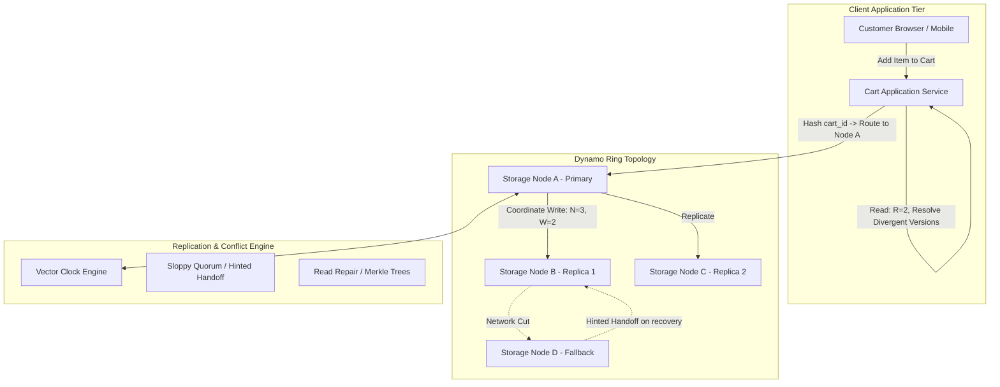

# Case Study: Amazon Shopping Cart & The Dynamo Paper

## 1. Company & Business Context

Amazon is the world’s largest e-commerce enterprise. In online retail, the shopping cart is the direct conduit to revenue. Any failure, latency spike, or data loss during cart addition directly translates into abandoned purchases and immediate revenue loss.

Traditional enterprise architectures relied on strict ACID transactions backed by relational databases. However, during network partitions or server failures, strict consistency models refuse writes to prevent stale data. Amazon established a radical architectural principle: **The shopping cart must always be writable, no matter what part of the infrastructure has failed.**

---

## 2. Scale & Workload Profile

```
+------------------------------------+---------------------------------------+
| Metric                             | Production Volume                     |
+------------------------------------+---------------------------------------+
| Global E-Commerce Transactions     | Billions of USD / Day                 |
| Concurrent Active Shopping Carts   | Tens of Millions Simultaneously       |
| Cart Read/Write Ratio              | Approximately 1:1 to 3:1              |
| Cart Operation Latency Target      | P99.9 < 10 Milliseconds               |
| Availability Requirement           | 99.999% ("Never Drop an Item")        |
| Operational Infrastructure         | Multi-Datacenter Commodity Servers    |
+------------------------------------+---------------------------------------+
```

---

## 3. Original Architecture (RDBMS ACID Bottlenecks)

Prior to the creation of Dynamo (2007):
- Shopping carts were stored in relational database clusters using master-slave replication.
- **Failures Under Partition**: If a network split disconnected an application server from the primary database master, the cart service threw errors, rejecting user additions.
- **Scale Ceilings**: Relational locks and two-phase commits severely restricted horizontal scaling across distributed data centers.

---

## 4. Modern Target Architecture: Dynamo Key-Value Store

Amazon designed **Dynamo**, a fully decentralized, masterless, highly available key-value storage system operating under an **AP (Available / Partition Tolerant)** trade-off profile.



---

## 5. Architectural Inventions & Mechanics

### A. Consistent Hashing with Virtual Nodes
- Keys are mapped to a 128-bit circular space (hash ring) using MD5.
- Physical servers are assigned multiple **virtual nodes (tokens)** distributed uniformly around the ring.
- Guarantees even load distribution and graceful addition/removal of hardware without mass data reshuffling.

### B. Configurable Sloppy Quorums $(N, R, W)$
Dynamo allows services to tune their consistency and latency trade-offs:
- $N$: Number of storage nodes responsible for replicating a key (typically $N=3$).
- $R$: Number of nodes that must respond to a read request (e.g., $R=2$).
- $W$: Number of nodes that must acknowledge a write request (e.g., $W=2$).
- To prioritize write availability: If $R + W > N$, systems achieve weak consistency; if network partitions isolate primary replicas, Dynamo executes **Sloppy Quorum** by writing to healthy downstream nodes with a "hint" to deliver the data back once connectivity resumes (**Hinted Handoff**).

### C. Vector Clocks & Client-Side Conflict Reconciliation
Because writes are accepted on divergent partitions:
- Two updates to the same cart may occur concurrently without synchronization.
- Dynamo associates every write with a **Vector Clock** $([\text{node}, \text{counter}])$.
- If versions cannot be resolved automatically through causal dominance, Dynamo returns **both versions** to the Cart Service during the next read.
- **Domain-Specific Resolution**: The shopping cart application merges both carts using a union operation: *never delete an item automatically if a conflict exists*. An item deleted in one partition might reappear, but no purchased item is ever lost.

### D. Anti-Entropy with Merkle Trees
To synchronize divergent replicas out-of-band without transferring huge dataset dumps, Dynamo uses hierarchical **Merkle Trees** (hash trees) for key ranges. Nodes compare top-level root hashes; only discordant branches are traversed and replicated.

---

## 6. Distributed Trade-Offs & Decisions

```
+-----------------------------------+----------------------------------------+
| Dimension                         | Amazon Dynamo Architectural Choice     |
+-----------------------------------+----------------------------------------+
| CAP Classification                | AP (Sacrifice Consistency for Avail)   |
| Coordination Model                | Decentralized Masterless (Peer-to-Peer)|
| Conflict Resolution Responsibility| Application Layer (Cart Service Union) |
| Synchronization Scheme            | Asynchronous Anti-Entropy via Merkle   |
+-----------------------------------+----------------------------------------+
```

---

## 7. Engineering Lessons & Enterprise Takeaways

1. **Business SLA Dictates Consistency Model**: When the cost of downtime exceeds the cost of temporary inconsistency, adopt eventual consistency and push conflict reconciliation to the application layer.
2. **The "Union" Resolution Pattern for Commerce**: By treating cart reconciliation as a mathematical set union ($\text{Cart}_A \cup \text{Cart}_B$), customers never experience lost items, protecting revenue.
3. **Decentralized Architectures Eliminate SPOFs**: Masterless peer-to-peer topologies (consistent hashing rings) provide predictable linear scalability and zero single points of failure.
