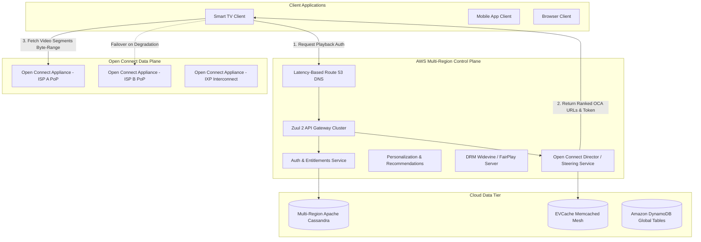

# Case Study: Netflix Video Streaming Architecture

## 1. Company & Business Context

Netflix migrated from a DVD rental service to a global streaming platform delivering video on demand to over 260 million paid subscribers across 190+ countries. The business demands 99.999% playback availability, near-zero video rebuffering rates (< 0.25%), immediate playback start times (< 1.5 seconds), and continuous operation even during regional hyperscaler cloud outages.

Streaming video accounts for up to 15% of global downstream internet bandwidth. This reality makes it financially and technically impossible to serve video traffic directly from centralized cloud infrastructure without crippling internet transit costs and saturating telecommunication backbones.

---

## 2. Scale & Workload Profile

```
+------------------------------------+---------------------------------------+
| Metric                             | Production Volume                     |
+------------------------------------+---------------------------------------+
| Global Paid Subscribers            | 260M+ Active Profiles                 |
| Concurrent Peak Streaming Sessions | 30M+ Simultaneous Streams             |
| Total Peak Bandwidth Consumed      | 100+ Tbps Global Aggregated Egress    |
| Catalog Titles & Assets            | > 200,000 Titles, > 10M Encoded Media |
| Control Plane API Requests         | 2.5B+ Requests / Day                  |
| Playback Availability SLA          | 99.999% Service Level Target          |
+------------------------------------+---------------------------------------+
```

---

## 3. Original Architecture (Pre-Migration Monolith)

In 2008, a major database corruption event in an on-premises data center halted DVD shipping operations for three days. The monolithic architecture suffered from:
- **Shared Relational Monolith**: A massive Oracle database serving as a single point of failure (SPOF) with tight coupling across billing, catalog, logistics, and user accounts.
- **Vertical Hardware Limits**: Vertical scaling constraints on Sun Microsystems hardware with multi-week provisioning cycles.
- **Lack of Multi-Tenancy & Isolation**: A failure in the recommendation engine brought down authentication and playback authorization.

---

## 4. Bottlenecks & Failure Modes

```
+--------------------------+-------------------------------------------------+
| Failure Mode             | Impact on Production System                     |
+--------------------------+-------------------------------------------------+
| Database Bottleneck      | Single locks held on user records stalled pools |
| Cascade Failures         | Latency spikes in downstream services cascaded  |
| Transit ISP Congestion   | Video delivery over public transit caused drops |
| Regional Cloud Blackout  | Complete loss of single AWS Availability Zone   |
+--------------------------+-------------------------------------------------+
```

---

## 5. Modern Target Architecture

Netflix split its operations into two fundamentally distinct planes:
1. **Control Plane (AWS Cloud)**: Billing, customer onboarding, personalization, metadata catalog, DRM license issuance, and UI orchestration. Built using a multi-region microservices mesh.
2. **Data / Delivery Plane (Open Connect CDN)**: Proprietary, globally distributed content delivery network comprised of custom FreeBSD-based Open Connect Appliances (OCAs) deployed directly inside Internet Service Provider (ISP) Points of Presence (PoPs) and Internet Exchange Points (IXPs).



---

## 6. Key Inventions & Architectural Patterns

### A. Open Connect Appliances (OCA)
Custom rack-mounted FreeBSD appliances containing high-density NVMe/SATA arrays capable of 100+ Gbps throughput per 2U server. Over 95% of all streaming video bytes are served directly from an ISP's internal network without touching transit backbones.
- Content is pushed to OCAs during off-peak overnight hours based on predictive machine learning demand forecasting.

### B. Chaos Engineering & The Simian Army
Netflix pioneered chaos engineering to validate fault-tolerance in production:
- **Chaos Monkey**: Randomly terminates EC2 microservice instances during business hours to ensure automatic replacement and zero client impact.
- **Chaos Kong**: Drops entire AWS regions simulating total regional data center loss, triggering automated global DNS traffic evacuation within 7 minutes.

### C. Client-Driven Dynamic Adaptive Streaming
Instead of the server dictating the bitrate:
- Video is pre-encoded into hundreds of combinations of resolution, codec (AV1, HEVC, H.264), dynamic range (HDR10, Dolby Vision), and audio bitrates using the Dynamic Optimizer algorithm.
- Video chunks are split into fixed 2-second to 6-second segments.
- The client application measures TCP throughput, buffer occupancy, and device hardware decode capabilities to dynamically request the optimal chunk resolution on the fly.

### D. Multi-Region Active-Active Data Tier
Using Apache Cassandra and EVCache (distributed Memcached with replication):
- Writes are replicated asynchronously across AWS US-East-1, US-West-2, and EU-West-1.
- Conflict resolution uses timestamp-based Last-Write-Wins (LWW) with client idempotency.

---

## 7. Distributed Trade-Offs & Decisions

```
+-----------------------------------+----------------------------------------+
| Dimension                         | Netflix Architectural Choice           |
+-----------------------------------+----------------------------------------+
| CAP Position                      | AP (High Availability, Eventual Cons.) |
| Microservices Communication       | Asynchronous Event-Driven (Kafka/gRPC) |
| Video Delivery Topography         | Proprietary Edge CDN over Cloud CDN    |
| Storage Strategy                  | Wide-Column NoSQL over Relational DB   |
| Resilience Paradigm               | Chaos Engineering over Static Audits   |
+-----------------------------------+----------------------------------------+
```

---

## 8. Engineering Lessons & Enterprise Takeaways

1. **Decouple Control Plane from Data Plane**: Never route heavy data payload through business microservices. Keep control logic lightweight and delegate bytes to specialized storage/edge nodes.
2. **Design for Failure as a First-Class Citizen**: Assume any single server, switch, or whole cloud region can vanish instantaneously. Stateless services and automated health evictions are mandatory.
3. **Push Intelligence to the Edge**: Client-driven bitrate adaptation and ISP-localized caching outperform centralized server-side routing under high volatility.
