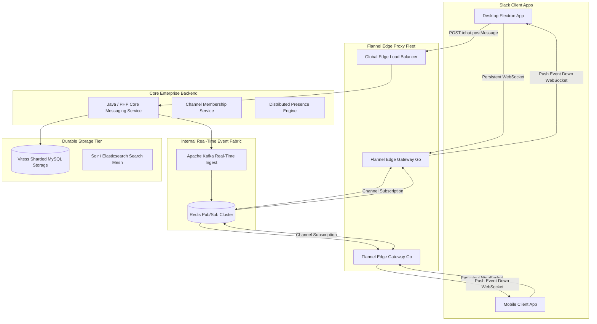

# Case Study: Slack Real-Time Enterprise Messaging Architecture

## 1. Company & Business Context

Slack is an enterprise collaboration and messaging platform serving over 30 million daily active users across hundreds of thousands of organizations. Unlike consumer messaging apps focused on 1:1 chats, Slack operates around **workspaces, shared enterprise channels, threading, and presence**.

In a large enterprise workspace (e.g., IBM or Amazon with 100,000+ employees in a single company), sending a message to a `#general` channel triggers a massive real-time fanout event. Every member's desktop and mobile app must reflect the new message, update unread indicators, and refresh desktop notifications within milliseconds.

---

## 2. Scale & Workload Profile

```
+------------------------------------+---------------------------------------+
| Metric                             | Production Volume                     |
+------------------------------------+---------------------------------------+
| Daily Active Users (DAU)           | 30M+ Enterprise Professionals         |
| Concurrent Connected Users         | > 10 Million Simultaneous WebSockets  |
| Peak Messages Dispatched           | Millions of Channel Events / Minute   |
| Maximum Users in Single Channel    | > 100,000 Users in one Channel        |
| End-to-End Delivery SLA            | < 100 Milliseconds P99 Latency        |
| Presence Update Frequency          | Hundreds of Millions of Events / Sec  |
+------------------------------------+---------------------------------------+
```

---

## 3. Original Architecture (The Monolith & Connection Storms)

Slack began as a PHP monolith backed by MySQL:
- Early WebSocket edge servers maintained connections, but every connection had to subscribe to broad channel updates.
- **Connection Storms & Memory Exhaustion**: Whenever a large office opened in the morning or a network glitch caused mass reconnects, thousands of clients simultaneously queried MySQL to synchronize channel history and presence status, causing severe database brownouts.

---

## 4. Modern Target Architecture: The Flannel Edge Gateway

Slack designed **Flannel**, an application-level edge caching proxy written in Go, acting as an intelligent buffer between client applications and core backend services.



---

## 5. Architectural Inventions & Mechanics

### A. Flannel: Intelligent In-Memory Edge Cache
Instead of routing every client's queries to central databases:
- Flannel instances reside close to users at edge points of presence.
- When a user connects via WebSocket, Flannel loads their workspace’s channels, users, and bots into local memory.
- Multiple users within the same workspace connecting to the same Flannel edge share identical in-memory channel state.
- Flannel acts as a read-through cache and subscription aggregator: if 500 users on a Flannel instance belong to `#general`, Flannel maintains only **one** subscription to the core Redis Pub/Sub topic for that channel.

### B. Presence Subsystem De-escalation
Tracking whether 100,000 colleagues are "Active" or "Away" in real time creates quadratic network traffic:
- Slack redesigned presence to be **lazy and viewport-driven**.
- A client does not receive presence status updates for all 100,000 coworkers in the workspace.
- Instead, the client only subscribes to presence updates for users currently visible in the user's active UI view (e.g., users in the currently open direct message list or channel view).

### C. Workspace-Based Sharding
- Slack shards databases and message routing primarily by `workspace_id` (Team ID).
- An entire organization's data typically resides within dedicated database clusters.
- This creates clean failure domain isolation: an outage in one customer's workspace cannot cascade to impact other enterprise organizations.

---

## 6. Distributed Trade-Offs & Decisions

```
+-----------------------------------+----------------------------------------+
| Dimension                         | Slack Architectural Choice             |
+-----------------------------------+----------------------------------------+
| Edge Protocol                     | Persistent Full-Duplex WebSockets      |
| Multiplexing Strategy             | Flannel Edge Aggregator vs Direct Hub  |
| Presence Delivery Strategy        | Viewport-Driven Lazy Fetch vs Broadcast|
| Partitioning Boundary             | Tenant / Workspace Sharding Isolation  |
+-----------------------------------+----------------------------------------+
```

---

## 7. Engineering Lessons & Enterprise Takeaways

1. **Multiplex Subscriptions at the Edge**: When thousands of clients listen to identical data streams, aggregate their subscriptions at an edge proxy layer to protect central message brokers from fanout overload.
2. **Lazy-Load Non-Critical State**: Real-time broadcast of cosmetic metadata (like presence indicators or typing notifications) scales quadratically. Restrict broadcasts to visible viewports.
3. **Tenant-Level Failure Isolation**: Aligning distributed database partitions with natural enterprise boundaries (the organization or workspace) prevents noisy neighbors and contains security and availability blasts.
