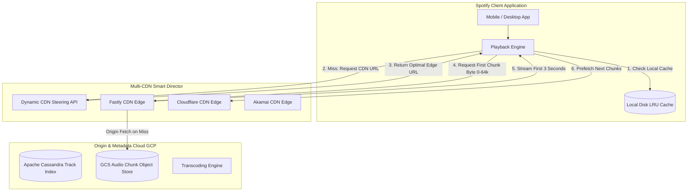

# Case Study: Spotify Low-Latency Audio Delivery & P2P-to-CDN Evolution

## 1. Company & Business Context

Spotify provides digital music, podcast, and video streaming to over 600 million active users across 180+ markets. The defining characteristic of the Spotify user experience is **instant playback**: when a user taps play, audio must begin within 200 milliseconds, eliminating any perceived lag.

Initially, Spotify relied heavily on a proprietary Peer-to-Peer (P2P) desktop protocol to minimize bandwidth costs. As mobile usage eclipsed desktops and mobile bandwidth/battery constraints grew, Spotify executed a massive architectural shift to a multi-CDN edge cloud delivery model.

---

## 2. Scale & Workload Profile

```
+------------------------------------+---------------------------------------+
| Metric                             | Production Volume                     |
+------------------------------------+---------------------------------------+
| Total Active Users                 | 600M+ Monthly Active Users            |
| Catalog Track Count                | > 100 Million Tracks                  |
| Playback Start Time SLA            | < 200 Milliseconds Global Latency     |
| Continuous Stream Bitrates         | Ogg Vorbis / AAC (96k, 160k, 320kbps) |
| Audio File Ingestion Daily         | > 100,000 New Songs Daily             |
| Edge Bandwidth Consumed            | Tens of Terabits / Second Peak        |
+------------------------------------+---------------------------------------+
```

---

## 3. The P2P-to-Cloud CDN Pivot

```
+--------------------------+----------------------------+----------------------------+
| Dimension                | Original P2P Protocol      | Modern Multi-CDN Edge      |
+--------------------------+----------------------------+----------------------------+
| Primary Client Target    | Desktop Computers          | Mobile Phones & Smart Spkrs|
| Delivery Mechanism       | Peer upload mesh           | Cloud CDN Points of Pres.  |
| Battery & Mobile Data    | High consumption (uploads) | Minimal client overhead    |
| Start Latency Variance   | High (peer hunt time)      | Uniform sub-200ms edge hit |
+--------------------------+----------------------------+----------------------------+
```

---

## 4. Modern Target Architecture: Audio Chunk Delivery Pipeline



---

## 5. Architectural Inventions & Mechanics

### A. Non-Uniform Track Chunking & Head-Chunk Prefetching
Audio tracks are not streamed as monolithic 10MB MP3 files. They are split into cryptographic chunks:
- **The "Head Chunk" Optimization**: The first 64KB (~3 seconds of audio at 160kbps) is indexed and pre-fetched or streamed immediately with highest priority.
- While the player plays the first 3 seconds from the head chunk, the application asynchronously prefetches the remaining body chunks in the background.
- This decoupling allows the UI to start playing music instantaneously (< 150ms).

### B. Multi-CDN Smart Routing
Spotify employs multiple commercial CDNs (Cloudflare, Fastly, Akamai) simultaneously:
- The client app continuously sends lightweight telemetry probes measuring real-time latency and packet loss to each CDN.
- An intelligent routing service dynamically directs requests to the best-performing CDN for that specific mobile carrier and geographical region.

### C. Persistent On-Device LRU Caching
- Spotify clients allocate a configurable disk cache (e.g., 5GB–10GB) on the user's local device.
- Songs played frequently or saved to the user’s library are decrypted and cached locally.
- Over 50% of all playback requests globally are served directly from the local device cache, generating zero network traffic.

---

## 6. Distributed Trade-Offs & Decisions

```
+-----------------------------------+----------------------------------------+
| Dimension                         | Spotify Architectural Choice           |
+-----------------------------------+----------------------------------------+
| Content Delivery Topology         | Multi-CDN with Dynamic Edge Steering   |
| Streaming Granularity             | Chunked Byte-Range Streaming vs File   |
| Audio Transcoding Storage         | Multiple Bitrates Pre-Encoded in Cloud |
| Catalog Storage Layer             | Apache Cassandra for Fast ID Lookups   |
+-----------------------------------+----------------------------------------+
```

---

## 7. Engineering Lessons & Enterprise Takeaways

1. **Optimize for Time-to-First-Byte (TTFB)**: Users perceive performance based on start time rather than full download time. Prioritize the first slice of data aggressively.
2. **Never Depend on a Single CDN**: Commercial CDNs suffer regional routing degradations and BGP outages. Multi-CDN architectures with active telemetry steering ensure 99.999% streaming availability.
3. **Maximize Edge & Client Storage**: The cheapest and fastest network request is the one that never leaves the user's device. Intelligent local LRU caching reduces cloud egress costs dramatically.
